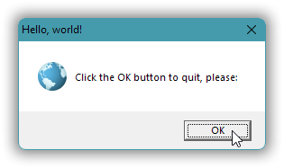

# Windows GUI-stuff in C++: a tutorial.

Desktop Windows API level programming from the ground up, in C++17.

Table of contents:

* [Directly in this repository](docs/index.md).  
  Links to example source code give you color coded syntax etc., but there is some extraneous information at the top of each page.
* [On corresponding Github Pages](https://alf-p-steinbach.github.io/Windows-GUI-stuff-in-C-tutorial-/).  
  In the Github pages presentation there’s less distracting Github stuff (Github just adds a link set in Very Large Font&trade; on the top of each page), but code is not necessarily syntax colored and links to example source code may just give you downloading of that code instead of presenting it.

Individual main parts, with links for reading in this repository:

- [1. A Windows GUI “Hello, world!”.](docs/01.md)
- [2. Use data resources to provide an icon.](docs/02.md)
- [3. A Tic-Tac-Toe game in a dialog window.](docs/03.md)
- [4. UTF-8 as the one and only text encoding.](docs/04.md)
- [5. GDI graphics: Basics.](docs/05.md)

I haven’t decided how far to take this. I’ll add more as I have free time to fill, maybe once a week or two weeks. Free time include those times when I get too bored with other stuff.
