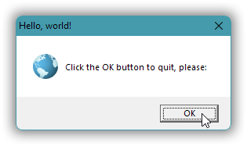

# Windows GUI-stuff in C++: a tutorial.

Desktop Windows API level programming starting from the ground up, in C++17.

If you read it as .md files [here in the repository](docs/index.md) then links to example source code give you color coded syntax etc.

If you instead read it [on Github Pages](https://alf-p-steinbach.github.io/Windows-GUI-stuff-in-C-tutorial-/) then there’s less distracting Github stuff (Github just adds a link set in Very Large Font&trade; on the top of each page), but links to example source code may just give you downloading of that code.

❁

*TLDR short contents so far, links to this repository:*
- [1. A Windows GUI “Hello, world!”.](part-01.md)
- [2. Use resources to provide an icon.](part-02.md)
- [3. A Tic-Tac-Toe game in a dialog window.](part-03.md)
- [4. UTF-8 as the one and only text encoding.](part-04.md)

❁

I haven’t decided how far to take this. I’ll add more as I have free time to fill, maybe once a week or two weeks. Free time include those times when I get too bored with other stuff.
