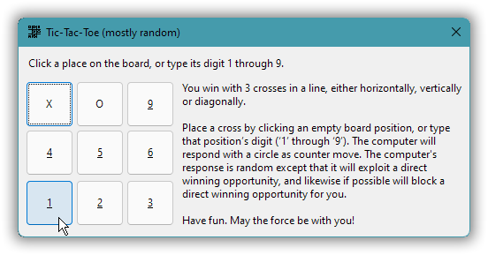
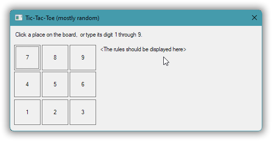
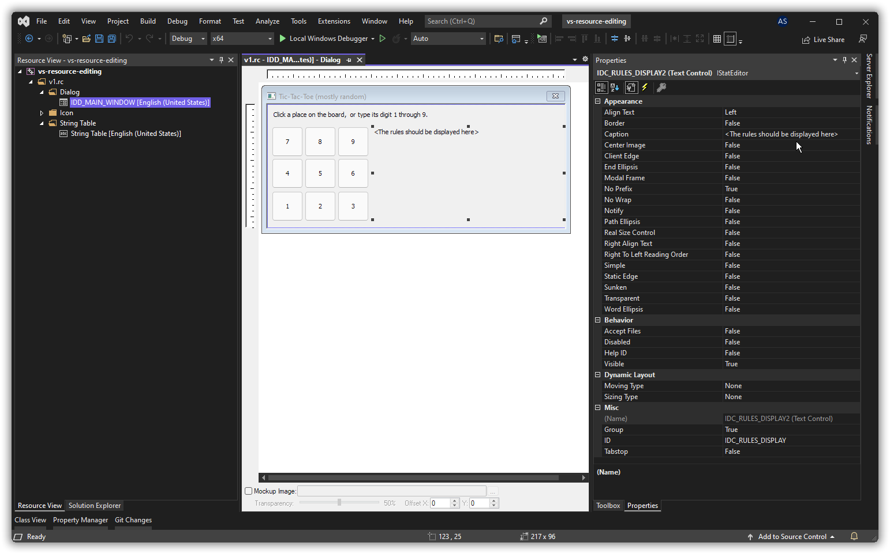
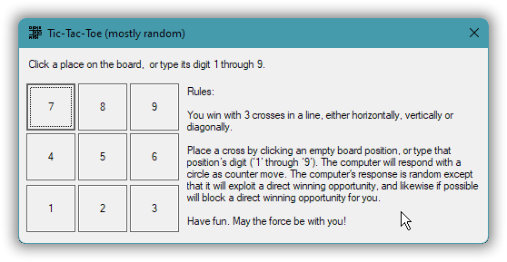
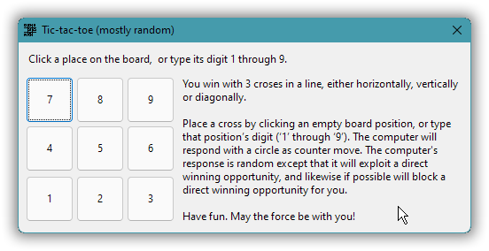
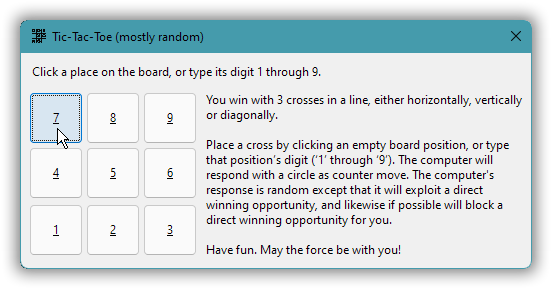
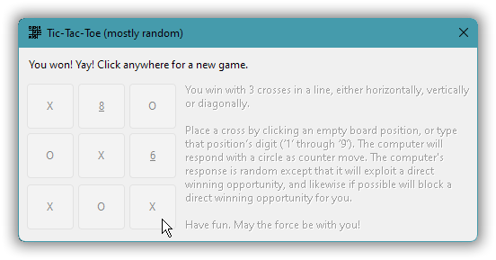

# Windows GUI-stuff in C++: a tutorial.

| ← previous                                    | up ↑                 | next →                                               |
|:--------------------------------------------- |:--------------------:| ----------------------------------------------------:|
| [2. Use resources to provide an icon.](02.md) | [Contents](index.md) | [4. UTF-8 as the one and only text encoding.](04.md) |

## Part 3 – A Tic-Tac-Toe game in a dialog window.

In the previous part we saw that an application’s icon is provided via data embedded in the executable, called a resource. Now we’ll additionally use a resource called a **dialog template**, that describes the contents of a simple window. As a concrete example we’ll use that for a simple Tic-Tac-Toe (tree in a row) game in a general window.

That window contains two text areas and nine flat buttons, specified by the dialog template:



The game logic is just a little detail at the end, though. Mainly the [five (!) versions of the program](03.version-descriptions.md) exemplify general Windows programming techniques and issues, a kind of C style **event based programming**. The parts of the Windows API used here are all designed for use from C, and we’ll use this API more or less directly with C++ as just a “better C”.

<!-- START doctoc generated TOC please keep comment here to allow auto update -->

<!-- DON'T EDIT THIS SECTION, INSTEAD RE-RUN doctoc TO UPDATE -->

*Contents (table generated with [DocToc](https://github.com/thlorenz/doctoc)):*

- [3.1. Create and run a general window based on a dialog template.](#31-create-and-run-a-general-window-based-on-a-dialog-template)
- [3.2. Add a window icon and the too longish text by sending window messages.](#32-add-a-window-icon-and-the-too-longish-text-by-sending-window-messages)
- [3.3. Factor out: `<windows.h>` inclusion; support machinery; window message cracking.](#33-factor-out-windowsh-inclusion-support-machinery-window-message-cracking)
- [3.4. Fix gross imperfections: standard font; window just on top; modern appearance.](#34-fix-gross-imperfections-standard-font-window-just-on-top-modern-appearance)
- [3.5. Add the game logic and user interaction.](#35-add-the-game-logic-and-user-interaction)

<!-- END doctoc generated TOC please keep comment here to allow auto update -->

---

### ***3.1.*** Create and run a general window based on a dialog template.

In order to keep things simple now, there will be a host of issues that are deferred, problems that will need fixing in later versions. So version 1 is an incomplete and quite imperfect window. It’s even without a custom window icon!



Only two absolutely crucial problems are addressed in this version:

* The default behavior is, quite unreasonably, that any attempt to close the window has *no effect*.
* Windows 11 often fails to [**activate**](https://docs.microsoft.com/en-us/windows/win32/winmsg/window-features#active-window) a new window, so that in many situations running a program has *no visible effect* where you’re looking (though an icon may appear in the taskbar).

For now and until version 4 we’ll deal with the activation problem by just specifying in the dialog template that the window should be in **topmost** mode, where it’s always very visible above all normal mode windows. The main problem with that is that the window also appears above existing topmost windows, such as on my machine above the on-screen analog clock. For that reason version 4 will turn off topmost mode after the window has been created.

<p align="center">❁   ❁   ❁</p>

To address the window no-close problem we need to programmatically override the default handling of a window close attempt. Normally in C++ one would do that by overriding some virtual function, preferably using the C++ `override` keyword, and indeed that’s the way to do it with some C++ GUI frameworks. However, here we’re dealing with a C oriented part of the Windows API, where it needs to be done in a C-ish way via a freestanding function:

```cpp
auto CALLBACK message_handler(
    const HWND              window,
    const UINT              msg_id,
    const WPARAM            ,       // w_param
    const LPARAM                    // ell_param
    ) -> INT_PTR
{
    if( msg_id == WM_CLOSE ) {
        EndDialog( window, IDOK );  // Without this the window won't close.
        return true;
    }
    return false;       // Didn't process the message, want default.
}
```

This function is specified in the call to `DialogBox` that creates and runs the window,

```cpp
DialogBox( ⋯, message_handler );
```

The `DialogBox` call returns when the window is closed, i.e. it’s a blocking call. In the meantime the internal Windows code that runs the window calls the specified function each time something happens that application code can customize or react to. I.e. this is a **callback** function.

A callback for a dialog, in Windows parlance a “**dialog proc**”, can serve many dialog windows. Which window a call of the callback is about is specified by the `window` argument, somewhat akin to the `this` pointer in C++ programming. And exactly what happened or is about to happen is specied by the `msg_id` argument, a window **message**. With modern terminology it’s called an **event id**. The modern event terminology is however rarely used in Windows API-level window programming. Both Microsoft Windows and the Apple Macintosh GUI were based on ideas from the research at Xerox PARC, and much of the Xerox PARC terminology, in particular [Smalltalk “message”](https://en.wikipedia.org/wiki/Smalltalk#Messages), was adopted.

The **`WM_CLOSE`** message (event id) is received when the user has attempted to close the window, e.g. by clicking the **✕** close button or via the `Alt`+`F4` keyboard shortcut. The default is that nothing happens, but our override/handler now calls `EndDialog`. Calling **`EndDialog`** is the proper way to close a window that was created via `DialogBox`.

The argument to `EndDialog`, here `IDOK`, specifies the value that `DialogBox` should return. `IDOK`, `IDCANCEL`, `IDYES` etc. are the id numbers of the possible buttons in a message box, and they serve as [standard return values from dialog windows](https://docs.microsoft.com/en-us/windows/win32/api/winuser/nf-winuser-messagebox#return-value). It’s just an `int` return value that you can use for whatever.

<p align="center">❁   ❁   ❁</p>

Full C++ code:

*[03/code/tic-tac-toe/v1/main.cpp](03/code/tic-tac-toe/v1/main.cpp):*

```cpp
// v1 - Roughly minimal code to display a window based on a dialog template resource.

#include <windows.h>
#include <stdlib.h>         // EXIT_...
#include "resources.h"
using Char_ptr = const char*;

auto CALLBACK message_handler(
    const HWND              window,
    const UINT              msg_id,
    const WPARAM            ,           // w_param
    const LPARAM                        // ell_param
    ) -> INT_PTR    
{   
    if( msg_id == WM_CLOSE ) {  
        EndDialog( window, IDOK );      // Without this the window won't close.
        return true;
    }
    return false;   // Didn't process the message, want default.
}

auto main() -> int
{
    const HINSTANCE this_executable             = GetModuleHandle( nullptr );
    const Char_ptr  resource_id_as_pseudo_ptr   = MAKEINTRESOURCE( IDD_MAIN_WINDOW );

    // Note: that there /is/ a return value is undocumented. Can fail if no dialog resource.
    const auto return_value = DialogBox(
        this_executable, resource_id_as_pseudo_ptr, HWND( 0 ), message_handler
        );
    return (return_value <= 0? EXIT_FAILURE : EXIT_SUCCESS);
}
```

The dialog resource that defines the contents of the window, its title, etc., is mainly identified via the `IDD_MAIN_WINDOW` macro defined by the `"resources.h"` header file. `IDD_MAIN_WINDOW` expands to a freely chosen number (see next paragraph) that together with the expected resource type and a specification of which executable the resource is in, the `this_executable`, yields a unique identification. In Microsoft code the `this_executable` is often obfuscationally called the **“`hInstance`”**; anyway it can just be a nullvalue for getting the default, but I chose to show explicit use of `GetModuleHandle`.

Windows’s **`MAKEINTRESOURCE`** macro casts the `IDD_MAIN_WINDOW` number to a pointer, as required by the **`DialogBox`** function that creates and runs the window. I named it `resource_id_as_pseudo_ptr` because it’s not a valid C++ pointer value; it’s not a pointer to a string, and must not be used as such. The resource functions recognize it as an id rather than as a pointer to text string because all bits are zero except the lower 16, and this scheme limits ***the id number range*** to 0 … 32767, inclusive.

There is apparently currently no documentation of `DialogBox` for Win32 desktop applications, but `DialogBox` is mentioned in a list of function names, with a link to the documentation for `DialogBoxA`. The `DialogBoxA` documentation states that the return type is `void`, while it is actually `INT_PTR`, because the macro resolves directly to a call of `DialogBoxParam`. With a `void` return type one couldn't check for failure, so that claim is not only at odds with the `<windows.h>` header for both Visual C++ and MinGW g++, but also plainly absurd. Microsoft’s documentation used to be of less severe ungoodness. It needs to be read with a lot of understanding and sometimes *testing*, and an assumption that those technical writers that maintain it, don’t know the first thing about programming (as an example, as of late 2021 the documentation is still [full of invalid-in-C++ `void main`](https://www.google.com/search?q=%22void+main%22+site%3Ahttps%3A%2F%2Fdocs.microsoft.com%2Fen-us%2Fwindows%2Fwin32%2Fapi) beginners’ first thing mistakes).

<p align="center">❁   ❁   ❁</p>

`IDD_MAIN_WINDOW` is a macro because the resource compiler understands C macros but not C or C++ typed constants. It acts as if it runs the resource script through the C preprocessor, with the symbol **`RC_INVOKED`** defined, before compiling the resulting script text. In essence the C preprocessor is the glue, a common shared little language, that connects the C++ code with the resource script.

*[03/code/tic-tac-toe/v1/resources.h](03/code/tic-tac-toe/v1/resources.h):*

```cpp
#pragma once

#define IDC_STATIC                      -1

#define IDD_MAIN_WINDOW                 101
#define IDC_RULES_DISPLAY               102
#define IDS_RULES                       103
#define IDI_APP                         104

#define BOARD_BUTTON_BASE               1000
```

The resource compiler understands simple constant expressions such as `BOARD_BUTTON_BASE + 7`, i.e. that’s part of the resource script language. Unfortunately the **dialog designer** in Visual Studio doesn’t support that, and it also has some other severe shortcomings that include generating resource script code that the resource compiler flags as an error. One Microsoft tool producing something that another Microsoft tool can’t digest. And the VS dialog editor is the only reasonably useful remaining one that I know of (the ones of old, such as the [Whitewater resource editor](https://en.wikipedia.org/wiki/Whitewater_Resource_Editor), are no more).

Because the VS resource editor adds more ungrokable meta-information than real resource script code I just used VS for the initial visual design,



… copied the resulting resource script, removed all the VS noise, and tidied up e.g. by using expressions:

*[03/code/tic-tac-toe/v1/resources.rc](03/code/tic-tac-toe/v1/resources.rc):*

```c
#pragma code_page( 1252 )   // Windows ANSI Western encoding, an extension of Latin 1.
#include "resources.h"
#include <windows.h>


/////////////////////////////////////////////////////////////////////////////
// Neutral resources
LANGUAGE LANG_NEUTRAL, SUBLANG_NEUTRAL

// The icon with lowest ID value should be placed first to ensure that the
// application icon (executable's file icon) remains consistent on all systems.
IDI_APP     ICON    "resources/app.ico"


/////////////////////////////////////////////////////////////////////////////
// English (United States) resources
LANGUAGE LANG_ENGLISH, SUBLANG_ENGLISH_US

IDD_MAIN_WINDOW DIALOGEX 0, 0, 344, 132
STYLE DS_SETFONT | DS_CENTER | WS_CAPTION | WS_SYSMENU
EXSTYLE WS_EX_OVERLAPPEDWINDOW | WS_EX_TOPMOST
CAPTION "Tic-Tac-Toe (mostly random)"
FONT 8, "MS Shell Dlg", 400, 0, 0x1
BEGIN
    LTEXT           "Click a place on the board, or type its digit 1 through 9.",
                    0, 7, 7, 313, 11, SS_NOPREFIX
    PUSHBUTTON      "7", BOARD_BUTTON_BASE + 7, 5, 24, 36, 32, BS_FLAT
    PUSHBUTTON      "8", BOARD_BUTTON_BASE + 8, 43, 24, 36, 32, BS_FLAT
    PUSHBUTTON      "9", BOARD_BUTTON_BASE + 9, 81, 24, 36, 32, BS_FLAT
    PUSHBUTTON      "4", BOARD_BUTTON_BASE + 4, 5, 58, 36, 32, BS_FLAT
    PUSHBUTTON      "5", BOARD_BUTTON_BASE + 5, 43, 58, 36, 32, BS_FLAT
    PUSHBUTTON      "6", BOARD_BUTTON_BASE + 6, 81, 58, 36, 32, BS_FLAT
    PUSHBUTTON      "1", BOARD_BUTTON_BASE + 1, 5, 93, 36, 32, BS_FLAT
    PUSHBUTTON      "2", BOARD_BUTTON_BASE + 2, 43, 93, 36, 32, BS_FLAT
    PUSHBUTTON      "3", BOARD_BUTTON_BASE + 3, 81, 93, 36, 32, BS_FLAT
    LTEXT           "<The rules should be displayed here>",
                    IDC_RULES_DISPLAY, 123, 25, 217, 96, SS_NOPREFIX
END

STRINGTABLE
BEGIN
  IDS_RULES         "\
Rules:\n\nYou win with 3 crosses in a line, either horizontally, vertically or diagonally.\
\n\nPlace a cross by clicking an empty board position, or type that position’s digit (‘1’ \
through ‘9’). The computer will respond with a circle as counter move. The computer's \
response is random except that it will exploit a direct winning opportunity, and likewise \
if possible will block a direct winning opportunity for you.\n\nHave fun. May the force be \
with you!"
END
```

As you can see each resource is associated with some natural language such as US English, or is language neutral. An application can use e.g. English, French or Russian resources, depending on the customer’s choice, which is nice. The aforementioned invalid code generated by Visual Studio was a `#pragma code_page(0)` directive for the language neutral icon, which in addition to being being treated as an error by the resource compiler, would be seriously wrong if it did work (the directive only concerns the text encoding in the resource script file, not the language of the resource).

The `STRINGTABLE` resource is used because Visual Studio refused to accept a rules text with more than 256 characters. A `STRINGTABLE` resource is generally a collection of text strings, a possible data source for the C++ standard library’s [`std::messages` locale facet](https://en.cppreference.com/w/cpp/locale/messages), but here it has just one string, namely the Tic-Tac-Toe rules text. So, in the dialog resource there’s just a short dummy text, and the text in the `STRINGTABLE` resource will be put into the dialog programmatically in version 2.

For the purpose of code presentation the long string is expressed in a pretty awkward way using *preprocessor line continuations*, because the resource script language has its own Basic-like string syntax that AFAIK doesn’t support string literal concatenation.

<p align="center">❁   ❁   ❁</p>

There’s a lot more to say about idiosyncrasies and limitations and how e.g. this Windows ANSI Western string resource specification is compiled into an UTF-16 encoded actual string resource that in turn at run time is translated automatically to the process’ Windows ANSI encoding, which can be UTF-8, and so on, a lot of details!, but let’s just now build and run this program.

*Using the Microsoft toolchain (Visual C++):*

```
[T:\03\code\tic-tac-toe\v1\.build]
> rc /nologo /fo resources.res ..\resources.rc

[T:\03\code\tic-tac-toe\v1\.build]
> cl ..\main.cpp resources.res user32.lib /Fe"ttt"
main.cpp

[T:\03\code\tic-tac-toe\v1\.build]
> ttt_
```

*Using the GNU toolchain (MinGW g++):*

```
[T:\03\code\tic-tac-toe\v1\.build]
> windres ..\resources.rc -o resources.o

[T:\03\code\tic-tac-toe\v1\.build]
> g++ ..\main.cpp resources.o -o ttt

[T:\03\code\tic-tac-toe\v1\.build]
> ttt_
```


This window is quite a bit wider than 344 pixels, and quite a bit higher than 132 pixels (the numbers in the resource script). That’s because the units in the dialog template specification are **dialog units**. A Windows dialog unit is [proportional to the font size](https://docs.microsoft.com/en-us/windows/win32/api/winuser/nf-winuser-getdialogbaseunits) and is much like the “em” unit in CSS, and was supposed to make dialogs automatically scaleable.

---

### ***3.2.*** Add a window icon and the too longish text by sending window messages.

Windows presents the executable with a custom Tic-Tac-Toe icon because that's in the executable’s resources, but there’s no such automatic use for the program’s main window. Worse, there’s no way to specify the window icon in the dialog template resource. And going beyond sheer unreasonableness, there’s not even a dedicated Windows API function to set the icon.

Instead you specify a window’s icon by sending the window a *message*, namely **`WM_SETICON`** (in passing, “`WM`” is short for *window message*). **Sending** the message means using the `SendMessage` function, which is a blocking call where the message is fully processed at this time, so that any effect is obtained before the call returns. Alternatively the message can be **posted**, using the `PostMessage` function, which means that the message id plus parameters is put in a queue, and is sent to the window and processed later, which is sometimes desirable and sometimes even necessary.

*In [03/code/tic-tac-toe/v2/main.cpp](03/code/tic-tac-toe/v2/main.cpp):*

```cpp
//------------------------------------------- API support machinery:

const HINSTANCE this_executable = GetModuleHandle( nullptr );

namespace icon_sizes{
    enum Enum{ small = ICON_SMALL, large = ICON_BIG };       // WM_SETICON values.
}  // namespace icon_sizes

void set_icon( const HWND window, const icon_sizes::Enum size, const int resource_id )
{
    const Char_ptr  id_as_pseudo_ptr    = MAKEINTRESOURCE( resource_id );
    const int       pixel_size          = (size == icon_sizes::small? 16 : 32);
    const HANDLE    icon                = LoadImage(
        this_executable, id_as_pseudo_ptr, IMAGE_ICON, pixel_size, pixel_size, {}
        );
    SendMessage( window, WM_SETICON, size, reinterpret_cast<LPARAM>( icon ) );
}
```

Ultimately the processing usually ends up somewhere in the deep innards of Windows, in the `DefWindowProc` function, which one *could* call directly instead of `SendMessage`. Calling `SendMessage` instead of `DefWindowProc` is like calling a virtual function in C++, instead of calling the non-virtual function that one is pretty sure that the virtual call will end up in, which is generally a very good idea. With a `SendMessage` call the processing can be overridden at several stages in the message’s journey towards `DefWindowProc`, including (for a dialog window) via the dialog proc.

The above wrapper function sets a single icon image of either “small” or “large” size, at a time. The small 16×16 image is used for the icon in the window’s upper left corner, and the (allegedly, perhaps historically) large 32×32 image is used for e.g. `Alt`+`Tab` switching between windows.

Recall that an icon resource contains a number of supported image sizes, usually at minimum 16×16 and 32×32, and that’s how it is for this app. So the the same resource id `IDI_APP` is used for small and large size, because it’s the same resource that’s accessed. The difference is just the size specification, which image in the icon resource:

```cpp
void set_app_icon( const HWND window )
{
    set_icon( window, icon_sizes::small, IDI_APP );
    set_icon( window, icon_sizes::large, IDI_APP );
}
```

I downloaded [a free 32×32 Tic-Tac-Toe icon image](https://icon-icons.com/icon/tic-tac-toe/39453) from the nets, and scaled it down for the 16×16 image, and used Visual Studio (as I recall) to embed these images in a single “.ico” file for the resource:

32×32:  &nbsp;&nbsp;&nbsp;&nbsp; 16×16: 

<p align="center">❁   ❁   ❁</p>

Setting the text in the rules text field is much the same as for the icon, ultimately done by sending a window message. Because even though it doesn’t look like a window to the user, technically, on the inside, as viewed from a programming perspective, *also a text field is a window*, called a **child window**. A child window is visually contained in and on top of its parent window. It can in turn have child windows, and so on, in a strict hierarchy of windows. In Windows a child window is also called a **control**, and with more general system-independent terminology it’s called a **widget**.

Any Windows window, whether a main window or a control, can have a text. A main window usually displays that text in its title bar, a.k.a. its caption; a button control displays the text as the button text; and a text field control just displays the text because that’s its one and only purpose, to display text. To set the text of a window you can send it the **`WM_SETTEXT`** message, but as opposed to the situation for the icon here Windows provides a common wrapper function, `SetWindowText`, which is much easier to use (in particular, no casting required), so:

```cpp
void set_rules_text( const HWND window )
{
    char text[2048];
    LoadString( this_exe, IDS_RULES, text, sizeof( text ) );
    const HWND rules_display = GetDlgItem( window, IDC_RULES_DISPLAY );
    SetWindowText( rules_display, text );
}
```

Details:

* the `LoadString` function converts the string resource text from UTF-16 encoding to the process’ ANSI codepage, and copies it to the specified buffer;
* the `GetDlgItem` function obtains a handle to a child window (control) that’s identified by its parent window and its control identifier, namely `IDC_RULES_DISPLAY` which was specified in the dialog resource; and
* `SetWindowText` as mentioned just sends a `WM_SETTEXT` message to the specified window, namely to the `IDC_RULES_DISPLAY` control.

<p align="center">❁   ❁   ❁</p>

Since both `set_app_icon` and `set_rules_text` require a **handle** to the window (the `HWND` value that identifies the window), they can’t be called before the window is created.

A good opportunity to call these functions is when the newly created window receives a **`WM_INITDIALOG`** message:

```cpp
void on_wm_close( const HWND window )
{
    EndDialog( window, IDOK );
}

auto on_wm_initdialog( const HWND window )
    -> bool
{
    set_app_icon( window );
    set_rules_text( window );
    return true;    // `true` sets focus to the control specified by the `w_param`.
}

auto CALLBACK message_handler(
    const HWND      window,
    const UINT      msg_id,
    const WPARAM    ,       // w_param
    const LPARAM            // ell_param
    ) -> INT_PTR
{
    switch( msg_id ) {
        case WM_CLOSE:          on_wm_close( window ); return true;
        case WM_INITDIALOG:     return on_wm_initdialog( window );
    }
    return false;   // Didn't process the message, want default processing.
}
```

To place this in context you may want to look at [the full code](03/code/tic-tac-toe/v2/main.cpp) for this version 2. One important little part not shown above — there was no really natural place to discuss this — is that the macro `small` that `<windows.h>` introduces by default, that would otherwise wreak havoc with the `icon_sizes::Enum` definition, is rendered harmless by an `#undef` directive. In later versions we’ll instead just use a subset of `<windows.h>` that is less over the top inconsiderate…

Result, the icon and rules text in place now:



---

### ***3.3.*** Clean up the code and prepare it for future extension.

Version 3 is a refactoring of version 2. No new functionality is introduced. But the code is cleaned up and prepared for being extended, to avoid a difficult to maintain mess in later versions.

The cleaning and preparation includes that

* we’ll drastically reduce `<windows.h>`’s problem potential regarding macros and build time;
* we’ll prepare the dialog proc for handling of general window messages;
* we’ll make a humble start on *reusing* support machinery code, which also increases modularity;
* we’ll increase the correctness confidence and [DRY](https://en.wikipedia.org/wiki/Don%27t_repeat_yourself)-ness of the message handling code by using the now undocumented `<windowsx.h>` window message cracking macros like `HANDLE_WM_CLOSE` and `HANDLE_WM_INITDIALOG`; and
* we’ll add some reusable support for message cracking, to ensure correctness and to make such code more consise (or maybe, less verbose) and DRY.

---

#### ***3.3.1.*** Reduce `<windows.h>`’s problem potential regarding macros and build time.

By default `<windows.h>` is not even compatible with modern C++ programming…

That’ because it defines lower case macros like `min` and `max` that Really Foul Up™ things, and not just `std::min` and `std::max`.

To make things worse at least one of Microsoft’s own C++ specific headers, namely `<gdiplus.h>` when it’s included from C++, *depends* on these macros. Happily the relevant code is in a namespace where one can just place a `using`-declaration of `std::min` and `std::max`, without modifying the header itself. After getting rid of those two macros.

There are two main approaches to get rid of an undesired `<windows.h>` macro:

* Ask `<windows.h>` to not define it in the first place.  
  This is done by defining header **configuration macros** like `NOMINMAX` before including `<windows.h>`. It’s the preferred approach. The available `NO...` macros and their effects are listed in a comment block in `<windows.h>`.
* `#undef` the macro after including `<windows.h>`.  
  Sometimes this is necessary, e.g. (concrete example) because some other Microsoft header drags in a definition of the `small` macro, which again would wreak havoc.

The five most important `<windows.h>` configuration macros are:

* **`STRICT`** ensures C++ compatible fully typed declarations, as opposed to more sloppy C style declarations that would not pass compilation as C++;
* **`UNICODE`** (undesired for modern UTF-8 based code) causes macros like `MessageBox` to map to `wchar_t` based functions like `MessageBoxW`, instead of `char` based ones like `MessageBoxA`, so that e.g. our current code wouldn’t compile;
* **`NOMINMAX`** avoids getting the nasty-macros `min` and `max`, which like the `small` macro can wreak havoc;
* **`WIN32_LEAN_AND_MEAN`** cuts the number of `<windows.h>` source lines roughly in half, avoids getting the `small` nasty-macro, and removes a problem with Windows’ socket library; and finally
* **`_WIN32_WINNT`** restricts `<windows.h>` to provide only the declarations available with the [minimum version of Windows](https://docs.microsoft.com/en-us/windows/win32/winprog/using-the-windows-headers) that you specify.     

`STRICT` now appears to be the default with all compilers, but since Microsoft doesn’t require it to be the default it’s probably best to explicitly ensure that it’s defined.

With Visual C++ 2020 `WIN32_LEAN_AND_MEAN`

* reduces the number of lines from 303 818 to 161 309, quite significant; it
* avoids defining the `small` macro by not including `<rpcndr.h>`; and it
* avoids including the `<winsock.h>` header which can have the same include guard as (and hence prevents inclusion of) the `<winsock2.h>` header that one really wants in modern code.

So, `WIN32_LEAN_AND_MEAN` should really be the modern default, much as `STRICT` is now in practice the default. Alas.

Version 2’s

```cpp
#include <windows.h>
#undef small    // MSVC <windows.h> includes <rpcndr.h> which defines `small` as macro. :(
```

… is therefore now replaced with `#include` of a reusable **header wrapper** `"wrapped-windows-h.hpp"`

In *[03/code/tic-tac-toe/v3-1/main.cpp](03/code/tic-tac-toe/v3-1/main.cpp)*:
```cpp
#include "wrapped-windows-h.hpp"    // Safer and faster. Safe = e.g. no `small` macro.    
```

… that defines the above `STRICT`, `NOMINMAX` and `WIN32_LEAN_AND_MEAN` macros, and more,

[*03/code/tic-tac-toe/v3-1/wrapped-windows-h.hpp*](03/code/tic-tac-toe/v3-1/wrapped-windows-h.hpp)
```cpp
#pragma once
#ifdef UNICODE
#   error "`UNICODE` should not be defined for a `char` based application."
#   include <stop-compilation>
#endif

#undef STRICT
#undef NOMINMAX
#undef WIN32_LEAN_AND_MEAN

#define STRICT                  // C++-compatible declarations (the default now).
#define NOMINMAX                // No `min` and `max` macros, please.
#define WIN32_LEAN_AND_MEAN     // Excludes about half of `<windows.h>` = faster & safer.

#include <windows.h>

#ifdef small
#   error "The macro `small` was defined by <windows.h>. Oops."
#   include <stop-compilation>
#endif
```

A configuration macro can be defined via the compiler’s `-D` or `/D` option. An advantage is that a compiler-defined macro can apply to all includes of `<windows.h>`, such as includes from 3ʳᵈ party code. A main problem is that the code is then not self contained and can become dependent on being built with certain configuration macros defined, which can be next to impossible to figure out for someone else, or for yourself after some time has passed. The above header wrapper opts for dependable self contained code regarding `STRICT`, `NOMINMAX` and `WIN32_LEAN_AND_MEAN`. However, the minimum supported Windows version as a default for `_WIN32_WINNT` would be a moving target, so this is left to the build machinery.

There’s a lot more settings and checking that can and maybe should go into a `<windows.h>` wrapper, but the above is good enough for our purposes.

---

#### ***3.3.2.*** Prepare the dialog proc for handling of general window messages.

For the processing of most window messages a dialog proc has to communicate two pieces of information back to the caller:

* whether the message was processed (otherwise default processing is needed), and
* if processed, the processing result value, if any.

In modern C++ terms this indicates a dialog proc result type like `optional<int>`, with a convention that empty optional means not processed, but a Windows dialog proc has a single integer return value…

Our current (version 3.3.1) sort of simplistic dialog proc works and *can* work because `WM_CLOSE` doesn’t have a message processing result, and `WM_INITDIALOG` is a special message that fits the single integer result:

```cpp
auto CALLBACK message_handler(
    const HWND      window,
    const UINT      msg_id,
    const WPARAM    ,       // w_param
    const LPARAM            // ell_param
    ) -> INT_PTR
{
    switch( msg_id ) {
        case WM_CLOSE:          on_wm_close( window ); return true;
        case WM_INITDIALOG:     return on_wm_initdialog( window );
    }
    return false;   // Didn't process the message, want default processing.
}
```

`WM_INITDIALOG` is one of 12 special **dialog messages** where simple code like the above is sufficient:

| Message:               | Dialog proc return value communicates:                 | Message result via:  |
| :--------------------- | :----------------------------------------------------- |:---------------------|
| `WM_CTLCOLORMSGBOX`    | A handle to a brush to be used for background.         | ←                    |
| `WM_CTLCOLOREDIT`      | A handle to a brush to be used for background.         | ←                    |
| `WM_CTLCOLORLISTBOX`   | A handle to a brush to be used for background.         | ←                    |
| `WM_CTLCOLORBTN`       | A handle to a brush to be used for background.         | ←                    |
| `WM_CTLCOLORDLG`       | A handle to a brush to be used for background.         | ←                    |
| `WM_CTLCOLORSCROLLBAR` | A handle to a brush to be used for background.         | ←                    |
| `WM_CTLCOLORSTATIC`    | A handle to a brush to be used for background.         | ←                    |
| `WM_COMPAREITEM`       | The order of two items, like the `strcmp()` result.    | ←                    |
| `WM_VKEYTOITEM`        | Desired further handling of a keystroke for a listbox. | ←                    |
| `WM_CHARTOITEM`        | Desired further handling of a keystroke for a listbox. | ←                    |
| `WM_QUERYDRAGICON`     | A handle to icon or cursor used for dragging.          | ←                    |
| `WM_INITDIALOG`        | Whether to get an automatic keyboard focus or not.     | ←                    |
| *Any other message*    | *Whether the message was processed or not.*            | `SetWindowLongPtr()` |

At one time Windows supported this multiple special casing via a macro called **`SetDlgMsgResult`**, provided by the `<windowsx.h>` header. Unfortunately, while both the Visual C++ and MinGW g++ `<windowsx.h>` headers still define this macro, it’s now apparently undocumented, analogous to deprecated in C++. And at least the g++ definition involves some dubious casts that apparently rely on message result values only having 32 significant bits.

So, both for clarity and safety we’ll instead use some Do It Yourself™ support:

In *[03/code/tic-tac-toe/v3-2/main.cpp](03/code/tic-tac-toe/v3-2/main.cpp)*:
```cpp
template< class Value, class Sequence >
auto contains( const Value& v, const Sequence& seq )
    -> bool
{
    const auto it_first     = begin( seq );
    const auto it_beyond    = end( seq );
    return (find( it_first, it_beyond, v ) != it_beyond);
}

namespace dialog_message {
    using Result = optional<INT_PTR>;
    constexpr auto was_processed_indication = Result( 0 );  // 0 is a dummy, could be any value.
    
    auto uses_dlgproc_return_value( const unsigned msg_id )
        -> bool
    {
        static const unsigned msgs[] = 
        {
            WM_CTLCOLORMSGBOX, WM_CTLCOLOREDIT, WM_CTLCOLORLISTBOX, WM_CTLCOLORBTN, WM_CTLCOLORDLG,
            WM_CTLCOLORSCROLLBAR, WM_CTLCOLORSTATIC, WM_COMPAREITEM, WM_VKEYTOITEM, WM_CHARTOITEM,
            WM_QUERYDRAGICON, WM_INITDIALOG
        };

        return contains( msg_id, msgs );
    }
}  // namespace dialog_message 
```

The code that deals with specifying the message processing result in a general way, is quite complex, so I now let the callback function (`dlgproc` below) deal only with that, and delegate the actual message processing to a more C++-ish function `message_handler`:

In *[03/code/tic-tac-toe/v3-2/main.cpp](03/code/tic-tac-toe/v3-2/main.cpp)*:
```cpp
auto CALLBACK dlgproc(
    const HWND      window,
    const UINT      msg_id,
    const WPARAM    w_param,
    const LPARAM    ell_param
    ) -> INT_PTR
{
    const optional<INT_PTR> result = message_handler({ window, msg_id, w_param, ell_param });
    if( not result.has_value() ) {
        return false;                   // Message was not processed, want default processing.
    } else if( dialog_message::uses_dlgproc_return_value( msg_id ) ) {
        return result.value();          // Special message was processed, this is the result.
    } else {
        // This may needlessly call `SetWindowLongPtr` for e.g. `WM_CLOSE`, but that's OK.
        // Avoiding that would require a more complex structure than just `optional<INT_PTR>`.
        SetWindowLongPtr( window, DWLP_MSGRESULT, result.value() ); // This is the result.
        return true;                    // General message was processed.
    }
}
```

The much simpler `message_handler` that it calls is very similar to the original dialog proc:

In *[03/code/tic-tac-toe/v3-2/main.cpp](03/code/tic-tac-toe/v3-2/main.cpp)*:
```cpp
auto message_handler( const MSG& msg )
    -> optional<INT_PTR>
{
    const auto& processed = dialog_message::was_processed_indication;
    switch( msg.message ) {
        case WM_CLOSE:          on_wm_close( msg.hwnd ); return processed;
        case WM_INITDIALOG:     return on_wm_initdialog( msg.hwnd );
    }
    return {};
}
```

The `MSG` parameter type that represents a message, is provided by `<windows.h>` for use with some API functions that are not yet relevant.


#### ***3.3.3.*** Reuse support machinery via self contained headers.

Some of the current code is clearly reusable. Repeating this code or reinventing it in every program that needs it is wasted work and muddles the header dependencies. So, this code should be factored out as separate headers that can be reused.

Refactoring is usually an iterative process where bits of functionality migrate from this to that, and where as necessary some bits are added in order to have more **complete functionality**, and so it was here.

However, there isn’t room to describe the actual iterative process I went through, so you get only the result, a little hierarchy of headers in a **`reuse`** folder:

```txt
reuse\
│   cpp_support_machinery.hpp
│   winapi_support_machinery.hpp
│   wrapped-windows-h.hpp
│
├───cpp_support_machinery\
│       assert_type_is_.hpp
│       full-core-language.hpp
│       value-constraints-checking.hpp
│
└───winapi_support_machinery\
        dialog_message.hpp
        icon.hpp
        resource.hpp
```

<p align="center">❁   ❁   ❁</p>

We’ll start with a sort of minimum refactoring challenge, just *one* function, namely the `contains` function. It goes into the `"reuse/cpp_support_machinery/value-constraints-checking.hpp"` header. Since the resource handling code validates that an integer id is in a given range, which is very similar to validating that an integer is one of a specific set of a values, a function for range checking called `is_in`, is also added here.

In *[03/code/tic-tac-toe/v3-3/reuse/cpp_support_machinery/value-constraints-checking.hpp](03/code/tic-tac-toe/v3-3/reuse/cpp_support_machinery/value-constraints-checking.hpp)*:
```cpp
#pragma once
#include <algorithm>        // std::find
#include <iterator>         // std::(begin, end)

namespace cpp_support_machinery {
    using   std::find,
            std::begin, std::end;

    template< class Value, class Container >
    inline auto contains( const Value& v, const Container& c )
        -> bool
    {
        const auto it_first     = begin( c );
        const auto it_beyond    = end( c );
        return (find( it_first, it_beyond, v ) != it_beyond);
    }

    struct Int_range { int first; int last; };
    
    constexpr auto is_in( const Int_range& range, const int v )
        -> bool
    { return (range.first <= v and v <= range.last); }
}  // namespace cpp_support_machinery
```

The underscores in the header name reflect my personal convention that this is actually a name in the C++ code in the header, that is the header’s main export; otherwise I’d use hyphens as word delimiters.

<p align="center">❁   ❁   ❁</p>

One way to strongly increase confidence that the header is **self contained** — that it itself includes everything that it needs — is to compile a dummy source with a *forced include* of the header, which is Visual C++ option `/FI` and g++ option `-include`:

```txt
[T:\03\code\tic-tac-toe\v3-3\.build]
> type nul >dummy.cpp

[T:\03\code\tic-tac-toe\v3-3\.build]
> cl /FI ..\cpp_support_machinery.hpp dummy.cpp /c
dummy.cpp

[T:\03\code\tic-tac-toe\v3-3\.build]
> g++ -std=c++17 -include ..\cpp_support_machinery.hpp dummy.cpp -c
```

<p align="center">❁   ❁   ❁</p>

In the section after the comment “API support machinery:” the v3.3.2 code defines the handle `this_executable`, the `icon_sizes::Enum` type, a function `set_icon`, and a namespace `dialog_message` with a `Result` type, a `was_processed_indication` value, and a `uses_dlgproc_return_value` function.

This is all stuff that should go in a `"winapi_support_machinery.hpp"` header. It could just be moved blindly over and hey presto, finished! But with a *reuse-oriented mindset* one strives to not end up with “missing” functionality, because then the stuff would tend to not be actually reused, so that header should include more such as:

* The `set_icon` function should be refactored into two functions, namely the current one and a more basic one that takes an icon handle as argument.
* The `dlgproc` function, not in the list above, *will be* reusable if it is templated on the message processing function it calls, and then it naturally belongs in the `dialog_message` namespace.
* The direct use of `MAKEINTRESOURCE` is unsafe and does not communicate well what it does (it makes a formally invalid pseudo `char` pointer). A simple little class that handles this conversion can be reusable, more safe, and can communicate better. As an example of commmunication, it can be used as parameter type that indicates and partially enforces that one is passing a resource identifier.

The above three examples represent three main areas of functionality that should be factored out for reuse: *icon* handling support, *dialog* support, and *resource* handling support.

In addition all this Windows API stuff will depend on some *C++ support* machinery, so let’s do that first.

<p align="center">❁   ❁   ❁</p>

I created the necessary C++ support machinery for this program as it turned out to be needed by the code for the main program and the Windows API support. Here’s what I ended up with — just magically exactly what’s later used:


asd

asdlkj


It might sound like a good idea to move version 2’s general reusable `set_icon` wrapper function to the `"wrapped-windowsx-h.hpp"` header. But as a rule a header wrapper should not provide additional functionality over the header it wraps. It should just provide a clean and order-independent include, so that it’s highly reliable (no extra name pollution, overload surprises or the like), and so that one knows what that header does just from inspection of the filename.

Another way to view that: a header wrapper should abide by the [Single Responsibility principle (SRP)](https://en.wikipedia.org/wiki/Single-responsibility_principle), i.e. it should only wrap, nothing more.

In a separate Windows API **support machinery header** it’s natural to include not just version 2’s `set_icon` but also other reusable Windows functionality that’s useful for the Tic Tac Toe program. For example, it’s natural to add a `Resource_id` class. As the support machinery header thus increases in size and gets more messy, compared to the clean first versions, it may be necessary to move some of the stuff to separate more specific headers, but for now (and in this part of the tutorial) it’s as shown below:

[*03/code/tic-tac-toe/v3/winapi_support_machinery.hpp*](03/code/tic-tac-toe/v3/winapi_support_machinery.hpp)

```cpp
#pragma once
#include "wrapped-windowsx-h.hpp"   // The "x" = e.g. HANDLE_WM_CLOSE, HANDLE_WM_INITDIALOG

#include <initializer_list>         // For using range-based `for` over initializer list.

#define WSM_HANDLE_WM( name, handler_func ) \
    HANDLE_WM_##name( msg.hwnd, msg.wParam, msg.lParam, handler_func )
// E.g., `WSM_HANDLE_WM( CLOSE, ...` expands to `HANDLE_WM_CLOSE( ...`, which calls the
// <windowsx.h> macro HANDLE_WM_CLOSE that in turns calls the specified `WM_CLOSE` handler
// with appropriate arguments extracted from the data in a `MSG` variable called `msg`.

namespace winapi_support_machinery {
    inline const HINSTANCE this_executable = GetModuleHandle( nullptr );

    namespace icon_sizes{
        enum Enum{ small = ICON_SMALL, large = ICON_BIG };
    }  // namespace icon_sizes

    struct Resource_id
    {
        int value;

        auto as_pseudo_ptr() const
            -> const char*
        { return MAKEINTRESOURCE( value ); }
    };

    inline void set_icon(
        const HWND              window,
        const icon_sizes::Enum  size,
        const Resource_id       id
        )
    {
        const int       pixel_size  = (size == icon_sizes::small? 16 : 32);
        const HANDLE    icon        = LoadImage(
            this_executable, id.as_pseudo_ptr(), IMAGE_ICON, pixel_size, pixel_size, {}
            );

        SendMessage( window, WM_SETICON, size, reinterpret_cast<LPARAM>( icon ) );
    }

    inline void set_icon( const HWND window, const Resource_id id )
    {
        for( const auto size: {icon_sizes::small, icon_sizes::large} ) {
            set_icon( window, size, id );
        }
    }
}  // namespace winapi_support_machinery
```

<p align="center">❁   ❁   ❁</p>

The **`<windowsx.h>`** header is included here because it adds a lot of convenience macros, including function-like macros such as `SetWindowFont` which we’ll use in version 4.

Here we’ll just avail us of the `SetDlgMsgResult`, `HANDLE_VM_CLOSE` and `HANDLE_WM_INITDIALOG` macros. The latter two are examples of **message cracker** macros. Unfortunately `SetDlgMsgResult` and all the message cracker macros appear to be currently ***[undocumented](https://docs.microsoft.com/en-us/windows/win32/api/windowsx/)***. 

The message cracker macros are called “cracker” macros because they extract message specific parameters from the `WPARAM` and `LPARAM` values, by means of bit-masking, shifts and casts. Each such macro passes the extracted values to a specified **message handler** function, that must have corresponding parameters. For example, modulo formatting, parentheses, warning suppression casts etc., the message cracking

```cpp
HANDLE_WM_INITDIALOG( window, w_param, ell_param, my_initdialog_handler )
```

&hellip; essentially expands to a call of `my_initdialog_handler` like

```cpp
WINBOOL( my_initdialog_handler( window, reinterpret_cast<HWND>( w_param ), ell_param ) )
```

&hellip; where the message parameters extraction in this case is a cast to `HWND` of the `WPARAM` message parameter.

For this to work the `my_initdialog_handler` must have a signature compatible with the call that the macro generates. Since these macros are undocumented one can either check the documentation for the message in question, and compare that with the generated call. Or one can inspect the comments in *Microsoft’s* `<windowsx.h>`:

```txt
[T:\03\code\tic-tac-toe\v3\.build]
> cl ..\main.cpp /E 2>nul | find /i "windowsx.h" | tail 1
#line 1381 "C:\\Program Files (x86)\\Windows Kits\\10\\include\\10.0.19041.0\\shared\\windowsx.h"

[T:\03\code\tic-tac-toe\v3\.build]
> set FILE="C:\\Program Files (x86)\\Windows Kits\\10\\include\\10.0.19041.0\\shared\\windowsx.h"

[T:\03\code\tic-tac-toe\v3\.build]
> type %FILE% | find /i "onclose"
/* void Cls_OnClose(HWND hwnd) */

[T:\03\code\tic-tac-toe\v3\.build]
> type %FILE% | find /i "oninitdialog"
/* BOOL Cls_OnInitDialog(HWND hwnd, HWND hwndFocus, LPARAM lParam) */
```

I.e. `my_initdialog_handler` should have a signature so that it can be used like a function `auto f( HWND hwnd, HWND hwndFocus, LPARAM lParam ) -> BOOL`, where the parameters apart from the common `hwnd` are [documented for the window message](https://docs.microsoft.com/en-us/windows/win32/dlgbox/wm-initdialog), here for `WM_INITDIALOG`.

All the `HANDLE_WM_…` message cracker macros can be used in exactly the same way because every message cracker macro takes the same arguments and produces an integer type return value, even when your message handler is a `void` function.

Direct use of the message cracker macros can look like this:

```cpp
auto handling_of( const MSG& msg )
    -> optional<INT_PTR>
{
    switch( msg.message ) {
        case WM_CLOSE:
            return HANDLE_WM_CLOSE( msg.hwnd, msg.wParam, msg.lParam, on_wm::close );
        case WM_INITDIALOG:
            return HANDLE_WM_INITDIALOG( msg.hwnd, msg.wParam, msg.lParam, on_wm::initdialog );
    }
    return {};  // Empty `optional` indicates message not handled.
}
```

That’s quite verbose, which is the reason why our `"winapi_support_machinery.hpp"` defines the macro

```cpp
#define WSM_HANDLE_WM( name, handler_func ) \
    HANDLE_WM_##name( msg.hwnd, msg.wParam, msg.lParam, handler_func )
```

With that macro the message handling reduces to the more readable and [DRY](https://en.wikipedia.org/wiki/Don%27t_repeat_yourself) code

```cpp
auto handling_of( const MSG& msg )
    -> optional<INT_PTR>
{
    switch( msg.message ) {
        case WM_CLOSE:          return WSM_HANDLE_WM( CLOSE, on_wm::close );
        case WM_INITDIALOG:     return WSM_HANDLE_WM( INITDIALOG, on_wm::initdialog );
    }
    return {};  // Empty `optional` indicates message not handled.
}
```

<p align="center">❁   ❁   ❁</p>

The `optional<INT_PTR>` result tells the caller whether a message was handled, and if it was, the return value if any.

<p align="center">❁   ❁   ❁</p>

The full version 3 main program:

[*03/code/tic-tac-toe/v3/main.cpp*](03/code/tic-tac-toe/v3/main.cpp)

```cpp
// v3 - Refactoring: <windows.h> wrapped; using <windowsx.h> macros; resource-id class.
//      "winapi-support-machinery.hpp" introduced as place for Windows API support stuff.
// v2 - Missing window parts added programmatically: the rules text; the window icon.
// v1 - Roughly minimum code to display a window based on a dialog template resource.

#include "winapi_support_machinery.hpp" // winapi_support_machinery::*, WSM_HANDLE_WM
#include "resources.h"                  // IDS_RULES, IDC_RULES_DISPLAY, IDD_MAIN_WINDOW, ...

#include <optional>         // std::optional
#include <tuple>            // std::ignore

namespace wsm = winapi_support_machinery;
using   std::optional,
        std::ignore;

using Char_ptr = const char*;

void set_app_icon( const HWND window )
{
    wsm::set_icon( window, wsm::Resource_id{ IDI_APP } );
}

void set_rules_text( const HWND window )
{
    char text[2048];
    LoadString( wsm::this_executable, IDS_RULES, text, sizeof( text ) );
    SetDlgItemText( window, IDC_RULES_DISPLAY, text );
}

namespace on_wm {
    void close( const HWND window )
    {
        EndDialog( window, IDOK );
    }

    auto initdialog( const HWND window, const HWND focus, const LPARAM ell_param )
        -> bool
    {
        ignore = focus;  ignore = ell_param;

        set_app_icon( window );
        set_rules_text( window );
        return true;    // `true` sets focus to the `focus` control.
    }
}  // namespace on_wm

auto handling_of( const MSG& msg )
    -> optional<INT_PTR>
{
    switch( msg.message ) {
        case WM_CLOSE:          return WSM_HANDLE_WM( CLOSE, on_wm::close );
        case WM_INITDIALOG:     return WSM_HANDLE_WM( INITDIALOG, on_wm::initdialog );
    }
    return {};  // Empty `optional` indicates message not handled.
}

auto CALLBACK message_handler_callback(
    const HWND          window,
    const UINT          msg_id,
    const WPARAM        w_param,
    const LPARAM        ell_param
    ) -> INT_PTR
{
    // Optional has value is `false` => Didn't process the message, want default processing.
    const optional<INT_PTR> result = handling_of({ window, msg_id, w_param, ell_param });
    return (result.has_value()? SetDlgMsgResult( window, msg_id, result.value() ) : false);
}

auto main() -> int
{
    // Note: that there /is/ a return value is undocumented. Can fail if no dialog resource.
    const auto return_value = DialogBox(
        wsm::this_executable,
        wsm::Resource_id{ IDD_MAIN_WINDOW }.as_pseudo_ptr(),
        HWND( 0 ),
        message_handler_callback
        );
    return (return_value <= 0? EXIT_FAILURE : EXIT_SUCCESS);
}
```

Detail: `SetDlgItemText` is a wrapper that obtains the window handle for a control specified by id and calls `SetWindowText`, saving 1 line of code in this version 3 relative to version 2.

<p align="center">❁   ❁   ❁</p>

In this version of the Tic Tac Toe program we’ll also start using some convenience macros from **`<windowsx.h>`**, and unfortunately like many Microsoft headers `<windowsx.h>`

* depends on `<windows.h>` but
* is not guaranteed to include `<windows.h>` itself.

I.e. `<windowsx.h>` is not a best practice guaranteed **self contained header**.

Microsoft recommends including `<windows.h>` before any of their other headers. Best practice for just about everyone else is that the order of header inclusion should not matter. So instead of using `<windowsx.h>` directly we’ll use a self-contained header wrapper `"wrapped-windowsx-h.hpp"`:

[*03/code/tic-tac-toe/v3/wrapped-windowsx-h.hpp*](03/code/tic-tac-toe/v3/wrapped-windowsx-h.hpp)
```cpp
#pragma once
#include "wrapped-windows-h.hpp"
#include <windowsx.h>
```

<p align="center">❁   ❁   ❁</p>

Summing up:

* By default the `<windows.h>` header counter-productively defines nasty-macros like `min`, `max` and `small`, yields about twice as much source code text as actually needed, and potentially may serve up C declarations that won’t compile as C++.
* The `<windowsx.h>` header is not guaranteed to include `<windows.h>` that it depends on.
* Both problems can be worked around by defining suitable wrapper headers.


---

### 3.4. Fix gross imperfections: standard font; window just on top; modern appearance.

As of versions 2 and 3 the window has an old-style font; is in topmost mode that can’t be turned off, as opposed to just being initially on top of other windows; and the appearance is pretty dated, like Windows 2000 with e.g. gray buttons with square corners:


Compare that to the version 5 game, with current Windows 11 GUI font and modern appearance where the buttons have some color and rounded corners:


As you can see the rules text has been slightly shortened (the “Rules:” line removed) in order to fit when the modern font is used. This problem may be the reason why one cannot simply state in the dialog template that the current standard GUI font, whatever it is, should be used. Still, as I see it one should have that *possibility*, that *freedom* to choose the usually most desirable alternative in a simple way, but Microsoft evidently once didn’t agree with that POV and has now mostly left this technology behind.

<p align="center">❁   ❁   ❁</p>

The **standard GUI font** is the font that’s used for the text in a message box. It has changed a number of times through the history of Windows, and will probably change again, and again, but a specification of this font is always available via the **`SystemParametersInfo`** function called with `SPI_GETNONCLIENTMETRICS` as the value to retrieve. In passing, two other such functions, sometimes quite useful, are `GetStockObject` and `GetSystemMetrics`, and there are more.

```cpp
struct Standard_gui_font
{
    Standard_gui_font( const Standard_gui_font& ) = delete;
    auto operator=( const Standard_gui_font& ) -> Standard_gui_font& = delete;

    HFONT   handle;

    ~Standard_gui_font()
    {
        DeleteFont( handle );
    }

    Standard_gui_font()
    {
        // Get the system message box font
        const auto ncm_size = sizeof( NONCLIENTMETRICS );
        NONCLIENTMETRICS metrics = {ncm_size};
        SystemParametersInfo( SPI_GETNONCLIENTMETRICS, ncm_size, &metrics, 0 );
        handle = CreateFontIndirect( &metrics.lfMessageFont );
    }
};

inline const auto   std_gui_font    = Standard_gui_font();
```

Here `DeleteFont` is a `<windowsx.h>` macro that casts the argument to a more general handle type and calls the `DeleteObject` function.

Every window keeps track of a default font, with no CSS-like inheritance, so the program has to replace the default font in both the main window and every control. Happily Windows provides a function **`EnumChildWindows`** that calls a specified function for each child window (control). Also, the `<windowsx.h>` header provides the wrapper macro `SetWindowFont` that sends a `WM_SETFONT` message to the specified window, simplifying that:

```cpp
inline void set_standard_gui_font( const HWND window )
{
    const auto callback = []( HWND control, LPARAM ) -> BOOL
    {
        SetWindowFont( control, std_gui_font.handle, true );
        return true;
    };

    SetWindowFont( window, std_gui_font.handle, true );
    EnumChildWindows( window, callback, 0 );
}
```

<p align="center">❁   ❁   ❁</p>

Fixing the problem with this window keeping itself on top of all other windows, including other topmost mode windows such as (on my system) an on-screen clock, likewise involves a general window management function, namely using `SetWindowPos` to just remove topmost mode:

```cpp
// Supports a Windows 11 workaround hack. The window is assumed to presently be a “topmost”
// window. The effect is then to bring the window to the top of the ordinary window Z-order.
void remove_topmost_style_for( const HWND window )
{
    SetWindowPos( window, HWND_NOTOPMOST, 0, 0, 0, 0, SWP_NOMOVE | SWP_NOSIZE );
}
```

<p align="center">❁   ❁   ❁</p>

All of the above code snippets are part of the “[03/code/tic-tac-toe/v4/winapi_support_machinery.hpp](03/code/tic-tac-toe/v4/winapi_support_machinery.hpp)” file. But of course these functions need to be called in order to have any effect. That’s done in the `WM_INITDIALOG` handler in the main program:

```cpp
auto on_wm_initdialog( const HWND window, const HWND /*focus*/, const LPARAM /*ell_param*/ )
    -> bool
{
    wu::set_standard_gui_font( window );
    wu::remove_topmost_style_for( window );
    set_app_icon( window );
    set_rules_text( window );
    return true;    // `true` sets focus to the `focus` control.
}
```

<p align="center">❁   ❁   ❁</p>

However, fixing the appearance — we want modern! — is more involved. There’s a C++ code part, and an XML resource part. The C++ code part explicitly initializes the **common controls** library, the library that provides button and text field controls (and many other controls), just because Microsoft’s documentation states or used to state that that’s necessary:

```cpp
constexpr DWORD basic_common_controls = ICC_STANDARD_CLASSES | ICC_WIN95_CLASSES;

inline auto init_common_controls( const DWORD which = basic_common_controls )
    -> bool
{
    const INITCOMMONCONTROLSEX params = {sizeof( params ), which};
    return !!InitCommonControlsEx( &params );
}
```

This function is also in the “winapi_support_machinery.hpp” file, because it’s reusable general functionality, but because it initializes the library used to create the controls it’s necessarily called *before the window is created*, namely in the `main` function:

```cpp
auto main() -> int
{
    wu::init_common_controls();
    DialogBox(
        wu::this_exe, wu::Resource_id{ IDD_MAIN_WINDOW }.as_ptr(),
        HWND(),             // Parent window, a zero handle is "no parent".
        message_handler
        );
}
```

The mentioned XML resource is an **application manifest** that specifies that the program should [use version 6 or better of the “comctl32.dll” Windows library](https://docs.microsoft.com/en-us/windows/win32/controls/cookbook-overview#using-comctl32dll-version-6-in-an-application-that-uses-only-standard-extensions
) (the library that the C++ code initializes). I do not know any rational explanation of why Microsoft chose to let the various DLL versions have the same filename and use a complex resource based scheme to differentiate between them, but at the time their engineers appeared to be quite proud of the, uh, solution, which they called [**SxS**, *side-by-side* DLLs](https://en.wikipedia.org/wiki/Side-by-side_assembly). I.e. having the same name for different versions of the same DLL-based library, and having those versions available at the same time, where an application by default would pick up the oldest version, which Microsoft for unknown reasons appeared to believe would be very desirable.

An application manifest file can contain much more than just library version specifications, but the following is roughly the minimum needed for styling:

[*03/code/tic-tac-toe/v4/resources/app-manifest.xml*](03/code/tic-tac-toe/v4/resources/app-manifest.xml)

```xml
<?xml version="1.0" encoding="UTF-8" standalone="yes"?>
<assembly xmlns="urn:schemas-microsoft-com:asm.v1" manifestVersion="1.0">
<assemblyIdentity
    version="0.4.0.0"
    processorArchitecture="*"
    name="Alfs.CppInPractice.TicTacToe"
    type="win32"
/>
<description>A basic tic-tac-toe game with intentionally limited smarts.</description>
<dependency>
    <dependentAssembly>
        <assemblyIdentity
            type="win32"
            name="Microsoft.Windows.Common-Controls"
            version="6.0.0.0"
            processorArchitecture="*"
            publicKeyToken="6595b64144ccf1df"
            language="*"
        />
    </dependentAssembly>
</dependency>
</assembly>
```

In the “.rc” resource script the XML file is added as a resource with special resource type `RT_MANIFEST` and an id that for an ordinary executable should be the number 1 or that number specified as `CREATEPROCESS_MANIFEST_RESOURCE_ID`.

In [*03/code/tic-tac-toe/v4/resources.rc*](03/code/tic-tac-toe/v4/resources.rc):

```cpp
CREATEPROCESS_MANIFEST_RESOURCE_ID      RT_MANIFEST "resources/app-manifest.xml"
```

Note: both macro symbols above are effectively defined as the pointer values from `MAKEINTRESOURCE` instead of just the number values, which limits their use in C++ code.

**\<rant\>** Considering that all this is in order to just get the conventional modern appearance that one would naïvely expect as *the default*, it seems excessively over-engineered: modern appearance should be the default, but if for some reason that was not practically possible then a  **yes/no option** would suffice. **\</rant\>**

<p align="center">❁   ❁   ❁</p>

The font fix uses functionality from Windows’ “gdi32.dll” (the Graphics Device Interface), and the appearance fix uses functionality from the “comctl32.dll” (the Common Controls). For Visual C++ that means adding `gdi32.lib` and `comctl32.lib` to the build command. Here I’m building for the console subsystem:

```txt
[T:\03\code\tic-tac-toe\v4\.build]
> rc /nologo /fo r.res ..\resources.rc

[T:\03\code\tic-tac-toe\v4\.build]
> cl /nologo ..\main.cpp r.res user32.lib gdi32.lib comctl32.lib /Fe"ttt"
main.cpp

[T:\03\code\tic-tac-toe\v4\.build]
> ttt_
```

With the MinGW g++ compiler the default libraries depend on the specified subsystem:

```txt
[T:\03\code\tic-tac-toe\v4\.build]
> g++ -dumpspecs 2>&1 | find "user32"
%{pg:-lgmon} %{!no-pthread:-lpthread} %{pthread: } %{mwindows:-lgdi32 -lcomdlg32} %{fvtable-verify=preinit:-lvtv -lpsapi;         fvtable-verify=std:-lvtv -lpsapi} -ladvapi32 -lshell32 -luser32 -lkernel32
```

This means that in any case you get `‑ladvapi32`, `‑lshell32`, `‑luser32` and `‑lkernel32` as default, and that when `‑mwindows` is specified, i.e. building for the GUI subsystem, you additionally get `‑lgdi32` and `‑lcomdlg32` as default.

Again building for the console subsystem:

```txt
[T:\part‑03\code\tic-tac-toe\v4\.build]
> windres ..\resources.rc -o r.o

[T:\03\code\tic-tac-toe\v4\.build]
> g++ -std=c++17 ..\main.cpp r.o -lgdi32 -lcomctl32 -o ttt

[T:\03\code\tic-tac-toe\v4\.build]
> ttt
```

Result:



---

### 3.5. Add the game logic and user interaction.

Dialog windows are designed to do all the work of handling keyboard events for you. For example, moving focus from one control to the next via `Tab`, pressing buttons via the `Space` key, and so on. In the Windows code that calls your dialog proc this functionality is added via calls to `IsDialogMessage`, which despite its name is not just a checking function but a function with very noticable effects.

Overriding parts of that default keyboard interaction can be non-trivial. I’d forgotten that somewhere on the road since I taught Windows programming in the 1990’s. But when I found that my `WM_KEYDOWN` handler was simply not called some vague memories started to suggest that maybe my plan to let the program handle keystrokes wasn’t totally perfect, maybe?

Well, *change of plan*. Instead of a solution with DIY custom keyboard handling, we’ll simply leverage the handling that the `IsDialogMessage` calls already provide. Namely, instead of handling keyboard events we’ll designate the digits “1” through “9” as button [**access keys**](https://docs.microsoft.com/en-us/cpp/windows/defining-mnemonics-access-keys?view=msvc-170#to-define-an-access-key-for-a-control-with-a-visible-caption-push-buttons-check-boxes-and-radio-buttons), also known as “mnemonics”, and more generally as “[keyboard shortcuts](https://en.wikipedia.org/wiki/Keyboard_shortcut)”, so that they press the buttons. And this is very easy to arrange, namely by placing an **“&” ampersand** in front of each digit — or more generally in front of the chosen access key letter — in the button texts:

[*03/code/tic-tac-toe/v5/resources.h*](03/code/tic-tac-toe/v5/resources.h)

```c
#pragma once

#define IDC_STATIC                      -1

#define IDD_MAIN_WINDOW                 101
#define IDC_RULES_DISPLAY               102
#define IDS_RULES                       103
#define IDI_APP                         104
#define IDC_STATUS_DISPLAY              105

#define BOARD_BUTTON_BASE               1000
```

[*03/code/tic-tac-toe/v5/resources.rc*](03/code/tic-tac-toe/v5/resources.rc)

```c
#pragma code_page( 1252 )   // Windows ANSI Western encoding, an extension of Latin 1.
#include "resources.h"
#include <windows.h>


/////////////////////////////////////////////////////////////////////////////
// Neutral resources
LANGUAGE LANG_NEUTRAL, SUBLANG_NEUTRAL

// The icon with lowest ID value should be placed first to ensure that the
// application icon (executable's file icon) remains consistent on all systems.
IDI_APP     ICON    "resources/app.ico"

CREATEPROCESS_MANIFEST_RESOURCE_ID      RT_MANIFEST "resources/app-manifest.xml"


/////////////////////////////////////////////////////////////////////////////
// English (United States) resources
LANGUAGE LANG_ENGLISH, SUBLANG_ENGLISH_US

IDD_MAIN_WINDOW DIALOGEX 0, 0, 340, 132
STYLE DS_SETFONT | DS_CENTER | WS_CAPTION | WS_SYSMENU
EXSTYLE WS_EX_OVERLAPPEDWINDOW | WS_EX_TOPMOST
CAPTION "Tic-Tac-Toe (mostly random)"
FONT 8, "MS Shell Dlg", 400, 0, 0x1
BEGIN
    LTEXT           "Click a place on the board, or type its digit 1 through 9.",
                    IDC_STATUS_DISPLAY, 7, 7, 313, 11, SS_NOPREFIX
    PUSHBUTTON      "&7", BOARD_BUTTON_BASE + 7, 5, 24, 36, 32, BS_FLAT
    PUSHBUTTON      "&8", BOARD_BUTTON_BASE + 8, 43, 24, 36, 32, BS_FLAT
    PUSHBUTTON      "&9", BOARD_BUTTON_BASE + 9, 81, 24, 36, 32, BS_FLAT
    PUSHBUTTON      "&4", BOARD_BUTTON_BASE + 4, 5, 58, 36, 32, BS_FLAT
    PUSHBUTTON      "&5", BOARD_BUTTON_BASE + 5, 43, 58, 36, 32, BS_FLAT
    PUSHBUTTON      "&6", BOARD_BUTTON_BASE + 6, 81, 58, 36, 32, BS_FLAT
    PUSHBUTTON      "&1", BOARD_BUTTON_BASE + 1, 5, 93, 36, 32, BS_FLAT
    PUSHBUTTON      "&2", BOARD_BUTTON_BASE + 2, 43, 93, 36, 32, BS_FLAT
    PUSHBUTTON      "&3", BOARD_BUTTON_BASE + 3, 81, 93, 36, 32, BS_FLAT
    LTEXT           "<The rules should be displayed here>",
                    IDC_RULES_DISPLAY, 123, 24, 214, 110, SS_NOPREFIX
END

STRINGTABLE
BEGIN
  IDS_RULES         "\
You win with 3 crosses in a line, either horizontally, vertically or diagonally.\
\n\nPlace a cross by clicking an empty board position, or type that position’s digit (‘1’ \
through ‘9’). The computer will respond with a circle as counter move. The computer's \
response is random except that it will exploit a direct winning opportunity, and likewise \
if possible will block a direct winning opportunity for you.\n\nHave fun. May the force be \
with you!"
END
```

Another oversight was also corrected here, namely, that up till now there was no place in the dialog to display a status such as “Game over!”. For a modern user interface there better be such a place, to avoid popping up modal message boxes and other annoyances. So now the topmost text field has that rôle, with id `IDC_STATUS_DISPLAY`.

Anyway, by default the access keys in buttons are underlined, like this:



When a button is logically pressed, either by clicking it with the mouse, or by using the `Space` key when it has focus, or by using its access key (if it has), the parent window receives a **`WM_COMMAND`** message. This message is also produced by menu items and by “accelerator keys”, so it’s a general way to deal with **user commands**. In addition to `WM_COMMAND` the dialog proc now also handles `WM_LBUTTONDOWN`, a mouse left click, as a way for the user to proceed from game-over-information-state to a new game:

```cpp
auto CALLBACK message_handler(
    const HWND      window,
    const UINT      msg_id,
    const WPARAM    w_param,
    const LPARAM    ell_param
    ) -> INT_PTR
{
    optional<INT_PTR> result;

    #define HANDLE_WM( name, handler_func ) \
        HANDLE_WM_##name( window, w_param, ell_param, handler_func )
    switch( msg_id ) {
        case WM_COMMAND:        result = HANDLE_WM( COMMAND, on_wm_command ); break;
        case WM_CLOSE:          result = HANDLE_WM( CLOSE, on_wm_close ); break;
        case WM_INITDIALOG:     result = HANDLE_WM( INITDIALOG, on_wm_initdialog ); break;
        case WM_LBUTTONDOWN:    result = HANDLE_WM( LBUTTONDOWN, on_wm_lbuttondown ); break;
    }
    #undef HANDLE_WM

    // `false` => Didn't process the message, want default processing.
    return (result? SetDlgMsgResult( window, msg_id, result.value() ) : false);
}
```

The mouse left click handling is almost trivial but instructive, so here it is:

```cpp
void on_wm_lbuttondown(
    const HWND          window,
    const bool          ,   // is_double_click
    const int           ,   // x
    const int           ,   // y
    const unsigned          // key_flags
    )
{
    if( the_game.is_over() ) {
        make_a_new_game( window );
    }
}
```

Here `the_game` is a (module-) **global variable** in the main program. It’s the simplest way to associate a program state with a window. Ideally the variable’s scope should have been limited by having it in a namespace, or perhaps in a `struct` instantiated at top level in the program, but for simplicity I just declared it as `static`.

There are plenty of potential problems with using global variables for window-associated state, in particular that they’re initialized before the window exists, and that they can’t easily serve more than one window of the same kind. But for a simple program with just one window, like this one, they’re fine. Or, they’re fine for our C style coding.

There is one other program state variable, namely one that remembers the original text of the dialog’s status line, so that that text can be reinstated for a new round of the game:

```cpp
static Game     the_game;
static string   the_original_status_text;       // Initialized by `on_wm_initdialog`.
```

Since `the_game` is initialized via its C++ default constructor, `on_wm_initdialog` only needs to deal with `the_original_status_text`, in addition to its version 4 GUI responsibilities:

```cpp
auto on_wm_initdialog( const HWND window, const HWND /*focus*/, const LPARAM /*ell_param*/ )
    -> bool
{
    // State:
    the_original_status_text = wu::text_of( GetDlgItem( window, IDC_STATUS_DISPLAY ) );

    // Window:
    wu::set_standard_gui_font( window );
    wu::remove_topmost_style_for( window );
    set_app_icon( window );
    set_rules_text( window );
    return true;    // `true` sets focus to the `focus` control.
}
```

… where `wu::text_of` is a simple utility function using Windows’ `GetWindowTextLength` and `GetWindowText` functions.

A `WM_COMMAND` message could be caused by many things, e.g. in a future version it could come from a menu item to display an “About”-box. And so, to show the general workings, `on_wm_command` first of all checks whether the message comes from a button press of one of the game board buttons. If so it calculates the corresponding internal board cell index and just calls a function `on_user_move` to handle that move:

```cpp
constexpr int button_1_id = BOARD_BUTTON_BASE + 1;
constexpr int button_9_id = BOARD_BUTTON_BASE + 9;

    ⋮

void on_wm_command(
    const HWND      window,
    const int       id,
    const HWND      , //control
    const UINT      notification )
{
    static constexpr auto button_ids = Range{ button_1_id, button_9_id };

    if( is_in( button_ids, id ) and notification == BN_CLICKED ) {
        const int cell_index = id - button_1_id;
        on_user_move( window, cell_index );
    }
}
```

… where `Range` is a little `struct` class that represents a range of integers.

The GUI side of handling an attempted user move is simple: if the attempted move is invalid then indicate that, otherwise do that move in the game state and show it, plus if the game is now not over, make a counter-move for the computer, and in any case, if the game is then over, indicate that and enter a state where all the user can do is start a new one.

Oh, I just reiterated what the code says more directly:

```cpp
void on_user_move( const HWND window, const int user_move )
{
    using ttt::cell_state::empty;
    if( the_game.board.cells[user_move] != empty or the_game.is_over() ) {
        FlashWindow( window, true );    // Documentation per late 2021 is misleading/wrong.
        return;
    }
    the_game.make_move( user_move );
    SetWindowText( button_for_cell_index( user_move, window ), "X" );
    if( not the_game.is_over() ) {
        const int computer_move = the_game.find_computer_move();
        the_game.make_move( computer_move );
        SetWindowText( button_for_cell_index( computer_move, window ), "O" );
    }
    if( the_game.is_over() ) { enter_game_over_state( window ); }
}
```

So far 2D board coordinates have not been needed. And as you’ll see a bit later they’re not even needed in the internal game logic; simple one-dimensional array indexing suffices. However, thinking about how a 2D board maps into (onto?) a one-dimensional array is necessary for calculating the “magic” strides used in the game logic, and ditto for the strides one could use to navigate in 2D with the arrow keys between the between buttons (functionality that is not provided here).

The `FlashWindow` call flashes the window title once to indicate invalid move. Popping up a message would be just as simple to code but far less user friendly. Displaying a temporary notice about invalid move would be more complex to code up but also more user friendly, in the sense that it would not needlessly force the user’s attention. So there is a range of design level options, including more than the three I mentioned now. I opted for simplest possible code for a tutorial, and then window title flashing was the more user-friendly choice compared to a message box.

The `button_for_cell_index` function is just a [DRY](https://en.wikipedia.org/wiki/Don%27t_repeat_yourself) centralization of details:

```cpp
auto button_for_cell_index( const int i, const HWND window )
    -> HWND
{ return GetDlgItem( window, BOARD_BUTTON_BASE + i + 1 ); }
```

`enter_game_over_state()` disables all the other controls and sets the status text to reflect the outcome: user win, computer win, or a tie. Disabling a control generally renders it in subdued gray, which gives a very visual indication that no further play is possible. Leaving the status text field control enabled then gives it relative emphasis:



The code that accomplishes this:

```cpp
void enter_game_over_state( const HWND window )
{
    assert( the_game.is_over() );
    for( int id = button_1_id; id <= button_9_id; ++id ) {
        wu::disable( GetDlgItem( window, id ) );
    }
    wu::disable( GetDlgItem( window, IDC_RULES_DISPLAY ) );
    if( the_game.win_line ) {
        using ttt::cell_state::cross;
        const bool user_won = (the_game.board.cells[the_game.win_line->start] == cross);
        if( user_won ) {
            set_status_text( window, "You won! Yay! Click anywhere for a new game." );
        } else {
            set_status_text( window, "I won. Better luck next time. Just click anywhere." );
        }
    } else {
        const char rsquo = '\x92';      // In Windows ANSI Western encoding, codepage 1252.
        set_status_text(                // Could be better handled using a string resource.
            window,
            string() + "It" + rsquo + "s a tie. Click anywhere for a new game."
            );
    }
}
```

… where `wu::disable(w)` just calls Windows’ `EnableWindow(w, false)`, but with a more self-describing, readable and a less misleading function name than Microsoft chose.

At the end this code has to deal with a text **encoding issue**, namely that the text encoding that the controls expect (e.g. Windows ANSI Western) is not necessarily the same as the one used for C++ literals (e.g. UTF-8). A non-ASCII character such as the round single right quote «’» *in literal text* meant for a control, can therefore be displayed as gobbledygook or one or more rectangles, whatever. Also it can be displayed as the intended «’», but that’s very much less than guaranteed. So the above code uses a single `char` with the Windows ANSI Western single byte character code for «’». This should also work when the process’ ANSI codepage is a compatible encoding such as the Cyrillic variant.

Workarounds like that are a code smell, signaling strongly that Something Isn’t Right&trade;. But to put that right we’d have to use UTF-8 throughout, including as the process ANSI codepage, and that’s a bit involved. So for now, the workaround.

After the game over state has been set the user can start a new game by clicking anywhere in the window, which just resets everything:

```cpp
void make_a_new_game( const HWND window )
{
    the_game = {};
    for( int i = 1; i <= 9; ++i ) {
        const HWND control = button_for_cell_index( i - 1, window );
        SetWindowText( control, ("&" + to_string( i )).c_str() );
        wu::enable( control );
    }
    wu::enable( GetDlgItem( window, IDC_RULES_DISPLAY ) );
    SetFocus( GetDlgItem( window, BOARD_BUTTON_BASE + 7 ) );
    set_status_text( window, the_original_status_text );
}
```

And that’s essentially all of the GUI side. To see this code in context, with a few more details, check out the complete version 5 [main program source](03/code/tic-tac-toe/v5/main.cpp).

For completeness, the game state logic:

[*03/code/tic-tac-toe/v5/ttt-Game.hpp*](03/code/tic-tac-toe/v5/ttt-Game.hpp)

```cpp
#pragma once
#include "cpp_util.hpp"

#include <array>
#include <initializer_list>
#include <optional>

namespace ttt {
    namespace cu = cpp_util;
    using   std::array, std::optional;

    namespace cell_state {
        enum Enum{ empty, cross, circle };
    }  // namespace cell_state

    struct Board
    {
        enum{ size = 3, n_cells = cu::squared( size ), max_index = n_cells - 1 };

        // x is left to right, y is bottom to top, zero-based, i = 3*y + x.
        struct Line{ int start; int stride; };  // `start` in left col or bottom row.
        static constexpr Line lines[] =
        {
            {0, 1}, {3, 1}, {6, 1}, {0, 3}, {1, 3}, {2, 3}, {0, 4}, {2, 2}
        };

        array<cell_state::Enum, n_cells>    cells   = {};

        auto win_line_with( const cell_state::Enum state ) const
            -> optional<Line>
        {
            for( const Line& line: lines ) {
                int count = 0;
                for( int offset = 0; offset < size*line.stride; offset += line.stride ) {
                    count += (cells[line.start + offset] == state);
                }
                if( count == size ) { return line; }
            }
            return {};
        }
    };

    struct Game
    {
        using Opt_line = optional<Board::Line>;

        Board       board       = {};
        int         n_moves     = 0;
        Opt_line    win_line    = {};

        void store_any_win_line_with( const cell_state::Enum state )
        {
            if( const Opt_line new_win_line = board.win_line_with( state ) ) {
                win_line = new_win_line;
            }
        }

        auto is_over() const -> bool { return n_moves == Board::n_cells or win_line; }

        void make_move( const int cell_index )
        {
            assert( not is_over() );
            assert( board.cells[cell_index] == cell_state::empty );

            const auto new_state = (n_moves % 2 == 0? cell_state::cross : cell_state::circle);
            board.cells[cell_index] = new_state;
            store_any_win_line_with( new_state );
            ++n_moves;
        }

        auto find_computer_move() const
            -> int
        {
            assert( not is_over() );
            for( const auto state_to_check: {cell_state::circle, cell_state::cross} ) {
                // If state is cell_state::circle: Choose a direct computer win if possible.
                // Else state is cell_state::cross:  Block the user’s win if any.
                for( int i = 0; i < Board::n_cells; ++i ) {
                    if( board.cells[i] == cell_state::empty ) {
                        Board a_copy = board;
                        a_copy.cells[i] = state_to_check;
                        if( a_copy.win_line_with( state_to_check ) ) {
                            return i;
                        }
                    }
                }
            }

            // Else choose a move at random.
            const int n_possibles = Board::n_cells - n_moves;
            const int which_free_cell = cu::random_in( {1, n_possibles} );
            int count = 0;
            for( int i = 0; i < Board::n_cells; ++i ) {
                if( board.cells[i] == cell_state::empty ) {
                    ++count;
                    if( count == which_free_cell ) {
                        return i;
                    }
                }
            }
            for( ;; );  // Should never get here.
        }
    };
}  // namespace ttt
```

Also for completeness, the C++ utility definitions used in the above (note: the `random_up_to` function isn’t used in this program, it’s also there just for completeness):

[*03/code/tic-tac-toe/v5/cpp-util.hpp*](03/code/tic-tac-toe/v5/cpp_util.hpp)

```cpp
#pragma once

#include <assert.h>
#include <random>

namespace cpp_util {
    using   std::random_device, std::mt19937, std::uniform_int_distribution;

    constexpr auto squared( const int v ) -> int { return v*v; }

    struct Range
    {
        int     first;
        int     last;
    };

    inline auto is_in( const Range& range, const int v )
        -> bool
    { return range.first <= v and v <= range.last; }


    inline auto random_in( const Range& range )
        -> int
    {
        static random_device    entropy;
        static mt19937          bits( entropy() );
        return uniform_int_distribution<>( range.first, range.last )( bits );
    }

    inline auto random_up_to( const int beyond )
        -> int
    { return random_in({ 0, beyond - 1 }); }

}  // namespace cpp_util
```

And that’s it.

In the next installment we’ll use UTF-8 encoding throughout, to fix the existing problem with round quote marks. Other unfinished Windows API business for this program  — mere nice-to-have functionality, not problems — includes more reasonable behavior for the arrow keys, equipping the window with a menu line with an exit choice and an “about” choice, and having a standard version resource so that Windows Explorer’s property dialog will display relevant information about the program. These details are discussed later on in the tutorial.

| ← previous                                    | up ↑                 | next →                                               |
|:--------------------------------------------- |:--------------------:| ----------------------------------------------------:|
| [2. Use resources to provide an icon.](02.md) | [Contents](index.md) | [4. UTF-8 as the one and only text encoding.](04.md) |
