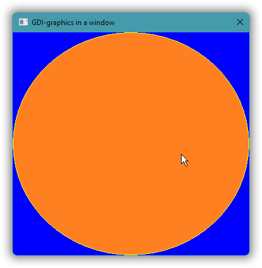
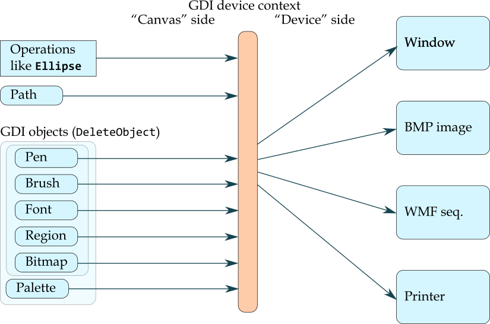
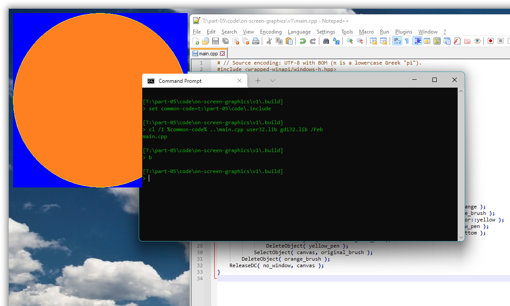
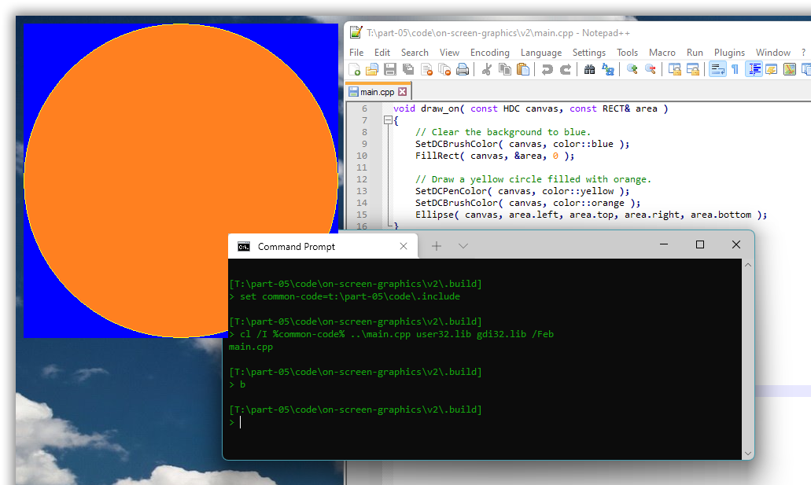

# Windows GUI-stuff in C++: a tutorial.

## Part 5 – GDI graphics: Basics.

In this and some more parts we’ll use the [**GDI**](https://en.wikipedia.org/wiki/Graphics_Device_Interface), Windows’ original *graphics device interface*, to explore basic graphics: drawing shapes, lines and text, and learning how graphics drawing relates to Windows’ GUI mechanisms.

The GDI is a good starting point for C++ graphics in Windows, because

* it’s the graphics API that the windowing functionality assumes and is originally designed for,
* it’s simple and C-oriented, which is nice, and
* you can explore GDI graphics directly on the screen, without complex windowing.

However, the GDI is generally slow and produces low quality graphics. In particular, regarding the quality, the GDI doesn’t support [anti-aliasing](https://en.wikipedia.org/wiki/Spatial_anti-aliasing), and it doesn’t support [alpha channel transparency](https://en.wikipedia.org/wiki/Alpha_compositing). These are both strong reasons to later move on to the successor technologies [GDI+](https://en.wikipedia.org/wiki/Graphics_Device_Interface#Windows_XP) and [Direct 2D](https://en.wikipedia.org/wiki/Direct2D). And unfortunately, in addition, the functionality is limited. For example, the GDI doesn’t (yet) support UTF-8 encoded Unicode text for *drawing* text as graphics, and it doesn’t support saving an image other than as an archaic non-portable ".wmf" file. Both these shortcomings are adressed in later parts; for now you can save your graphics manually by taking a screenshot of a graphics presentation.



<!-- START doctoc generated TOC please keep comment here to allow auto update -->
<!-- DON'T EDIT THIS SECTION, INSTEAD RE-RUN doctoc TO UPDATE -->
*Contents (table generated with [DocToc](https://github.com/thlorenz/doctoc)):*

- [5.1. Draw on the screen, via a device context.](#51-draw-on-the-screen-via-a-device-context)
- [5.2 Use “DC colors” to reduce the drawing code.](#52-use-dc-colors-to-reduce-the-drawing-code)
- [5.3. Present graphics in a window by handling `WM_PAINT`.](#53-present-graphics-in-a-window-by-handling-wm_paint)

<!-- END doctoc generated TOC please keep comment here to allow auto update -->

---

### 5.1. Draw on the screen, via a device context.

With the GDI you can draw more or less directly on the screen.

Drawing directly on the screen is just a special case of drawing in a window, the slightly paradoxical case of “no window”.

This involves first calling `GetDC(0)` (with `0` for “no window”) to get a handle to a drawing surface covering the screen. In Windows terminology that’s called a **device context** for the screen, and the handle type is a `HDC`, handle to device context. In more general programming the equivalent of a Windows DC is often called a **canvas**, emphasizing that it’s used for painting.

On the *output side* — the right side in the figure below — a device context generates graphics in windows, in bitmap images, to printers, and to now archaic “.wmf” image files. So, you can use roughly the same code to generate graphics for all these destinations, much like with a C++ abstract base class with `virtual` functions. There is probably some historical reason why Microsoft incongruously refers to all these graphics destinations as “devices”; maybe originally only screens and printers were supported.

The side of a device context that your code relates to, its *input side*, mainly executes drawing commands such as calls of the `Ellipse` function, but it also receives and retains drawing attributes such as a **pen** that specifies attributes of lines (e.g. color, width and pattern), and such as a **brush** that specifies attributes of color fills, in particular the fill color.



By default a device context typically has a black pen and a white brush. To draw a yellow circle filled with orange the code below uses the general GDI approach of (1) creating pen and brush objects, respectively yellow and orange; (2) **selecting** them in the device context; (3) drawing, which implicitly uses the selected objects; (4) deselecting the objects by selecting back in the original objects; and finally (5) destroying the objects. This is not necessarily inefficient, but, which is a general problem with the GDI, it’s quite verbose:

*[05/code/on-screen-graphics/v1/main.cpp](05/code/on-screen-graphics/v1/main.cpp)*:

```cpp
# // Source encoding: UTF-8 with BOM (π is a lowercase Greek "pi").
#include <wrapped-winapi-headers/windows-h.hpp>

// COLORREF is 32-bit unsigned.
namespace color {
    constexpr COLORREF  orange      = RGB( 0xFF, 0x80, 0x20 );
    constexpr COLORREF  yellow      = RGB( 0xFF, 0xFF, 0x20 );
    constexpr COLORREF  blue        = RGB( 0x00, 0x00, 0xFF );
}  // namespace color

auto main() -> int
{
    constexpr auto  no_window   = HWND( 0 );
    constexpr auto  area        = RECT{ 10, 10, 10 + 400, 10 + 400 };

    const HDC canvas = GetDC( no_window );
        // Fill the background with blue.
        const HBRUSH blue_brush = CreateSolidBrush( color::blue );
            FillRect( canvas, &area, blue_brush );
        DeleteObject( blue_brush );

        // Draw a yellow circle filled with orange.
        const HBRUSH    orange_brush                = CreateSolidBrush( color::orange );
            const HGDIOBJ   original_brush          = SelectObject( canvas, orange_brush );
                const HPEN      yellow_pen          = CreatePen( PS_SOLID, 1, color::yellow );
                    const HGDIOBJ   original_pen    = SelectObject( canvas, yellow_pen );
                        Ellipse( canvas, area.left, area.top, area.right, area.bottom );
                    SelectObject( canvas, original_pen );
                DeleteObject( yellow_pen );
            SelectObject( canvas, original_brush );
        DeleteObject( orange_brush );
    ReleaseDC( no_window, canvas );
}
```

Originally the effect was probably to actually draw directly on the screen, bypassing all the window management, and messing up the screen Real Good&trade;. But in Windows 11 there are layers of indirection and management interposed between the drawing calls and the screen output, in particular the [Desktop Window Manager](https://docs.microsoft.com/en-us/windows/win32/dwm/dwm-overview). There are some weird effects such as the graphics partially intruding in console windows, but such code still “works” and supports explorative programming.



The effect is not entirely consistent between runs. Usually, if one doesn’t fill in the background, there’s a black background around the disk; but sometimes (rarely) there’s only the disk, then with essentially transparent background; and with some other graphics I’ve seen the background from one run of one program being retained as background for the graphics from another program, which was pretty confusing, huh where did *that* come from, before I understood what was going on. This is much like the rest of Windows 11’s functionality, i.e. it’s pretty shaky, not very reliable, depending on the phase of the moon, but the unreliability doesn’t really matter here.

For completeness, the `COLORREF` type is a 32-bit [RGB](https://en.wikipedia.org/wiki/RGB_color_model) **color** specification (3×8 = 24 bits used), and the `RECT` type is a simple struct with `left`, `top`, `right` and `bottom` integer value members.

In the default pixel coordinate system *x* increases left to right so that `left` ≤ `right` and *y* increases top to bottom so that `top` ≤ `bottom`.

Worth knowing: the `right` pixel column and the `bottom` pixel row are not part of a `RECT` rectangle. These are “beyond” values just like a C++ `o.end()` iterator. Thus the initialization `RECT{ 10, 10, 10 + 400, 10 + 400 }` creates a 400×400 rectangle.

Also, for completeness, here’s how to build and run with the Microsoft toolchain, Visual C++ (needs linking with “**gdi32**.lib”):

```txt
[T:\05\code\on-screen-graphics\v1\.build]
> set common-code=t:\05\code\.include

[T:\05\code\on-screen-graphics\v1\.build]
> cl /I %common-code% ..\main.cpp user32.lib gdi32.lib /Feb
main.cpp

[T:\05\code\on-screen-graphics\v1\.build]
> b_
```

Ditto, building and running with the MinGW toolchain, g++:

```txt
[T:\05\code\on-screen-graphics\v1\.build]
> set common-code=t:\05\code\.include

[T:\05\code\on-screen-graphics\v1\.build]
> g++ -I %common-code% ..\main.cpp -lgdi32

[T:\05\code\on-screen-graphics\v1\.build]
> a_
```

### 5.2 Use “DC colors” to reduce the drawing code.

Instead of creating, selecting, using, unselecting and destroying pen and brush objects, as long as you don’t need fancy effects such as line patterns you can just change the device context’s **DC pen color** and **DC brush color**, via respectively `SetDCPenColor` and `SetDCBrushColor`. These colors are only *used* when the **stock objects** you get from respectively `GetStockObject(DC_PEN)` and `GetStockObject(DC_BRUSH)` are selected in the device context.

My experimentation showed that in Windows 11 these are not the default objects in a DC from `GetDC(0)`, so it’s necessary to explicitly select them:

*[05/code/on-screen-graphics/v2/main.cpp](05/code/on-screen-graphics/v2/main.cpp)*:

```cpp
# // Source encoding: UTF-8 with BOM (π is a lowercase Greek "pi").
#include <winapi/gdi/color_names.hpp>
#include <wrapped-winapi-headers/windows-h.hpp>
namespace color = winapi::gdi::color_names;

void draw_on( const HDC canvas, const RECT& area )
{
    // Clear the background to blue.
    SetDCBrushColor( canvas, color::blue );
    FillRect( canvas, &area, 0 );

    // Draw a yellow circle filled with orange.
    SetDCPenColor( canvas, color::yellow );
    SetDCBrushColor( canvas, color::orange );
    Ellipse( canvas, area.left, area.top, area.right, area.bottom );
}

auto main() -> int
{
    constexpr auto  no_window   = HWND( 0 );

    const HDC canvas = GetDC( no_window );
    SelectObject( canvas, GetStockObject( DC_PEN ) );
    SelectObject( canvas, GetStockObject( DC_BRUSH ) );

        draw_on( canvas, RECT{ 10, 10, 10 + 400, 10 + 400 } );

    ReleaseDC( no_window, canvas );
}
```

… where

*[05/code/.include/winapi/gdi/color_names.hpp](05/code/.include/winapi/gdi/color_names.hpp)*:

```cpp
#pragma once    // Source encoding: UTF-8 with BOM (π is a lowercase Greek "pi").
#include <wrapped-winapi/windows-h.hpp>

namespace winapi::gdi {

    // COLORREF is 32-bit unsigned.
    namespace color_names {
        constexpr COLORREF  orange      = RGB( 0xFF, 0x80, 0x20 );
        constexpr COLORREF  yellow      = RGB( 0xFF, 0xFF, 0x20 );
        constexpr COLORREF  blue        = RGB( 0x00, 0x00, 0xFF );
    }  // namespace color_names

}  // namespace winapi::gdi
```

Result: same as before, just with shorter & more clear code,



The [current documentation of `SelectObject`](https://docs.microsoft.com/en-us/windows/win32/api/wingdi/nf-wingdi-selectobject) states that the object one selects “must have been created” by one of the functions listed in a table there, which does not include `GetStockObject`. But of course that’s just the usual Microsoft documentation SNAFU. The stock objects would not be useful for anything if they couldn’t be used.

However, the stock objects are special in that they don’t need to and shouldn’t be destroyed via `DeleteObject` (or any other way).

---

### 5.3. Present graphics in a window by handling `WM_PAINT`.

Windows was originally designed for computers with very little memory and processing capacity. And so the original scheme for presenting graphics avoided the need for the system to store the graphics for each window, by having each application *regenerate* each of its windows’ graphics on demand. Later Windows got support for remembering window graphics (no longer a steep cost in memory and processing time usage), through “layered windows” and the “desktop window manager” (DWM), but most code still just uses the original scheme.

Windows asks for graphics regeneration, or updating, via the **`WM_PAINT`** window message. Handling of this message should include

* calling the **`BeginPaint`** function, which returns a suitable device context handle,
* generating the graphics, and
* in any case, even if `BeginPaint` failed, calling the **`EndPaint`** function.

Given the low accuracy of Microsoft’s documentation it’s quite possible that `EndPaint` needs not actually be called when `BeginPaint` fails, or even that it ideally should not be called in that case, which would make this functionality more suitable for C++ RAII treatment, i.e. calling `BeginPaint` in a C++ constructor and `EndPaint` in a destructor. However, the code I present here now doesn’t employ C++ level automation. There’s some abstraction but it’s just C++-as-more-convenient-C:

```cpp
void paint( const HWND window )
{
    PAINTSTRUCT info;
    if( const HDC dc = BeginPaint( window, &info ) ) {
        SelectObject( dc, GetStockObject( DC_PEN ) );
        SelectObject( dc, GetStockObject( DC_BRUSH ) );
        ::paint( window, dc );
    }
    EndPaint( window, &info );  // Docs say this must be called for each BeginPaint.
}
```

The `paint` function that takes a `HDC` argument is just responsible for finding the rectangle inside the window where graphics should be presented, and calling a `draw_on` function identical to the one in the previous section. The area where ordinary window content graphics can be presented is called the **client area** (from a Windows API library developer’s point of view it’s the area available to “client code”, code that uses the library). And the **`GetClientRect`** function finds that area:

```cpp
void paint( const HWND window, const HDC dc )
{
    RECT client_rect;
    GetClientRect( window, &client_rect );
    draw_on( dc, client_rect );
}
```

Both the resulting `RECT` coordinates and the coordinates of the device context are relative to the client area, i.e. (0,&nbsp;0) is at the upper left of the client area. And so the client area rectangle’s `left` and `top` are usually just ignored; they’re zero. However, our existing drawing code makes no such assumption, and I chose to use it unchanged:

```cpp
void draw_on( const HDC canvas, const RECT& area )
{
    // Clear the background to blue.
    SetDCBrushColor( canvas, color::blue );
    FillRect( canvas, &area, 0 );

    // Draw a yellow circle filled with orange.
    SetDCPenColor( canvas, color::yellow );
    SetDCBrushColor( canvas, color::orange );
    Ellipse( canvas, area.left, area.top, area.right, area.bottom );
}
```

Result, with the client area filled with our graphics:


---

For completeness, the full code:

*[05/code/graphics-in-window/v1/resources.h](05/code/graphics-in-window/v1/resources.h)*:
```cpp
#pragma once

#define IDC_STATIC                      -1
#define IDD_MAIN_WINDOW                 101
```

*[05/code/graphics-in-window/v1/resources.rc](05/code/graphics-in-window/v1/resources.rc)*:
```rc
#pragma code_page( 1252 )   // Windows ANSI Western encoding, an extension of Latin 1.
#include "resources.h"
#include <windows.h>


/////////////////////////////////////////////////////////////////////////////
// English (United States) resources
LANGUAGE LANG_ENGLISH, SUBLANG_ENGLISH_US

IDD_MAIN_WINDOW DIALOGEX 0, 0, 40, 30
STYLE DS_SETFONT | DS_CENTER | WS_CAPTION | WS_SYSMENU
EXSTYLE WS_EX_OVERLAPPEDWINDOW | WS_EX_TOPMOST
CAPTION "GDI-graphics in a window"
FONT 8, "MS Shell Dlg", 400, 0, 0x1
BEGIN
END
```

*[05/code/graphics-in-window/v1/main.cpp](05/code/graphics-in-window/v1/main.cpp)*:
```cpp
#include "resources.h"                  // Resource identifier macros.

#include <winapi/gdi/color_names.hpp>   // winapi::gdi::color_names::*
#include <winapi/gui/util.hpp>          // winapi::gui::*, winapi::kernel::*

namespace color = winapi::gdi::color_names;
namespace wg    = winapi::gui;
namespace wk    = winapi::kernel;

#include <stdlib.h>     // EXIT_...

#include <optional>
using   std::optional;

void draw_on( const HDC canvas, const RECT& area )
{
    // Clear the background to blue.
    SetDCBrushColor( canvas, color::blue );
    FillRect( canvas, &area, 0 );

    // Draw a yellow circle filled with orange.
    SetDCPenColor( canvas, color::yellow );
    SetDCBrushColor( canvas, color::orange );
    Ellipse( canvas, area.left, area.top, area.right, area.bottom );
}

void paint( const HWND window, const HDC dc )
{
    RECT client_rect;
    GetClientRect( window, &client_rect );
    draw_on( dc, client_rect );
}

void set_client_area_size( const HWND window, const int width, const int height )
{
    RECT r = {0, 0, width, height};                 // Desired client area.

    const LONG window_style = GetWindowLong( window, GWL_STYLE );
    const bool has_menu = (GetMenu( window ) != 0);
    AdjustWindowRect( &r, window_style, has_menu ); // Find window size for given client rect.

    SetWindowPos( window, HWND(), 0, 0, r.right, r.bottom, SWP_NOMOVE|SWP_NOZORDER );
}

namespace on_wm {
    void close( const HWND window )
    {
        EndDialog( window, IDOK );
    }

    auto initdialog( const HWND window, const HWND /*focus*/, const LPARAM /*ell_param*/ )
        -> bool
    {
        wg::remove_topmost_style_for( window );
        set_client_area_size( window, 400, 400 );
        
        return true;    // `true` sets focus to the `focus` control.
    }

    void paint( const HWND window )
    {
        PAINTSTRUCT info;
        if( const HDC dc = BeginPaint( window, &info ) ) {
            SelectObject( dc, GetStockObject( DC_PEN ) );
            SelectObject( dc, GetStockObject( DC_BRUSH ) );
            ::paint( window, dc );
        }
        EndPaint( window, &info );  // Docs say this must be called for each BeginPaint.
    }
}  // namespace on_wm

auto CALLBACK dialog_message_handler(
    const HWND      window,
    const UINT      msg_id,
    const WPARAM    w_param,
    const LPARAM    ell_param
    ) -> INT_PTR
{
    optional<INT_PTR> result;

    #define HANDLE_WM( name, handler_func ) \
        HANDLE_WM_##name( window, w_param, ell_param, handler_func )
    switch( msg_id ) {
        case WM_CLOSE:      result = HANDLE_WM( CLOSE,      on_wm::close ); break;
        case WM_INITDIALOG: result = HANDLE_WM( INITDIALOG, on_wm::initdialog ); break;
        case WM_PAINT:      result = HANDLE_WM( PAINT,      on_wm::paint ); break;
    }
    #undef HANDLE_WM

    // `false` => Didn't process the message, want default processing.
    return (result? SetDlgMsgResult( window, msg_id, result.value() ) : false);
}

auto main() -> int
{
    // The `DialogBox` return value is misdocumented per 2022, but is like `DialogBoxParam`.
    const auto dialogbox_result = DialogBox(
        wk::this_exe,
        wk::Resource_id{ IDD_MAIN_WINDOW }.as_pseudo_ptr(),
        HWND(),             // Parent window, a zero handle is "no parent".
        &dialog_message_handler
        );
    return (dialogbox_result <= 0? EXIT_FAILURE : EXIT_SUCCESS);
}
```

---

Also for completeness, how to build (here implicitly specifying the console subsystem, which generally is a good idea for development builds, e.g. to be able to inspect the process exit code):

*Using Visual C++*:
```
[T:\05\code\graphics-in-window\v1\.build]
> rc /nologo /fo"r.res" ..\resources.rc

[T:\05\code\graphics-in-window\v1\.build]
> set common-code=t:\05\code\.include

[T:\05\code\graphics-in-window\v1\.build]
> cl /I%common-code% ..\main.cpp user32.lib gdi32.lib r.res /Fe"gdi-graphics"
main.cpp

[T:\05\code\graphics-in-window\v1\.build]
> gdi-graphics
```

*Using MinGW g++*:
```
[T:\05\code\graphics-in-window\v1\.build]
> windres ..\resources.rc -o r.o

[T:\05\code\graphics-in-window\v1\.build]
> set common-code=t:\05\code\.include

[T:\05\code\graphics-in-window\v1\.build]
> g++ -std=c++17 -I%common-code% ..\main.cpp r.o -lgdi32 -o gdi-graphics

[T:\05\code\graphics-in-window\v1\.build]
> gdi-graphics
```


| ← previous |  up ↑ | next → |
|:----|:----:|---:|
| [4. UTF-8 as the one and only text encoding.](04.md) | [Contents](index.md)  | &nbsp;&nbsp;&nbsp;&nbsp;&nbsp;&nbsp;&nbsp;&nbsp;&nbsp;&nbsp;&nbsp;&nbsp;&nbsp;&nbsp;&nbsp;&nbsp;&nbsp;&nbsp;&nbsp;&nbsp;&nbsp;&nbsp;&nbsp;&nbsp;&nbsp;&nbsp;&nbsp;&nbsp;&nbsp;&nbsp;&nbsp;&nbsp;&nbsp;&nbsp;&nbsp;&nbsp;&nbsp;&nbsp;&nbsp;&nbsp;&nbsp;&nbsp;&nbsp;&nbsp;&nbsp;&nbsp;&nbsp;&nbsp;&nbsp;&nbsp;&nbsp;&nbsp;&nbsp;&nbsp;&nbsp;&nbsp; ? |
