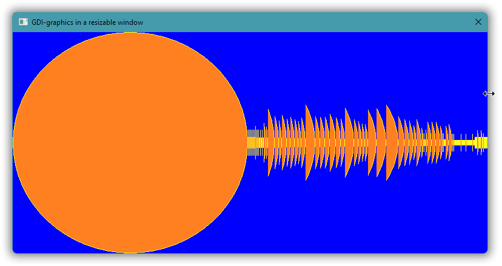
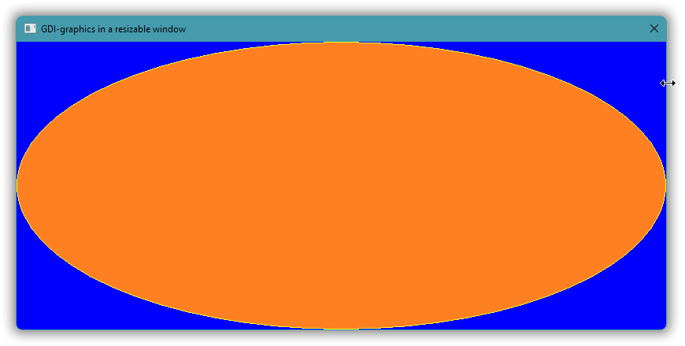
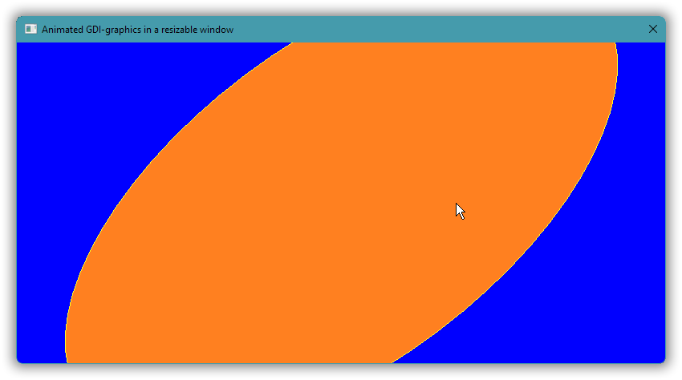

# Windows GUI-stuff in C++: a tutorial.

## Part 5 – GDI graphics: Basics.

In this and some more parts we’ll use the [**GDI**](https://en.wikipedia.org/wiki/Graphics_Device_Interface), Windows’ original *graphics device interface*, to explore basic graphics: drawing shapes, lines and text, and learning how graphics drawing relates to Windows’ GUI mechanisms.

The GDI is a good starting point for C++ graphics in Windows, because

* it’s the graphics API that the windowing functionality assumes and is originally designed for,
* it’s simple and C-oriented, which is nice, and
* you can explore GDI graphics directly on the screen, without complex windowing.

However, the GDI is generally slow and produces low quality graphics. In particular, regarding the quality, the GDI doesn’t support [anti-aliasing](https://en.wikipedia.org/wiki/Spatial_anti-aliasing), and it doesn’t support [alpha channel transparency](https://en.wikipedia.org/wiki/Alpha_compositing). These are both strong reasons to later move on to the successor technologies [GDI+](https://en.wikipedia.org/wiki/Graphics_Device_Interface#Windows_XP) and [Direct 2D](https://en.wikipedia.org/wiki/Direct2D). And unfortunately, in addition, the functionality is limited. For example, the GDI doesn’t (yet) support UTF-8 encoded Unicode text for *drawing* text as graphics, and it doesn’t support saving an image other than as an archaic non-portable ".wmf" file. Both these shortcomings are adressed in later parts; for now you can save your graphics manually by taking a screenshot of a graphics presentation.


<!-- START doctoc generated TOC please keep comment here to allow auto update -->
<!-- DON'T EDIT THIS SECTION, INSTEAD RE-RUN doctoc TO UPDATE -->
*Contents (table generated with [DocToc](https://github.com/thlorenz/doctoc)):*

- [5.1. Draw on the screen, via a device context.](#51-draw-on-the-screen-via-a-device-context)
- [5.2 Use “DC colors” to reduce the drawing code.](#52-use-dc-colors-to-reduce-the-drawing-code)
- [5.3. Present graphics in a window by handling `WM_PAINT`.](#53-present-graphics-in-a-window-by-handling-wm_paint)
- [5.4. Support a dynamic window sized ellipse via `WM_SIZE` + `InvalidateRect`.](#54-support-a-dynamic-window-sized-ellipse-via-wm_size--invalidaterect)
- [5.5. Avoid animation flicker by handling `WM_ERASEBKGND` and using double buffering.](#55-avoid-animation-flicker-by-handling-wm_erasebkgnd-and-using-double-buffering)

<!-- END doctoc generated TOC please keep comment here to allow auto update -->

---

### 5.1. Draw on the screen, via a device context.

With the GDI you can draw more or less directly on the screen.

Drawing directly on the screen is just a special case of drawing in a window, the slightly paradoxical case of “no window”.

This involves first calling `GetDC(0)` (with `0` for “no window”) to get a handle to a drawing surface covering the screen. In Windows terminology that’s called a **device context** for the screen, and the handle type is a `HDC`, handle to device context. In more general programming the equivalent of a Windows DC is often called a **canvas**, emphasizing that it’s used for painting.

On the *output side* — the right side in the figure below — a device context generates graphics in windows, in bitmap images, to printers, and to now archaic “.wmf” image files. So, you can use roughly the same code to generate graphics for all these destinations, much like with a C++ abstract base class with `virtual` functions. There is probably some historical reason why Microsoft incongruously refers to all these graphics destinations as “devices”; maybe originally only screens and printers were supported.

The side of a device context that your code relates to, its *input side*, mainly executes drawing commands such as calls of the `Ellipse` function, but it also receives and retains drawing attributes such as a **pen** that specifies attributes of lines (e.g. color, width and pattern), and such as a **brush** that specifies attributes of color fills, in particular the fill color.


By default a device context typically has a black pen and a white brush. To draw a yellow circle filled with orange the code below uses the general GDI approach of (1) creating pen and brush objects, respectively yellow and orange; (2) **selecting** them in the device context; (3) drawing, which implicitly uses the selected objects; (4) deselecting the objects by selecting back in the original objects; and finally (5) destroying the objects. This is not necessarily inefficient, but, which is a general problem with the GDI, it’s quite verbose:

*[05/code/on-screen-graphics/v1/main.cpp](05/code/on-screen-graphics/v1/main.cpp)*:

```cpp
# // Source encoding: UTF-8 with BOM (π is a lowercase Greek "pi").
#include <wrapped-winapi-headers/windows-h.hpp>

// COLORREF is 32-bit unsigned.
namespace color {
    constexpr COLORREF  orange      = RGB( 0xFF, 0x80, 0x20 );
    constexpr COLORREF  yellow      = RGB( 0xFF, 0xFF, 0x20 );
    constexpr COLORREF  blue        = RGB( 0x00, 0x00, 0xFF );
}  // namespace color

auto main() -> int
{
    constexpr auto  no_window   = HWND( 0 );
    constexpr auto  area        = RECT{ 10, 10, 10 + 400, 10 + 400 };

    const HDC canvas = GetDC( no_window );
        // Fill the background with blue.
        const HBRUSH blue_brush = CreateSolidBrush( color::blue );
            FillRect( canvas, &area, blue_brush );
        DeleteObject( blue_brush );

        // Draw a yellow circle filled with orange.
        const HBRUSH    orange_brush                = CreateSolidBrush( color::orange );
            const HGDIOBJ   original_brush          = SelectObject( canvas, orange_brush );
                const HPEN      yellow_pen          = CreatePen( PS_SOLID, 1, color::yellow );
                    const HGDIOBJ   original_pen    = SelectObject( canvas, yellow_pen );
                        Ellipse( canvas, area.left, area.top, area.right, area.bottom );
                    SelectObject( canvas, original_pen );
                DeleteObject( yellow_pen );
            SelectObject( canvas, original_brush );
        DeleteObject( orange_brush );
    ReleaseDC( no_window, canvas );
}
```

Originally the effect was probably to actually draw directly on the screen, bypassing all the window management, and messing up the screen Real Good&trade;. But in Windows 11 there are layers of indirection and management interposed between the drawing calls and the screen output, in particular the [Desktop Window Manager](https://docs.microsoft.com/en-us/windows/win32/dwm/dwm-overview). There are some weird effects such as the graphics partially intruding in console windows, but such code still “works” and supports explorative programming.


The effect is not entirely consistent between runs. Usually, if one doesn’t fill in the background, there’s a black background around the disk; but sometimes (rarely) there’s only the disk, then with essentially transparent background; and with some other graphics I’ve seen the background from one run of one program being retained as background for the graphics from another program, which was pretty confusing, huh where did *that* come from, before I understood what was going on. This is much like the rest of Windows 11’s functionality, i.e. it’s pretty shaky, not very reliable, depending on the phase of the moon, but the unreliability doesn’t really matter here.

For completeness, the `COLORREF` type is a 32-bit [RGB](https://en.wikipedia.org/wiki/RGB_color_model) **color** specification (3×8 = 24 bits used), and the `RECT` type is a simple struct with `left`, `top`, `right` and `bottom` integer value members.

In the default pixel coordinate system *x* increases left to right so that `left` ≤ `right` and *y* increases top to bottom so that `top` ≤ `bottom`.

Worth knowing: the `right` pixel column and the `bottom` pixel row are not part of a `RECT` rectangle. These are “beyond” values just like a C++ `o.end()` iterator. Thus the initialization `RECT{ 10, 10, 10 + 400, 10 + 400 }` creates a 400×400 rectangle.

Also, for completeness, here’s how to build and run with the Microsoft toolchain, Visual C++ (needs linking with “**gdi32**.lib”):

```txt
[T:\05\code\on-screen-graphics\v1\.build]
> set common-code=t:\05\code\.include

[T:\05\code\on-screen-graphics\v1\.build]
> cl /I %common-code% ..\main.cpp user32.lib gdi32.lib /Feb
main.cpp

[T:\05\code\on-screen-graphics\v1\.build]
> b_
```

Ditto, building and running with the MinGW toolchain, g++:

```txt
[T:\05\code\on-screen-graphics\v1\.build]
> set common-code=t:\05\code\.include

[T:\05\code\on-screen-graphics\v1\.build]
> g++ -I %common-code% ..\main.cpp -lgdi32

[T:\05\code\on-screen-graphics\v1\.build]
> a_
```

### 5.2 Use “DC colors” to reduce the drawing code.

Instead of creating, selecting, using, unselecting and destroying pen and brush objects, as long as you don’t need fancy effects such as line patterns you can just change the device context’s **DC pen color** and **DC brush color**, via respectively `SetDCPenColor` and `SetDCBrushColor`. These colors are only *used* when the **stock objects** you get from respectively `GetStockObject(DC_PEN)` and `GetStockObject(DC_BRUSH)` are selected in the device context.

My experimentation showed that in Windows 11 these are not the default objects in a DC from `GetDC(0)`, so it’s necessary to explicitly select them:

*[05/code/on-screen-graphics/v2/main.cpp](05/code/on-screen-graphics/v2/main.cpp)*:

```cpp
# // Source encoding: UTF-8 with BOM (π is a lowercase Greek "pi").
#include <winapi/gdi/color_names.hpp>
#include <wrapped-winapi-headers/windows-h.hpp>
namespace color = winapi::gdi::color_names;

void draw_on( const HDC canvas, const RECT& area )
{
    // Clear the background to blue.
    SetDCBrushColor( canvas, color::blue );
    FillRect( canvas, &area, 0 );

    // Draw a yellow circle filled with orange.
    SetDCPenColor( canvas, color::yellow );
    SetDCBrushColor( canvas, color::orange );
    Ellipse( canvas, area.left, area.top, area.right, area.bottom );
}

auto main() -> int
{
    constexpr auto  no_window   = HWND( 0 );

    const HDC canvas = GetDC( no_window );
    SelectObject( canvas, GetStockObject( DC_PEN ) );
    SelectObject( canvas, GetStockObject( DC_BRUSH ) );

        draw_on( canvas, RECT{ 10, 10, 10 + 400, 10 + 400 } );

    ReleaseDC( no_window, canvas );
}
```

… where

*[05/code/.include/winapi/gdi/color_names.hpp](05/code/.include/winapi/gdi/color_names.hpp)*:

```cpp
#pragma once    // Source encoding: UTF-8 with BOM (π is a lowercase Greek "pi").
#include <wrapped-winapi-headers/windows-h.hpp>

namespace winapi::gdi {

    // COLORREF is 32-bit unsigned.
    namespace color_names {
        constexpr COLORREF  orange      = RGB( 0xFF, 0x80, 0x20 );
        constexpr COLORREF  yellow      = RGB( 0xFF, 0xFF, 0x20 );
        constexpr COLORREF  blue        = RGB( 0x00, 0x00, 0xFF );
    }  // namespace color_names

}  // namespace winapi::gdi
```

Result: same as before, just with shorter & more clear code,


The [current documentation of `SelectObject`](https://docs.microsoft.com/en-us/windows/win32/api/wingdi/nf-wingdi-selectobject) states that the object one selects “must have been created” by one of the functions listed in a table there, which does not include `GetStockObject`. But of course that’s just the usual Microsoft documentation SNAFU. The stock objects would not be useful for anything if they couldn’t be used.

However, the stock objects are special in that they don’t need to and shouldn’t be destroyed via `DeleteObject` (or any other way).

---

### 5.3. Present graphics in a window by handling `WM_PAINT`.

Windows was originally designed for computers with very little memory and processing capacity. And so the original scheme for presenting graphics avoided the need for the system to store the graphics for each window, by having each application *regenerate* each of its windows’ graphics on demand. Later Windows got support for remembering window graphics (no longer a steep cost in memory and processing time usage), through “layered windows” and the “desktop window manager” (DWM), but most code still just uses the original scheme.

Windows asks for graphics regeneration, or updating, via the **`WM_PAINT`** window message. Handling of this message should include

* calling the **`BeginPaint`** function, which returns a suitable device context handle,
* generating the graphics, and
* in any case, even if `BeginPaint` failed, calling the **`EndPaint`** function.

Given the low accuracy of Microsoft’s documentation it’s quite possible that `EndPaint` needs not actually be called when `BeginPaint` fails, or even that it ideally should not be called in that case, which would make this functionality more suitable for C++ RAII treatment, i.e. calling `BeginPaint` in a C++ constructor and `EndPaint` in a destructor. However, the code I present here now doesn’t employ C++ level automation. There’s some abstraction but it’s just C++-as-more-convenient-C:

```cpp
void paint( const HWND window )
{
    PAINTSTRUCT info;
    if( const HDC dc = BeginPaint( window, &info ) ) {
        SelectObject( dc, GetStockObject( DC_PEN ) );
        SelectObject( dc, GetStockObject( DC_BRUSH ) );
        ::paint( window, dc );
    }
    EndPaint( window, &info );  // Docs say this must be called for each BeginPaint.
}
```

The `paint` function that takes a `HDC` argument is just responsible for finding the rectangle inside the window where graphics should be presented, and calling a `draw_on` function identical to the one in the previous section. The area where ordinary window content graphics can be presented is called the **client area** (from a Windows API library developer’s point of view it’s the area available to “client code”, code that uses the library). And the **`GetClientRect`** function finds that area:

```cpp
void paint( const HWND window, const HDC dc )
{
    RECT client_rect;
    GetClientRect( window, &client_rect );
    draw_on( dc, client_rect );
}
```

Both the resulting `RECT` coordinates and the coordinates of the device context are relative to the client area, i.e. (0,&nbsp;0) is at the upper left of the client area. And so the client area rectangle’s `left` and `top` are usually just ignored; they’re zero. However, our existing drawing code makes no such assumption, and I chose to use it unchanged:

```cpp
void draw_on( const HDC canvas, const RECT& area )
{
    // Clear the background to blue.
    SetDCBrushColor( canvas, color::blue );
    FillRect( canvas, &area, 0 );

    // Draw a yellow circle filled with orange.
    SetDCPenColor( canvas, color::yellow );
    SetDCBrushColor( canvas, color::orange );
    Ellipse( canvas, area.left, area.top, area.right, area.bottom );
}
```

Result, with the client area filled with our graphics:


---

For completeness, the full code:

*[05/code/graphics-in-window/v1/resources.h](05/code/graphics-in-window/v1/resources.h)*:
```cpp
#pragma once

#define IDC_STATIC                      -1
#define IDD_MAIN_WINDOW                 101
```

*[05/code/graphics-in-window/v1/resources.rc](05/code/graphics-in-window/v1/resources.rc)*:
```rc
#pragma code_page( 1252 )   // Windows ANSI Western encoding, an extension of Latin 1.
#include "resources.h"
#include <windows.h>


/////////////////////////////////////////////////////////////////////////////
// English (United States) resources
LANGUAGE LANG_ENGLISH, SUBLANG_ENGLISH_US

IDD_MAIN_WINDOW DIALOGEX 0, 0, 40, 30
STYLE DS_SETFONT | DS_CENTER | WS_CAPTION | WS_SYSMENU
EXSTYLE WS_EX_OVERLAPPEDWINDOW | WS_EX_TOPMOST
CAPTION "GDI-graphics in a window"
FONT 8, "MS Shell Dlg", 400, 0, 0x1
BEGIN
END
```

*[05/code/graphics-in-window/v1/main.cpp](05/code/graphics-in-window/v1/main.cpp)*:
```cpp
#include "resources.h"                  // Resource identifier macros.

#include <winapi/gdi/color_names.hpp>   // winapi::gdi::color_names::*
#include <winapi/gui/util.hpp>          // winapi::gui::*, winapi::kernel::*

namespace color = winapi::gdi::color_names;
namespace wg    = winapi::gui;
namespace wk    = winapi::kernel;

#include <stdlib.h>     // EXIT_...

#include <optional>
using   std::optional;

void draw_on( const HDC canvas, const RECT& area )
{
    // Clear the background to blue.
    SetDCBrushColor( canvas, color::blue );
    FillRect( canvas, &area, 0 );

    // Draw a yellow circle filled with orange.
    SetDCPenColor( canvas, color::yellow );
    SetDCBrushColor( canvas, color::orange );
    Ellipse( canvas, area.left, area.top, area.right, area.bottom );
}

void paint( const HWND window, const HDC dc )
{
    RECT client_rect;
    GetClientRect( window, &client_rect );
    draw_on( dc, client_rect );
}

namespace on_wm {
    void close( const HWND window )
    {
        EndDialog( window, IDOK );
    }

    auto initdialog( const HWND window, const HWND /*focus*/, const LPARAM /*ell_param*/ )
        -> bool
    {
        wg::remove_topmost_style_for( window );
        wg::set_client_area_size( window, 400, 400 );
        
        return true;    // `true` sets focus to the `focus` control.
    }

    void paint( const HWND window )
    {
        PAINTSTRUCT info;
        if( const HDC dc = BeginPaint( window, &info ) ) {
            SelectObject( dc, GetStockObject( DC_PEN ) );
            SelectObject( dc, GetStockObject( DC_BRUSH ) );
            ::paint( window, dc );
        }
        EndPaint( window, &info );  // Docs say this must be called for each BeginPaint.
    }
}  // namespace on_wm

auto CALLBACK dialog_message_handler(
    const HWND      window,
    const UINT      msg_id,
    const WPARAM    w_param,
    const LPARAM    ell_param
    ) -> INT_PTR
{
    optional<INT_PTR> result;

    #define HANDLE_WM( name, handler_func ) \
        HANDLE_WM_##name( window, w_param, ell_param, handler_func )
    switch( msg_id ) {
        case WM_CLOSE:      result = HANDLE_WM( CLOSE,      on_wm::close ); break;
        case WM_INITDIALOG: result = HANDLE_WM( INITDIALOG, on_wm::initdialog ); break;
        case WM_PAINT:      result = HANDLE_WM( PAINT,      on_wm::paint ); break;
    }
    #undef HANDLE_WM

    // `false` => Didn't process the message, want default processing.
    return (result? SetDlgMsgResult( window, msg_id, result.value() ) : false);
}

auto main() -> int
{
    // The `DialogBox` return value is misdocumented per 2022, but is like `DialogBoxParam`.
    const auto dialogbox_result = DialogBox(
        wk::this_exe,
        wk::Resource_id{ IDD_MAIN_WINDOW }.as_pseudo_ptr(),
        HWND(),             // Parent window, a zero handle is "no parent".
        &dialog_message_handler
        );
    return (dialogbox_result <= 0? EXIT_FAILURE : EXIT_SUCCESS);
}
```

---

Also for completeness, how to build (here implicitly specifying the console subsystem, which generally is a good idea for development builds, e.g. to be able to inspect the process exit code):

*Using Visual C++*:
```
[T:\05\code\graphics-in-window\v1\.build]
> rc /nologo /fo"r.res" ..\resources.rc

[T:\05\code\graphics-in-window\v1\.build]
> set common-code=t:\05\code\.include

[T:\05\code\graphics-in-window\v1\.build]
> cl /I%common-code% ..\main.cpp user32.lib gdi32.lib r.res /Fe"gdi-graphics"
main.cpp

[T:\05\code\graphics-in-window\v1\.build]
> gdi-graphics
```

*Using MinGW g++*:
```
[T:\05\code\graphics-in-window\v1\.build]
> windres ..\resources.rc -o r.o

[T:\05\code\graphics-in-window\v1\.build]
> set common-code=t:\05\code\.include

[T:\05\code\graphics-in-window\v1\.build]
> g++ -std=c++17 -I%common-code% ..\main.cpp r.o -lgdi32 -o gdi-graphics

[T:\05\code\graphics-in-window\v1\.build]
> gdi-graphics
```
---

### 5.4. Support a dynamic window sized ellipse via `WM_SIZE` + `InvalidateRect`.

What happens if we change the dialog definition to enable window resizing?

Well, the current drawing code adjusts the ellipse size to the window size, because it’s passed the client area rectangle as the area to draw in. But dialog windows are designed for *static layout content*, content that doesn’t move or change size depending on the window size. And Windows optimizes the graphics drawing under that (for our graphics invalid!) assumption, namely by **suppressing** the effect of graphics operations in areas that as far as Windows knows do not need updating, e.g. areas not uncovered by sizing.

The effect of Windows retaining original client area content and only honoring the graphics requests in newly uncovered areas, can be visually stunning and unexpected:



---

The dialog definition enables that resizing by including window style **`WS_THICKFRAME`**, which originally resulted in a thick window frame usable for grabbing with the mouse. This *is* the option for “resizable window”; it’s just named after its original visual effect instead of the functionality it enables. In the same direction, with Microsoft ignoring the functionality aspects that should matter most, in modern Windows the frame you can grab with the mouse looks stylish but is just 1 pixel wide, requiring very fine mouse positioning and very steady hands; a Windows for a subset of the population.

*[05/code/graphics-in-window/v2/resources.rc](05/code/graphics-in-window/v2/resources.rc)*:
```rc
#pragma code_page( 1252 )   // Windows ANSI Western encoding, an extension of Latin 1.
#include "resources.h"
#include <windows.h>


/////////////////////////////////////////////////////////////////////////////
// English (United States) resources
LANGUAGE LANG_ENGLISH, SUBLANG_ENGLISH_US

IDD_MAIN_WINDOW DIALOGEX 0, 0, 40, 30
STYLE DS_SETFONT | DS_CENTER | WS_CAPTION | WS_SYSMENU | WS_THICKFRAME
EXSTYLE WS_EX_OVERLAPPEDWINDOW | WS_EX_TOPMOST
CAPTION "GDI-graphics in a resizable window"
FONT 8, "MS Shell Dlg", 400, 0, 0x1
BEGIN
END
```

---

One way to fix the problem is to call **`InvalidateRect`** each time the window size changes. When the window size has changed the window receives a **`WM_SIZE`** message, so all that’s needed is to handle that message and call `InvalidateRect`. A nullpointer as rectangle argument specifies the client area, so one doesn’t need to call `GetClientRect`.

As its name implies `InvalidateRect` **invalidates** a specified rectangle, which means that the graphics in that rectangle is considered to be out of date and in need of an update, which causes all of that rectangle to be part of the **update region** that is affected by `WM_PAINT` graphics operations.

The `WM_SIZE` handler can look like this:

*In [05/code/graphics-in-window/v2/main.cpp](05/code/graphics-in-window/v2/main.cpp)*:
```cpp
namespace on_wm {
    void size( const HWND window, const UINT state, const int new_width, const int new_height )
    {
        ignore = state; ignore = new_width; ignore = new_height;
        const auto the_whole_client_area = nullptr;
        InvalidateRect( window, the_whole_client_area, not "erase the background" );
    }
}  // namespace on_wm
```

The last `InvalidateRect` argument is a boolean that specifies whether the update region, the *background* for our drawing code, should be erased before each `WM_PAINT`. Since our drawing code completely fills the update region with graphics this argument is `false` above. I fell for the temptation to express that `false` in a clever way; it may or may not be more informative than a direct boolean value when or if one gets used to it.

The handler function signature, which is assumed by the `HANDLE_WM_SIZE` macro, is documented in a comment along with the definition of that macro in Microsoft’s (but unfortunately not in the MinGW) `<windowsx.h>` header.

For completeness, the complete dialog window message handler, its “dialog proc”, which invokes `HANDLE_WM_SIZE` via an internal [DRY](https://en.wikipedia.org/wiki/Don%27t_repeat_yourself)-support macro `HANDLE_WM`:

*In [05/code/graphics-in-window/v2/main.cpp](05/code/graphics-in-window/v2/main.cpp)*:
```cpp
auto CALLBACK dialog_message_handler(
    const HWND      window,
    const UINT      msg_id,
    const WPARAM    w_param,
    const LPARAM    ell_param
    ) -> INT_PTR
{
    optional<INT_PTR> result;

    #define HANDLE_WM( name, handler_func ) \
        HANDLE_WM_##name( window, w_param, ell_param, handler_func )
    switch( msg_id ) {
        case WM_CLOSE:      result = HANDLE_WM( CLOSE, on_wm::close ); break;
        case WM_INITDIALOG: result = HANDLE_WM( INITDIALOG, on_wm::initdialog ); break;
        case WM_PAINT:      result = HANDLE_WM( PAINT, on_wm::paint ); break;
        case WM_SIZE:       result = HANDLE_WM( SIZE, on_wm::size ); break;
    }
    #undef HANDLE_WM

    // `false` => Didn't process the message, want default processing.
    return (result? SetDlgMsgResult( window, msg_id, result.value() ) : false);
}
```

Result after changing the size of the window:



In modern Windows this code is enough to get a relatively smooth, flicker free dynamic resizing of the ellipse (along with the window resizing).

---
### 5.5. Avoid animation flicker by handling `WM_ERASEBKGND` and using double buffering.

As an example of animation let’s rotate the ellipse; give it a spin.

When the ellipse is set rotating, without additional measures there will visible flickering, with more and more manifest flickering the larger one sizes the window. The solid ellipse devolves into a sort of jerky shadow of itself. This flickering happens because

* before the ellipse is drawn our code colors the background blue, and when that happens say 30 times per second it becomes visible; and
* before our code colors the background blue, Windows erases it to some standard color, which for dialog windows usually is a gray, which also becomes visible.

The first problem can be avoided by using **double buffering**, which means to draw in an in-memory-only bitmap image and then presenting the finished image.

And the second problem can be avoided by handling the **`WM_ERASEBKGND`** message and just lie to Windows, telling Windows that our code has already erased the background, which prevents Windows’ erasing. When you define your own window completely instead of adapting a dialog window, you can just set up the “window class” with no background erasure. However, one doesn’t control the standard dialog “window class”; it is as it is.

Anyway, before we can do this flicker elimination we need the ability to present an ellipse at some angle other than filling out a horizontal rectangle, but unfortunately the GDI does not provide an ellipse function with tilted axis for the ellipse.

---

One way to do a tilted ellipse drawing with the GDI is to apply a rotating **coordinate transformation** and then use the ordinary `Ellipse` function.

The GDI supports coordinate transformation via e.g. [**`SetWorldTransform`**](https://docs.microsoft.com/en-us/windows/win32/api/wingdi/nf-wingdi-setworldtransform). But to use that one must first enable that functionality by calling `SetGraphicsMode(dc, GM_ADVANCED)`. Getting back to the default simple mode is likewise protected, I don’t know why.

The main idea in the code below is to draw the ellipse centered on (0,&nbsp;0), with a transformation that first rotates the ellipse around (0,&nbsp;0), and that then moves it back to where we really want it, e.g. centered in the window’s client area. This can’t be pixel *perfect* because `Ellipse` only supports integer coordinates. But it’s good enough.

*In [05/code/graphics-in-window/v3/main.cpp](05/code/graphics-in-window/v3/main.cpp)*:
```cpp
namespace calc {
    const double pi = acos( -1 );
    
    struct Angle
    {
        double value;
        auto as_float() const -> auto { return static_cast<float>( value ); }
    };

    struct Radians: Angle {};
    struct Degrees: Angle {};
    
    auto to_radians( const Degrees v ) -> Radians { return {pi*v.value/180}; }
    auto to_degrees( const Radians v ) -> Degrees { return {180*v.value/pi}; }
}  // namespace calc

// The `bounds` argument specifies the ellipse boundary rectangle /before/ it's rotated.
void draw_ellipse( const HDC canvas, const RECT& bounds, const calc::Radians angle )
{
    // Rotate clockwise because the coordinate mapping mode is MM_TEXT.
    const auto [w, h] = SIZE{ bounds.right - bounds.left, bounds.bottom - bounds.top };
    const auto translation = SIZE{ bounds.left + w/2, bounds.top + h/2 };
    const float c = cosf( angle.as_float() );
    const float s = sinf( angle.as_float() );
    const XFORM transform =
    {
        c, s,       // eM11, eM12
        -s, c,      // eM21, eM22
        float( translation.cx ), float( translation.cy )    // eDx, eDy
    };
    const int original_mode = SetGraphicsMode( canvas, GM_ADVANCED );
    assert( original_mode == GM_COMPATIBLE );               // Ensures MM_TEXT mapping mode.
    SetWorldTransform( canvas, &transform );
    Ellipse(
        canvas,
        bounds.left - translation.cx, bounds.top - translation.cy,
        bounds.right - translation.cx, bounds.bottom - translation.cy
        );
    ModifyWorldTransform( canvas, nullptr, MWT_IDENTITY );  // Reset the transform, so that
    SetGraphicsMode( canvas, original_mode );               // the mode can be reset.
}
```

The `draw_on` function is modified to call the above instead of `Ellipse`. It computes the angle, the ellipse axis tilt, as a simple function of the time obtained from Windows’ **`GetTickCount`**. This value wraps around every 49.7 days, which means that every 49.7 days, if the program is left running, the ellipse will suddenly jump from some orientation to some other, but hey, good enough!

*In [05/code/graphics-in-window/v3/main.cpp](05/code/graphics-in-window/v3/main.cpp)*:
```cpp
void draw_on( const HDC canvas, const RECT& area )
{
    // Clear the background to blue.
    SetDCBrushColor( canvas, color::blue );
    FillRect( canvas, &area, 0 );

    // Draw a yellow circle filled with orange.
    SetDCPenColor( canvas, color::yellow );
    SetDCBrushColor( canvas, color::orange );
    
    const auto degrees_per_second = double( 60 );
    const auto seconds = double( GetTickCount() )/1000;
    const auto angle = calc::to_radians( calc::Degrees{ degrees_per_second*seconds } );
    draw_ellipse( canvas, area, angle );
}
```

Result, at one arbitrary instant of rotation with an arbitrary window size:



The ellipse rotates because `InvalidateRect` is called about 50 times per second, via a `WM_TIMER` message (code for this presented further down), and this causes `WM_PAINT` messages to be received at times suitable for Windows.

The exact invervals between the `WM_TIMER` messages can vary and are anyway unknown even to a rough approximation, so the program does not simply increase an angle value each time it receives such a message. Instead it *computes* the angle from the `GetTickCount` millisecond time. And since that involves no program state it’s done directly in `draw_on`.

---

The previous section’s `paint(HWND,HDC)` just obtained the window’s client area rectangle and called `draw_on` with the device context and that rectangle.

But now `paint` has the added responsibility of (by default) doing double buffering, to avoid the flickering from our own code’s blue background painting.

Another added responsibility, now moved from `on_wm::paint`, is to equip the device context that’s drawn in with DC colors support, i.e. the `DC_` stock objects.

*In [05/code/graphics-in-window/v3/main.cpp](05/code/graphics-in-window/v3/main.cpp)*:
```cpp
auto dc_colors_enabled( const HDC dc )
    -> HDC
{
    SelectObject( dc, GetStockObject( DC_PEN ) );
    SelectObject( dc, GetStockObject( DC_BRUSH ) );
    return dc;
}

void paint( const HWND window, const HDC dc )
{
    RECT client_rect;
    GetClientRect( window, &client_rect );

    #ifndef NO_DOUBLEBUFFERING_PLEASE
        const auto [width, height] = SIZE{ client_rect.right, client_rect.bottom };

        // Create an off-screen DC with a compatible bitmap, for double-buffering.
        // See <url: http://www.catch22.net/tuts/win32/flicker-free-drawing> for some background.
        const HDC memory_dc = dc_colors_enabled( CreateCompatibleDC( dc ) );
        const HBITMAP bitmap = CreateCompatibleBitmap( dc, width, height );
        const HGDIOBJ original_bitmap = SelectObject( memory_dc, bitmap );

            draw_on( memory_dc, client_rect );
            BitBlt( dc, 0, 0, width, height, memory_dc, 0, 0, SRCCOPY );

        SelectObject( memory_dc, original_bitmap );
        DeleteObject( bitmap );
        DeleteDC( memory_dc);
    #else
        draw_on( dc_colors_enabled( dc ), client_rect );
    #endif
}
```

The **`BitBlt`** function is Windows’ variant of the original Smalltalk bit block transfer function. Here it’s used just to copy the bitmap image. But in general in can apply any boolean function to the source and destination bitmap bits; it’s quite versatile.

If you define `NO_DOUBLEBUFFERING_PLEASE` in the build, you can experience the flickering first hand, though only the part of it that’s due to our blue background erasure.

---


asd

| ← previous |  up ↑ | next → |
|:----|:----:|---:|
| [4. UTF-8 as the one and only text encoding.](04.md) | [Contents](index.md)  | &nbsp;&nbsp;&nbsp;&nbsp;&nbsp;&nbsp;&nbsp;&nbsp;&nbsp;&nbsp;&nbsp;&nbsp;&nbsp;&nbsp;&nbsp;&nbsp;&nbsp;&nbsp;&nbsp;&nbsp;&nbsp;&nbsp;&nbsp;&nbsp;&nbsp;&nbsp;&nbsp;&nbsp;&nbsp;&nbsp;&nbsp;&nbsp;&nbsp;&nbsp;&nbsp;&nbsp;&nbsp;&nbsp;&nbsp;&nbsp;&nbsp;&nbsp;&nbsp;&nbsp;&nbsp;&nbsp;&nbsp;&nbsp;&nbsp;&nbsp;&nbsp;&nbsp;&nbsp;&nbsp;&nbsp;&nbsp; ? |
