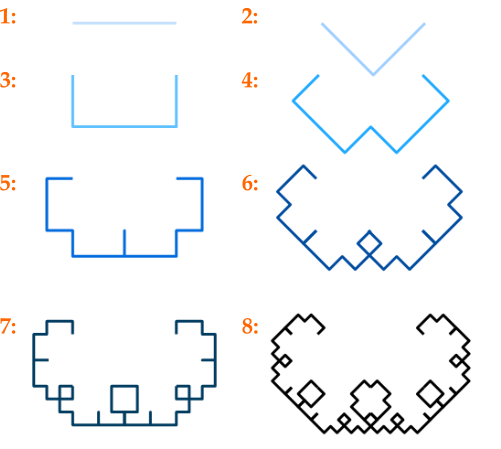

# Windows GUI-stuff in C++: a tutorial.

## Part 5 – GDI: xxx.

Happily Windows does support conversion between UTF-8 and UTF-16 via API functions such as [`MultiByteToWideChar`](https://docs.microsoft.com/en-us/windows/win32/api/stringapiset/nf-stringapiset-multibytetowidechar), in addition to, since Windows 10, providing the feature rich C API of the main Unicode library [**ICU**](https://docs.microsoft.com/en-us/windows/win32/intl/international-components-for-unicode--icu-).

aswd

And unfortunately, also, the GDI doesn’t yet support UTF-8 based text for *drawing* text as graphics, as opposed to using controls to present text as we did in part 4. UTF-8 based text drawing is a must for leveraging the previous part’s discussion of how to use UTF-8 as the `char` based text encoding. Unfortunately this part got too long to cover that, but in the next part we’ll just write our own wrappers over GDI’s wide text drawing functions.

Happily Windows does support conversion between UTF-8 and UTF-16 via API functions such as [`MultiByteToWideChar`](https://docs.microsoft.com/en-us/windows/win32/api/stringapiset/nf-stringapiset-multibytetowidechar), in addition to, since Windows 10, providing the feature rich C API of the main Unicode library [**ICU**](https://docs.microsoft.com/en-us/windows/win32/intl/international-components-for-unicode--icu-).

[some figure]

<!-- START doctoc generated TOC please keep comment here to allow auto update -->

<!-- DON'T EDIT THIS SECTION, INSTEAD RE-RUN doctoc TO UPDATE -->

<!-- DON'T EDIT THIS SECTION, INSTEAD RE-RUN doctoc TO UPDATE -->

- [5.1. Draw directly on the screen to learn GDI basics.](#51-draw-directly-on-the-screen-to-learn-gdi-basics)
- [5.2 Use pseudo-mutable `DC_PEN` and `DC_BRUSH` stock objects to reduce verbosity.](#52-use-pseudo-mutable-dc_pen-and-dc_brush-stock-objects-to-reduce-verbosity)
- [5.3. Automate cleanup for device contexts and GDI objects.](#53-automate-cleanup-for-device-contexts-and-gdi-objects)
- [5.4. Save the generated graphics to an image file.](#54-save-the-generated-graphics-to-an-image-file)
- [5.x. Draw UTF-8 text by converting to UTF-16 and using the wide text API.](#5x-draw-utf-8-text-by-converting-to-utf-16-and-using-the-wide-text-api)
- [5.3. In passing: support `assert` messages in a GUI program built with Visual C++.](#53-in-passing-support-assert-messages-in-a-gui-program-built-with-visual-c)
- [5.4. A potpourri of GDI things introduced via a C curve example.](#54-a-potpourri-of-gdi-things-introduced-via-a-c-curve-example)

<!-- END doctoc generated TOC please keep comment here to allow auto update -->

---

### 5.x. Draw UTF-8 text by converting to UTF-16 and using the wide text API.

As of early 2022 GDI’s `char` based text drawing functions unfortunately assume the global Windows ANSI encoding instead of the process’ ANSI encoding. The `wchar_t` based functions work. But with the incorrect encoding assumption the result of drawing `char` based international text can be a lot of gobbledygook:

\docs\05\images\sshot-4.mangled-utf-8.cropped.png)

Not only is the text “Every 日本国 кошка loves Norwegian blåbærsyltetøy!” mangled, but it’s also drawn with an old 1980’s raster font. As I see it this double whammy of problems is due to a Microsoft business tactic of not fixing or updating what they’ve made, but just moving on to ever more fancy stuff (like GDI+ and DirectX, with their own problems). However, we obtained a handle to the modern GUI font [in part 3](03.md#34-fix-gross-imperfections-standard-font-window-just-on-top-modern-appearance), and all that remains is a call of `SelectObject`, so the main problem is the text mangling.

Full code for this example:

*[05/code/on-screen-graphics/v3/resources/app-manifest.xml](05/code/on-screen-graphics/resources/app-manifest.xml)*:

```xml
<?xml version="1.0" encoding="UTF-8" standalone="yes"?>
<assembly xmlns="urn:schemas-microsoft-com:asm.v1" manifestVersion="1.0">
    <assemblyIdentity
        version="0.3.0.0"
        processorArchitecture="*"
        name="Alfs.CppInPractice.GDI-stuff"
        type="win32"
    />
    <description>Exemplifies that GDI text drawing doesn't support UTF-8 code page.</description>
    <application>
        <windowsSettings>
            <activeCodePage xmlns="http://schemas.microsoft.com/SMI/2019/WindowsSettings"
                >UTF-8</activeCodePage>
        </windowsSettings>
    </application>
</assembly>
```

*05/code/on-screen-graphics/v3/resources.rc*:

```c
#pragma code_page( 65001 )  // UTF-8
#include <windows.h>


/////////////////////////////////////////////////////////////////////////////
// Neutral resources
LANGUAGE LANG_NEUTRAL, SUBLANG_NEUTRAL

CREATEPROCESS_MANIFEST_RESOURCE_ID      RT_MANIFEST "resources/app-manifest.xml"
```

*05/code/on-screen-graphics/v3/main.cpp*:

```cpp
# // Source encoding: UTF-8 with BOM (π is a lowercase Greek "pi").
#include <wrapped-winapi/windows-h.hpp>
#include <string_view>      // std::string_view
#include <iterator>         // std::size

#include <assert.h>

using   std::string_view, std::size;

template< class T > auto int_size( const T& o ) -> int { return static_cast<int>( size( o ) ); }

void draw_on( const HDC canvas, const RECT& area )
{
    constexpr auto  white       = COLORREF( RGB( 0xFF, 0xFF, 0xFF ) );  (void) white;   // Unused.
    constexpr auto  orange      = COLORREF( RGB( 0xFF, 0x80, 0x20 ) );
    constexpr auto  yellow      = COLORREF( RGB( 0xFF, 0xFF, 0x20 ) );
    constexpr auto  blue        = COLORREF( RGB( 0, 0, 0xFF ) );
    constexpr auto  black       = COLORREF( RGB( 0, 0, 0 ) );

    // Clear the background to blue.
    SetDCBrushColor( canvas, blue );
    FillRect( canvas, &area, 0 );

    // Draw a yellow circle filled with orange.
    SetDCPenColor( canvas, yellow );
    SetDCBrushColor( canvas, orange );
    Ellipse( canvas, area.left, area.top, area.right, area.bottom );

    // Draw some international text. Note: non-ASCII UTF-8 characters are incorrectly rendered.
    constexpr auto text = string_view( "Every 日本国 кошка loves\nNorwegian blåbærsyltetøy!" );
    auto text_rect = RECT{ area.left + 40, area.top + 150, area.right, area.bottom };
    SetTextColor( canvas, black );              // This is also the default, but making it explicit.
    SetBkMode( canvas, TRANSPARENT );           // Don't fill in the background of the text, please.
    DrawText( canvas, text.data(), int_size( text ), &text_rect, DT_LEFT | DT_TOP | DT_NOPREFIX );
}

auto main() -> int
{
    assert( GetACP() == CP_UTF8 );
    constexpr auto  no_window   = HWND( 0 );

    const HDC canvas = GetDC( no_window );
    SelectObject( canvas, GetStockObject( DC_PEN ) );
    SelectObject( canvas, GetStockObject( DC_BRUSH ) );

    draw_on( canvas, RECT{ 10, 10, 10 + 400, 10 + 400 } );

    ReleaseDC( no_window, canvas );
}
```

And for completeness, building with Visual C++:

```txt
[T:\05\code\on-screen-graphics\v3\.build]
> rc /nologo /c 65001 /fo r.res ..\resources.rc

[T:\05\code\on-screen-graphics\v3\.build]
> set common-code=t:\05\code\.include

[T:\05\code\on-screen-graphics\v3\.build]
> cl /I %common-code% ..\main.cpp user32.lib gdi32.lib r.res /Feb
main.cpp
```

… and with MinGW g++:

```txt
[T:\05\code\on-screen-graphics\v3\.build]
> windres ..\resources.rc -o res.o

[T:\05\code\on-screen-graphics\v3\.build]
> set common-code=t:\05\code\.include

[T:\05\code\on-screen-graphics\v3\.build]
> g++ -std=c++17 -I %common-code% ..\main.cpp res.o -lgdi32
```

❁ ❁ ❁

In the above code `<windows.h>` defined the `DrawText` macro as `DrawTextA`, the `char` based wrapper version of this function. The basic `wchar_t` based version, `DrawTextW`, doesn’t have an encoding assumption problem because it deals with only one encoding, namely UTF-16. So we just need the text re-encoded as UTF-16.

Windows provides the `MultiByteToWideChar` and `WideCharToMultiByte` functions to convert to and from UTF-16. These functions assume that the input is a sequence of complete code point specifications, i.e. that the input doesn’t start or end in the middle of a UTF-8 code point sequence or in the middle of a UTF-16 surrogate pair. However that’s usually the case and anyway easy to arrange, and this assumption makes the functions stateless, easy to use.

The functions can be used to just determine the necessary minimum size of the output buffer, quite common in C-oriented libraries. However for conversion UTF-8 → UTF-16 that preparation is not necessary, it would just introduce an inefficiency, because the UTF-8 number of bytes is a known sufficient buffer size for the UTF-16 text. More precisely because all Unicode code points that are single byte as UTF-8 are single value as UTF-16, and UTF-16 never uses more than two values per code point.

*05/code/convert-to-wide-text/main.cpp*:

```cpp
# // Source encoding: UTF-8 with BOM (π is a lowercase Greek "pi").
#include <wrapped-winapi/windows-h.hpp>
#include <stdlib.h>         // EXIT_FAILURE
#include <string>           // std::wstring;
#include <string_view>      // std::string_view
using   std::wstring, std::string_view;

auto main() -> int
{
    constexpr auto& text        = "Every 日本国 кошка loves\nNorwegian blåbærsyltetøy!";
    constexpr auto  text_length = static_cast<int>( string_view( text ).length() );

    constexpr auto buffer_size = text_length;
    auto wide_text = wstring( buffer_size, L'\0' );
    const auto flags = DWORD( 0 );
    const int n_wide_values = MultiByteToWideChar(
        CP_UTF8, flags, text, text_length, &wide_text[0], buffer_size
        );
    if( n_wide_values == 0 ) { return EXIT_FAILURE; }
    wide_text.resize( n_wide_values );

    MessageBoxW( 0, wide_text.c_str(), L"UTF-16 text:", MB_ICONINFORMATION | MB_SETFOREGROUND );
}
```

\docs\05\images\sshot-5.wide-text-messagebox.png)

❁ ❁ ❁

With now confidence that the convert-to-UTF-16 approach works we can express the text drawing as reusable machinery,

In *05/code/.include/cpp/util.hpp*:

```cpp
    #define CPPUTIL_FAIL( s ) ::cpp::util::fail( std::string( __func__ ) + " - " + (s) )

    template< class T >
    auto int_size( const T& c ) -> int { return static_cast<int>( size( c ) ); }
```

*05/code/.include/winapi/encoding-conversions.hpp*:

```cpp
#pragma once // Source encoding: UTF-8 with BOM (π is a lowercase Greek "pi").
#include <wrapped-winapi/windows-h.hpp>
#include <cpp/util.hpp>     // CPPUTIL_FAIL, cpp::util::(hopefully, int_size)

#include <string>           // std::wstring
#include <string_view>      // std::string_view
#include <utility>          // std::move

namespace winapi {
    namespace cu = cpp::util;
    using   cu::hopefully, cu::fail, cu::int_size;
    using   std::wstring,
            std::string_view,
            std::move;

    inline auto to_utf16( const string_view& s, wstring result_buffer = {} )
        -> wstring
    {
        const auto s_length = int_size( s );
        if( s_length == 0 ) { return L""; }

        const auto buffer_size = s_length;  // May be a litte too large, but that's OK.
        result_buffer.resize( buffer_size );
        constexpr auto flags = DWORD( 0 );
        const int n_wide_values = MultiByteToWideChar(
            CP_UTF8, flags, s.data(), s_length, &result_buffer[0], buffer_size
            );
        hopefully( n_wide_values != 0 ) or CPPUTIL_FAIL( "MultiByteToWideChar failed" );
        result_buffer.resize( n_wide_values );
        return move( result_buffer );
    }
}  // namespace winapi
```

*05/code/.include/winapi/gdi-text-display.hpp*:

```cpp
#pragma once    // Source encoding: UTF-8 with BOM (π is a lowercase Greek "pi").
#include <wrapped-winapi/windows-h.hpp>
#include <winapi/encoding-conversions.hpp>
#include <cpp/util.hpp>

#include    <assert.h>
#include    <string_view>       // std::(string_view, wstring_view)

namespace winapi::gdi {
    using cpp::util::int_size;
    using std::string_view, std::wstring_view;

    constexpr UINT  default_draw_format = DT_LEFT | DT_TOP | DT_NOPREFIX;

    inline auto draw_text(
        const HDC                   canvas,
        const wstring_view&         wide_s,
        RECT&                       area,
        const UINT                  format  = default_draw_format
        ) -> int
    { return DrawTextW( canvas, wide_s.data(), int_size( wide_s ), &area, format ); }

    inline auto draw_text(
        const HDC                   canvas,
        const string_view&          s,
        RECT&                       area,
        const UINT                  format  = default_draw_format
        ) -> int
    { return draw_text( canvas, to_utf16( s ), area, format ); }

}  // namespace winapi::gdi
```

I’ve intentionally refrained from adressing the problem with introducing arbitrary implementation stuff such as standard library names, in the namespace that exports things. Fixing that is trivial but would reduce clarity by introducing additional COBOL-like verbosity, because C++17 lacks support for namespace [information hiding](https://en.wikipedia.org/wiki/Information_hiding). Alternatively one could use C++20 modules.

However, this code introduces the *possibility of failure*, i.e. an exception. But this is purely a technical possibility because per the documentation in modern Windows `MultiByteToWideChar` doesn’t ignore malformed UTF-8 sequences but replaces each with Unicode code point `L'\uFFFD'`, i.e. *some* output. Thus, except for the really remote possibility of failure due to internal resource exhaustion or the like, there’s no way that the result can be an empty string.

And thus the new version of the main program just assumes that there is no exception:

*05/code/on-screen-graphics/v4/main.cpp*:

```cpp
# // Source encoding: UTF-8 with BOM (π is a lowercase Greek "pi").
#include <wrapped-winapi/windows-h.hpp>
#include <winapi/encoding-conversions.hpp>  // winapi::to_utf16
#include <winapi/gdi-text-display.hpp>      // winapi::gdi::draw_text
#include <winapi/gui-util.hpp>              // winapi::gui::std_gui_font

#include <string_view>      // std::string_view
#include <iterator>         // std::size

#include <assert.h>

namespace gdi   = winapi::gdi;
using   std::string_view, std::size;

void draw_on( const HDC canvas, const RECT& area )
{
    constexpr auto  white       = COLORREF( RGB( 0xFF, 0xFF, 0xFF ) );  (void) white;   // Unused.
    constexpr auto  orange      = COLORREF( RGB( 0xFF, 0x80, 0x20 ) );
    constexpr auto  yellow      = COLORREF( RGB( 0xFF, 0xFF, 0x20 ) );
    constexpr auto  blue        = COLORREF( RGB( 0, 0, 0xFF ) );
    constexpr auto  black       = COLORREF( RGB( 0, 0, 0 ) );

    // Clear the background to blue.
    SetDCBrushColor( canvas, blue );
    FillRect( canvas, &area, 0 );

    // Draw a yellow circle filled with orange.
    SetDCPenColor( canvas, yellow );
    SetDCBrushColor( canvas, orange );
    Ellipse( canvas, area.left, area.top, area.right, area.bottom );

    // Draw some international (English, Russian, Chinese, Norwegian) text.
    constexpr auto text = string_view( "Every 日本国 кошка loves\nNorwegian blåbærsyltetøy!" );
    SetTextColor( canvas, black );              // This is also the default, but making it explicit.
    auto text_rect = RECT{ area.left + 40, area.top + 150, area.right, area.bottom };
    gdi::draw_text( canvas, text, text_rect );
}

void init( const HDC canvas )
{
    SelectObject( canvas, GetStockObject( DC_PEN ) );
    SelectObject( canvas, GetStockObject( DC_BRUSH ) );
    SetBkMode( canvas, TRANSPARENT );           // Don't fill in the background of text, please.
    SelectObject( canvas, winapi::gui::std_gui_font.handle );
}

auto main() -> int
{
    assert( GetACP() == CP_UTF8 );
    constexpr auto  no_window   = HWND( 0 );

    const HDC canvas = GetDC( no_window );
    init( canvas );

    draw_on( canvas, RECT{ 10, 10, 10 + 400, 10 + 400 } );

    ReleaseDC( no_window, canvas );
}
```

Building examples were provided earlier; just note, if you don’t look at them, that since this code uses the `char` based Windows API functions with UTF-8 encoding, i.e. since it assumes and requires UTF-8 as the process’ ANSI code page, it’s necessary to compile and link with the resources file that provides a minimal application manifest.

\docs\05\images\sshot-6.international-text.cropped.png)

---

asdasd

---

---

### 5.3. In passing: support `assert` messages in a GUI program built with Visual C++.

To be sure that the `assert` statements really do their job you can intentionally trigger an assert, make it “fire”, e.g. by changing

```cpp
    assert(( m_dc != 0 ));
```

… to

```cpp
    assert(( m_dc != 0, false ));
```

With a MinGW g++ console subsystem build this works fine; in that the assertion text is reported in the console:

```txt
[T:\05\code\on-screen-graphics\v2\.build]
> g++ -std=c++17 -I %common-code% ..\main.cpp -lgdi32

[T:\05\code\on-screen-graphics\v2\.build]
> a
Assertion failed: ( m_dc != 0, false ), file t:\05\code\.include/winapi/gdi.hpp, line 23
```

With a MinGW g++ GUI subsystem build it also works fine, producing an **assertion failure box**:

```txt
[T:\05\code\on-screen-graphics\v2\.build]
> g++ -std=c++17 -I %common-code% ..\main.cpp -lgdi32 -mwindows

[T:\05\code\on-screen-graphics\v2\.build]
> a
```


And, it works fine with a Visual C++ console program build:

```txt
[T:\05\code\on-screen-graphics\v2\.build]
> cl /I %common-code% ..\main.cpp user32.lib gdi32.lib /Feb
main.cpp

[T:\05\code\on-screen-graphics\v2\.build]
> b
Assertion failed: ( m_dc != 0, false ), file t:\05\code\.include\winapi/gdi.hpp, line 23
```

But with a Visual C++ GUI subsystem build the assertion message is not reported in any way. Indeed there’s ***nothing to tell you that an assertion fired***. All you can see is that the program mysteriously fails to have any effect:

```txt
[T:\05\code\on-screen-graphics\v2\.build]
> set LINK=/entry:mainCRTStartup

[T:\05\code\on-screen-graphics\v2\.build]
> cl /I %common-code% ..\main.cpp user32.lib gdi32.lib /Feb /link /subsystem:windows
main.cpp

[T:\05\code\on-screen-graphics\v2\.build]
> b

[T:\05\code\on-screen-graphics\v2\.build]
> echo %errorlevel%
0
```

The technical reason is that Microsoft’s runtime library decides how to present the assertion message, as text output or in an assertion failure box, based on ***which entry point function*** one linked with:

| Entry point:         | Calls startup function: | Assumed subsystem: | Presentation of assertion message: |
| -------------------- | ----------------------- | ------------------ | ---------------------------------- |
| `mainCRTStartup`     | `main`                  | Console            | Text output.                       |
| `wmainCRTStartup`    | Microsoft `wmain`       | Console            | Text output.                       |
| `WinMainCRTStartup`  | Microsoft `WinMain`     | GUI                | Assertion failure box.             |
| `wWinMainCRTStartup` | Microsoft `wWinMain`    | GUI                | Assertion failure box.             |

From a design level perspective, if the intent was to support the programmer, then a decision to base the presentation mode on the executable’s subsystem is sub-optimal. For example, a GUI subsystem program may be running with its standard error stream tied to a console, so that presentation as text output is desirable. And in most cases it supports the programmer best to have both presentation modes, both text output that can be logged and an assertion failure box that can be viewed when the assertion failure happens; a restriction of the presentation to a single mode very seldom has any advantage.

**\<rant\>** Then, a decision to *infer* the subsystem from the entry point, instead of checking the subsystem, is a bit of lunacy. But perhaps the intent was not to support but instead to add yet another vendor lock in, and after all, this is tied to the `WinMain` monstrosity, which itself was a vendor lock in device. Microsoft got infamous for its vendor lock in business tactics when some [internal mails were revealed](https://www.cnet.com/tech/services-and-software/eu-report-takes-microsoft-to-task/) in the legal dispute between Microsoft and Sun Corporation. **\</rant\>**

Anyway, the assertion message wasn’t actually suppressed: it was just erroneously presented as text output on the program’s standard error stream, that wasn’t connected to anything. So a simple fix is to connect that error stream to the console. To do that in Cmd, simply redirecting the standard error stream via `2>con` doesn’t work, but fusing it into the standard output stream via `2>&1` and then piping the output to e.g. `find /v ""`, works nicely:

```txt
[T:\05\code\on-screen-graphics\v2\.build]
> b 2>&1 | find /v ""
Assertion failed: ( m_dc != 0, false ), file t:\05\code\.include\winapi/gdi.hpp, line 23
```

It would be much better if the program itself chose a more reasonable practically useful presentation mode. For example, depending on whether its standard error stream is connected to something, as it is with the above command, or not. Doing this involves ***lying*** to the Microsoft runtime about the executable’s subsystem (like with a sabotage-minded donkey that always goes in the opposite direction of where you indicate you want to go, so you just lie to it), but happily that Just Works&trade; with as of Visual C++ 2022 no ill effects:

[*05/code/.include/compiler/msvc/Assertion_reporting_fix.hpp*](05/code/.include/compiler/msvc/Assertion_reporting_fix.hpp)

```cpp
#pragma once    // Source encoding: UTF-8 with BOM (π is a lowercase Greek "pi").
#ifndef     _MSC_VER
#   error   "This header is for the Visual C++ compiler only."
#   include <stop-compilation>
#endif

#include <wrapped-winapi/windows-h.hpp>

#include <process.h>            // Microsoft - _set_app_type

namespace compiler::msvc {
    class  Assertion_reporting_fix
    {
        static auto is_connected( const HANDLE stream )
            -> bool
        {
            DWORD dummy;
            if( ::GetConsoleMode( stream, &dummy ) ) { return true; }
            switch( ::GetFileType( stream ) ) {
                case FILE_TYPE_DISK:    [[fallthrough]];
                case FILE_TYPE_PIPE:    { return true; }
            }
            return false;       // E.g. stream is redirected to `nul`.
        }

        Assertion_reporting_fix()
        {
            // Prevent assertion text being sent to The Big Bit Bucket In The Sky™.
            const HANDLE error_stream = ::GetStdHandle( STD_ERROR_HANDLE );
            _set_app_type( static_cast<_crt_app_type>(
                is_connected( error_stream )? _crt_console_app : _crt_gui_app
                ) );
        }

    public:
        static auto global_instantiation()
            -> bool
        {
            static Assertion_reporting_fix  the_instance;
            return true;
        };
    };
}  // namespace compiler::msvc
```

Here [**`_set_app_type`**](https://docs.microsoft.com/en-us/cpp/c-runtime-library/set-app-type?view=msvc-170) is an internal function in Microsoft’s runtime library.

The above is intended to be used like this:

```cpp
#ifdef _MSC_VER
#   include <compiler/msvc/Assertion_reporting_fix.hpp>
    const bool msvc_arf = compiler::msvc::Assertion_reporting_fix::global_instantiation();
#endif
```

The [Meyers’ singleton](https://stackoverflow.com/a/17712497) ensures that this results in a single call of `_set_app_type` even if this code appears in several translation units. I chose to exemplify this general `global_instantiation` technique even though the `_set_app_type` calls are idempotent, because it’s a good way to provide such fixes in general. A C++17 `inline` variable’s initialization could alternatively have done the job, but `inline` variables appear to still be somewhat unreliable in Visual C++.

With this, if you don’t redirect standard error, then with GUI subsystem you get the assertion failure box (the very same as shown earlier for MinGW g++, because it’s the same library in both cases), but if you do connect up the standard error stream then you get the message as text output, so you can decide the reporting mode in the command to run the program.

However, for more [DRY code](https://en.wikipedia.org/wiki/Don%27t_repeat_yourself) the above usage is placed in a convenience header:

*[05/code/.include/compiler/msvc/Assertion_reporting_fix.auto.hpp](05/code/.include/compiler/msvc/Assertion_reporting_fix.auto.hpp)*

```cpp
#pragma once    // Source encoding: UTF-8 with BOM (π is a lowercase Greek "pi").
#ifdef _MSC_VER
#   include <compiler/msvc/Assertion_reporting_fix.hpp>
    const bool msvc_arf = compiler::msvc::Assertion_reporting_fix::global_instantiation();
#endif
```

And so all that appears in v3 of the program is an include of the above file:

*In [05/code/on-screen-graphics/v3/main.cpp](05/code/on-screen-graphics/v3/main.cpp)*

```cpp
#include <compiler/msvc/Assertion_reporting_fix.auto.hpp>
```

---

### 5.4. A potpourri of GDI things introduced via a C curve example.

One of my pet pedagogical ideas is that the things that are most important are the things one ends up using or needing in concrete examples. So, as a concrete example I chose a simple recursive figure called the [C curve](https://en.wikipedia.org/wiki/L%C3%A9vy_C_curve). One way to create it is to start with a single line segment **–**, replace each line segment with an angle bracket **∨**, do that again, and so on:



The above figure is based on [an image from Wikimedia](https://en.wikipedia.org/wiki/File:Levy_C_construction.png).

Using the above conceptual construction directly in code has the advantage that the starting line defines the direction and size of the result curve, but it has the problems that the generated (line start and end-) points are not necessarily at integer pixel coordinates, and that one may end up with diagonal lines that don’t look so good without anti-aliasing (GDI).

An alternative is to generate the curve with essentially [turtle graphics](https://en.wikipedia.org/wiki/Turtle_graphics), just tracing the curve from start to end, recreating its logical structure  — the left and right turnings — without regard for absolute orientation or size. This yields pixel perfect line segments that are either horizontal or vertical and always start and end on integer pixel coordinates, but the curve gets larger and rotates 45° when the number of levels is increased by 1. Anyway, with this approach one doesn’t need any graphics library or geometry maths to generate the curve points, just an understanding of recursive functions:

```cpp
void generate( const int order )
{
    if( order == 0 ) {
        current_position += step;
        output_curve_point( current_position );
    } else {
        generate( order - 1 );
        rotate_left( step );
        generate( order - 1 );
        rotate_right( step );
    }
}
```

That code gets a little obfuscated, sorry, by having the details filled in and being expressed as something easy to *use*, as opposed to easy to grok:

*[05\code\c-curve\v1\c_curve.hpp](05\code\c-curve\v1\c_curve.hpp)*

```cpp
# // Source encoding: UTF-8 with BOM (π is a lowercase Greek "pi").
#include <functional>       // std::function
#include <utility>          // std::move
#include <vector>           // std::vector

namespace c_curve {
    using std::function, std::move, std::vector;

    struct Point { int x; int y; };
    void rotate_left( Point& pt )   { pt = {-pt.y, pt.x}; }
    void rotate_right( Point& pt )  { pt = {pt.y, -pt.x}; }

    void operator+=( Point& pt, const Point& d )
    {
        pt.x += d.x; pt.y += d.y;
    }

    using Callback = function<void( const Point& )>;

    class Impl
    {
        Point       m_current_position;
        Point       m_step;
        Callback    m_output_curve_point;

    public:
        Impl( Callback output_curve_point, const int step ):
            m_current_position{ 0, 0 },
            m_step{ 0, -step },
            m_output_curve_point( move( output_curve_point ) )
        {
            m_output_curve_point( m_current_position );
        }

        void generate( const int order )
        {
            if( order == 0 ) {
                m_current_position += m_step;
                m_output_curve_point( m_current_position );
            } else {
                generate( order - 1 );
                rotate_left( m_step );
                generate( order - 1 );
                rotate_right( m_step );
            }
        }
    };

    inline void generate( const int order, Callback output_curve_point, const int step = 4 )
    {
        Impl( move( output_curve_point ), step ).generate( order );
    }

    template< class Point_type >
    auto as_vector_of_( const int order, const int step = 4 )
        -> vector<Point_type>
    {
        vector<Point_type> points;
        points.reserve( 1 + (1 << order) );     // Just because this is C++ => efficiency.
        generate(
            order,
            [&]( const Point& pt ){ points.push_back( Point_type{ pt.x, pt.y } ); },
            step
            );
        return points;
    }
}  // namespace c_curve
```

```cpp

```
