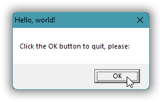
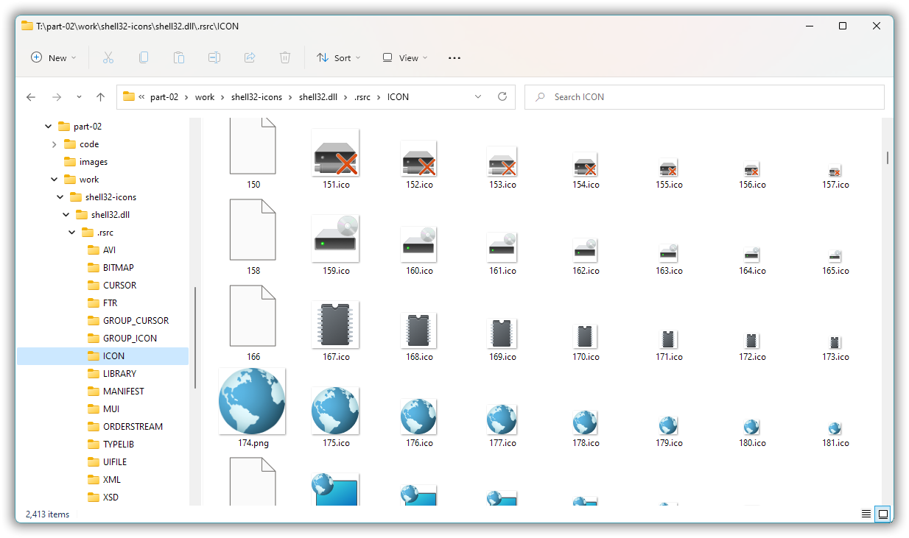

# Windows GUI-stuff in C++: a tutorial.

## Part 2 – Use resources to provide an icon.

In Windows programming data that’s embedded in the executable are called **resources**.

There is an original resource handling scheme that deals with binary resources such as icons, and, using that original scheme to embed a text file in the executable, there is a newer XML text based resource scheme that must be used to deal with crucial stuff like UTF-8 support and modern look ’n feel. The original binary resource scheme is the “Windows API” scheme, and as of Windows 11 it’s still the scheme used to provide information such as file icon and file details to Windows Explorer. The XML based scheme is closely tied to .NET programming, but is also used for API level resolution of “side by side” DLLs.

In this part we’ll only use the original “Windows API” resource scheme, namely to add a custom icon to the “Hello, world!” message box.

The actual result in itself is just very marginal progress: a message box with a custom icon, plus the same icon for the executable. The important aspect is *how* that’s accomplished, namely by using resources, which later (in part 3) will enable us to tackle general windows with contents & layout defined by a resource. In even later parts it will also enable us to tackle e.g. the problems of providing version information via Windows Explorer, and using UTF-8 Unicode text.

However, for now we’ll do just the icon resource thing, a message box with a custom icon.

<!-- START doctoc generated TOC please keep comment here to allow auto update -->
<!-- DON'T EDIT THIS SECTION, INSTEAD RE-RUN doctoc TO UPDATE -->
*Contents (table generated with [DocToc](https://github.com/thlorenz/doctoc)):*

- [2.1. File icons.](#21-file-icons)
- [2.2. Icon files.](#22-icon-files)
- [2.3. Package the icon in a linker friendly binary file, via a resource script.](#23-package-the-icon-in-a-linker-friendly-binary-file-via-a-resource-script)
- [2.4. The C++ side: identify the resource via a *pseudo-pointer* and a *module handle*.](#24-the-c-side-identify-the-resource-via-a-pseudo-pointer-and-a-module-handle)
- [2.5 Build the executable with resources embedded.](#25-build-the-executable-with-resources-embedded)

<!-- END doctoc generated TOC please keep comment here to allow auto update -->

---

### 2.1. File icons.

Since the icon that we’ll add to the “Hello, world!” message box will be the only one in the executable file it will be the icon there with lowest id, and then it’s automatically also the **file icon** that Windows Explorer presents:

| Which: | Executable as presented in Explorer: | Message box: |
|------- |  ------------------------------------- | ------------ |
| In part 1 |  |   |
| Now |  |   |

Explorer presents the old part 1 executable with Windows’s default application icon , because it doesn’t provide an icon itself.

The default icons can change a little with each Windows version; the above is for Windows 11.

---
### 2.2. Icon files.

Compared to images in general, an icon image (1) is typically of a very small standard square size, e.g. 16×16 or 32×32 pixels, and (2) can have transparent areas. Windows 11 supports icons up to 256×256 pixels, called “extra large icons”. But since icons generally are very small, with very course-grained graphics, automatic scaling will generally not do a good job. Instead icons are handcrafted in the standard sizes that one supports, and an **“.ico” file** contains a set of such standard size specially crafted adapations of the image; just providing 16×16 and 32×32 pixel variants go a long way. In some cases the smallest image can be quite different to make it look good, less awful, or even recognizable.

An icon resource is the same format as an “.ico” file: a collection of standard size icon images.

So that’s what we need: an “.ico” file with at least 16×16 and 32×32 pixel images.

The Earth globe icon for this part’s message box and executable is one provided by Windows. In Windows 11 it’s one resource for each supported standard size in the file “c:\windows\SystemResources\shell32.dll.mun”. I used the free [7-Zip](https://www.7-zip.org/) program to extract the icon images to a browsable collection of individual image files, shown in the screenshot below, and the free [ImageMagick tools](https://imagemagick.org/index.php) (specifically the `transform` command) to combine the various sizes into one single multi-size “.ico” file suitable as an icon resource.

The icon is probably used for something in Windows, probably something global like the internet, but that’s OK for an example like this.

---

### 2.3. Package the icon in a linker friendly binary file, via a resource script.

I saved the icon file in sub-directory relative to the C++ source code, as “resources\globe.ico”.

It can be embedded as a resource in the executable in two main ways:

* Using the ordinary C++ linker → *new executable*.
* *Existing executable* → using the Windows API functions, via some tool.

The second option is rarely used, but still as of 2021 it can be useful. For example, I use this approach to make the g++ compiler's preprocessor interpret `#include` directives as UTF-8 encoded paths, via [a little DIY tool](https://github.com/progrock-apps/set_utf8_as_ansi_codepage/blob/master/source/app/main.cpp). It just involves — as we’ll look at in a later part — adding a resource that sets the compiler’s process’ “ANSI codepage” to UTF-8.

The ordinary linking approach involves packaging the resource(s) in a file that the linker knows how to deal with. With the MinGW g++ linker that’s an ordinary “.o” COFF object code file, while with the Microsoft linker it’s a special binary “.res” file that contains a structure with the resources. Regardless of toolchain one *creates* this binary linker friendly resources file by using a special **resource compiler** that’s directed by an “.rc” **resource script**, a text file that can look like this:

[*part-02/code/messagebox-with-icon/resources.rc*](part-02/code/messagebox-with-icon/resources.rc)
~~~txt
#include <windows.h>
100     ICON    "resources/globe.ico"
~~~

Line 1, the `#include` directive, is an ordinary C language `#include` directive. And yes it’s the ordinary C or C++ preprocessor that’s applied. Happily, considering that `<windows.h>` is a gigantic several hundred thousand lines header, the resource compiler defines the macro symbol **`RC_INVOKED`** which excludes most of the contents of that header.

With Microsoft’s Visual C++ 2022 compiler `RC_INVOKED` reduces the include from 303 818 lines to 9355 lines. And with the MinGW g++ 9.2 compiler it reduces the include from 80 287 lines to 119 lines. I originally wrote here that the resulting text appeared to have nothing that was used, mostly blank lines, but while not present in the produced text the include does define macros such as `IDOK` that are useful (if not strictly necessary) for some resource definitions.

Line 2, the resource inclusion statement, starts with an arbitrary id number, `100`; then a specification of the resource type, `ICON`; and then a quoted path to the resource file.

For our current task that’s all, really.

With the MinGW g++ tools the resource compiler is called **windres**:

~~~txt
[T:\part-02\code\messagebox-with-icon]
> windres resources.rc -o resources.o

[T:\part-02\code\messagebox-with-icon]
> dir /a-d /b res*
resources.o
resources.rc

[T:\part-02\code\messagebox-with-icon]
> _
~~~

With the Visual C++ tools it's called **rc**, short for “resource compiler”:

~~~txt
[T:\part-02\code\messagebox-with-icon]
> rc /nologo resources.rc

[T:\part-02\code\messagebox-with-icon]
> dir /a-d /b res*
resources.rc
resources.res

[T:\part-02\code\messagebox-with-icon]
> _
~~~

---
### 2.4. The C++ side: identify the resource via a *pseudo-pointer* and a *module handle*.

The basic `MessageBox` function officially only supports four icons — namely the standard informational, question, warning and error icons — but its slightly more general sibling `MessageBoxIndirect` officially also supports using a custom icon from an icon resource, i.e. one embedded as data in the executable:

[*part-02/code/messagebox-with-icon/hello.cpp:*](part-02/code/messagebox-with-icon/hello.cpp)
~~~cpp
#include <windows.h>

auto main() -> int
{
    MSGBOXPARAMS params = {sizeof( MSGBOXPARAMS )};
    
    params.lpszCaption  = "Hello, world!";
    params.lpszText     = "Click the OK button to quit, please:";

    params.lpszIcon     = MAKEINTRESOURCE( 100 );
    params.hInstance    = GetModuleHandle( nullptr );
    
    params.dwStyle      = MB_SETFOREGROUND | MB_USERICON;
    
    MessageBoxIndirect( &params );
}
~~~

The `MessageBoxIndirect` function takes its arguments collected in a single structure of type `MSGBOXPARAMS`. The curly braces initialization above provides the structure’s size in bytes for the first field, and zeroes the rest. Windows uses the size field to support backwards compatibility; it’s a common technique.

The icon resource is identified by its id number (here chosen by me as 100) and by which executable or DLL it resides in. The number one chooses as id must be in the range of a 16-bit signed integer, i.e. maximum 32 767. The `MAKEINTRESOURCE` macro casts this integer to a pointer, in this program a `const char*`, and [with all but the 16 lowest bits zero](https://docs.microsoft.com/en-us/windows/win32/api/winuser/nf-winuser-is_intresource) the resource handling code in Windows then recognizes this pointer as an integer id rather than a string.

In Windows 11 `MessageBoxIndirect` only presents an icon when it's specified with such **pseudo pointer value** for an integer id.

I believe — because I cannot remember otherwise — that in earlier Windows versions it would also work with that [integer specified as the string `"#100"`](https://docs.microsoft.com/en-us/windows/win32/api/libloaderapi/nf-libloaderapi-findresourcew#remarks). Plus, I believe it would then work with a resource with an alphanumerical id specified as string, e.g. `"icon_globe"`, but that doesn’t work either in Windows 11. Whether this and other obstructions are intentional or due to lack of [Quality Assurance](https://en.wikipedia.org/wiki/Quality_assurance) they indicate that Microsoft is heading in the direction of not supporting 3ʳᵈ party Windows desktop application development; presumably they envision a Microsoft world of only sandboxed Store apps.

The **handle** returned by `GetModuleHandle(nullptr)` is a small pointer sized value that identifies the current executable, and is known as the **`HINSTANCE`**, the “instance handle”. `MessageBoxIndirect` needs this in order to look for the icon resource in the right file. Or more precisely, it looks in a loaded **module**, which can be an executable or a DLL library.

AFAIK undocumented but very much worth knowing: a module handle is simply the memory start address of the loaded image of that executable or DLL. Thus it can be used for inspection of that module, e.g. to [list the exports of a DLL](https://github.com/alf-p-steinbach/list-exports/blob/master/source/main.cpp). You can google articles about the PE32 file format to get further, if you’re interested.

---

### 2.5 Build the executable with resources embedded.

Building is the same as for part 1’s “Hello, world!” message box program, except that now you also need to specify the binary linker friendly resources file as a compiler or linker argument.

For completeness I now include also the earlier shown commands for generating that binary from an “.rc” resource script.

With the MingW g++ toolchain:

~~~txt
[T:\part-02\code\messagebox-with-icon]
> windres resources.rc -o resources.o

[T:\part-02\code\messagebox-with-icon]
> g++ hello.cpp resources.o -mwindows

[T:\part-02\code\messagebox-with-icon]
> a.exe_
~~~

With the Visual C++ toolchain:

~~~txt
[T:\part-02\code\messagebox-with-icon]
> rc /nologo resources.rc

[T:\part-02\code\messagebox-with-icon]
> set LINK=/entry:mainCRTStartup

[T:\part-02\code\messagebox-with-icon]
> cl hello.cpp resources.res user32.lib /link /subsystem:windows
hello.cpp

[T:\part-02\code\messagebox-with-icon]
> hello.exe_
~~~

In any case, result:

| ← previous |  up ↑ | next → |
|:----|:----:|---:|
| [1. A Windows GUI “Hello, world!”.](part-01.md)  | [Contents](index.md)   |  [3. A Tic-Tac-Toe game in a dialog window.](part-03.md)  |
