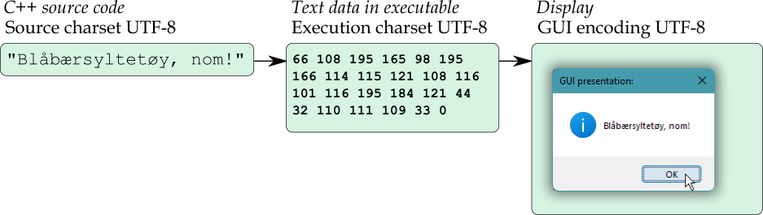

# Windows GUI-stuff in C++: a tutorial.

## Part 4 – UTF-8 as the one and only text encoding.

In the previous version there was a character encoding problem, that a right single quote mark in a C++ string literal, would not necessarily be displayed correctly.

The problem happened because the controls in a window assume that `char` based text is encoded with the process’ **Windows ANSI** encoding, the encoding specified by the `GetACP` function, which is usually some variant of Windows ANSI Western, whereas the encoding for a C++ literal typically is UTF-8 — at least for experienced programmers.

So, in this part we’ll change everything to UTF-8 encoding. Which involves telling the tools that they should assume and produce UTF-8. This gets rid of the right single quote problem, and also enables use of some fancy Unicode characters. 😃

<!-- START doctoc generated TOC please keep comment here to allow auto update -->
<!-- DON'T EDIT THIS SECTION, INSTEAD RE-RUN doctoc TO UPDATE -->
*Contents (table generated with [DocToc](https://github.com/thlorenz/doctoc)):*

- [4.1. Some background on Unicode in Windows programming.](#41-some-background-on-unicode-in-windows-programming)
- [4.2. Specify UTF-8 as the process’ ANSI codepage.](#42-specify-utf-8-as-the-process-ansi-codepage)
- [4.3. Specify UTF-8 as the “.rc” resource script code page.](#43-specify-utf-8-as-the-rc-resource-script-code-page)

<!-- END doctoc generated TOC please keep comment here to allow auto update -->

---
### 4.1. Some background on Unicode in Windows programming.

TLDR: ***Using UTF-8 we are at the leading edge of Windows desktop software development where not all Windows’ wrinkles have been ironed out yet, and our programs only work with Windows versions since June 2019, but it’s worth it.***

* * *

Full text:

The [**Unicode** character set](https://home.unicode.org/basic-info/faq/) with currently 144 697 characters is the basis of a number of possible text encodings, where the most popular in Windows are `char`-based UTF-8 and `wchar_t`-based UTF-16.

UTF-16 encoded text is a sequence of 16-bit encoding values which in Windows C and C++ programming are of type **`wchar_t`**. The “`w`” in `wchar_t` stands for **wide text**, text represented with “`wide`” encoding values. In C and C++ you can express wide text literals with prefix **`L`**, e.g. `L"Hello!"`.

But note: in Linux and other Unixes `wchar_t` is in general 32 bits, using UTF-32 encoding. So, while `L"Hello!"` is a sequence of 7 16-bit `wchar_t` values in Windows, it’s a sequence of 7 32-bit `wchar_t` values in Linux. Plus, some Unicode code points that can be represented with a single 32-bit `wchar_t` value in Linux, require two 16-bit `wchar_t` values in Windows, an UTF-16 **surrogate pair**, so that a wide literal doesn’t even always produce the same sequence of values in Linux and Windows.

When we used `MessageBox` like

~~~cpp
MessageBox( 0, "Some text in the box", "A title", MB_SETFOREGROUND );
~~~

… we actually used a `<windows.h>` macro `MessageBox` that was defined as `MessageBoxA`, the message box function that takes `char` based string arguments:

~~~cpp
MessageBoxA( 0, "Some text in the box", "A title", MB_SETFOREGROUND );
~~~

This function just translates the text to `wchar_t` based UTF-16 and calls `MessageBoxW` (suffix “A” for “ANSI” and suffix “W” for “wide”), as if one had coded

~~~cpp
MessageBoxW( 0, L"Some text in the box", L"A title", MB_SETFOREGROUND );
~~~

That is, the Windows core functionality is based on UTF-16 encoding, but `<windows.h>` defaults to offering wrapper functions that convert `char` based text to `wchar_t` based UTF-16, and vice versa. This wrapper layer originated as a compatibility layer for old non-Unicode `char` based applications. The intent was, in the early and mid 1990’s, that new Windows programs should use wide text, e.g. `MessageBoxW`.

And up [until June 2019](https://docs.microsoft.com/en-us/windows/apps/design/globalizing/use-utf8-code-page#set-a-process-code-page-to-utf-8) one had to use UTF-16 encoded wide text in that way in any serious Windows desktop programming, because that was the only Unicode encoding supported by the API functions. One defined the macro symbol **`UNICODE`** before including `<windows.h>`, so that `<windows.h>` would define the function-name macros to map to the “W” functions. For example, with `UNICODE` defined before `<windows.h>` is included, it defines `MessageBox` as `MessageBoxW`.

However, from June 2019 Windows supports using UTF-8 as a process’ `char`-based encoding, i.e. the process’ ANSI encoding, the one specified by [`GetACP()`](https://docs.microsoft.com/en-us/windows/win32/api/winnls/nf-winnls-getacp). Also, from this point on a Windows locale can have UTF-8 as its text encoding. And a C or C++ locale can therefore also have UTF-8 encoding provided that the C or C++ standard library implementation supports that.

With this the `char` based wrapper layer, the “A” suffix functions like `MessageBoxA`, has been *re-purposed to support the future* instead of supporting the past, just now with the “A” very much a misleading misnomer. This is  much like how C++ `auto` was re-purposed to support the future instead of supporting the past, just now with the “auto” very much a misleading misnomer… Well, I guess there must be an example also in the human body, maybe.

As of early 2022 the UTF-8 support is far from complete, but together with earlier introduced UTF-8 support in the Visual C++ compiler and other Microsoft tools the June 2019 support in Windows *enables* use of UTF-8 throughout. This avoids text encoding problems such as for the right single quote in the previous version of our Tic-Tac-Toe game. And it enables use of special Unicode characters provided that the font one uses, supports them.

---
### 4.2. Specify UTF-8 as the process’ ANSI codepage.

Text fields and other controls assume that text is encoded with the process’ ANSI text encoding, the **code page** specified by the `GetACP` — short for “get ANSI code page” — function.

[“Code page”](https://en.wikipedia.org/wiki/Code_page) is an old alternative term for “text encoding”, originally referring to a practice of displaying a complete old times’ text encoding table such as ASCII on a single page of paper. Each code page has an identifying number (note: other vendors do not necessarily use the Microsoft code page numbers). For example, for Windows ANSI Western `GetACP` returns **1252**, and for UTF-8 it returns **65001**.

Codepage numbers are used for Windows’ global text encoding assumptions, e.g. in the registry value “HKLM\SYSTEM\CurrentControlSet\Control\Nls\CodePage@ACP” that more or less undocumented specifies the default for `GetACP`. I’ve found experimentally that it generally works to set that to 65001, with a reboot of Windows, and then there’s no need to set particular processes’ ANSI codepage. But I don’t know if that’s supported or whether it’s at all a good idea, and hence I don’t use it.

Codepage numbers are also used for the [API functions](https://docs.microsoft.com/en-us/windows/console/setconsoleoutputcp) and commands ([chcp](https://docs.microsoft.com/en-us/windows-server/administration/windows-commands/chcp), [mode](https://docs.microsoft.com/en-us/windows-server/administration/windows-commands/mode#select-code-page)) to set a console window’s **active code page**, the text encoding that it should assume, to a specific code page number. 

Unfortunately Microsoft doesn’t offer a function to set a process’ ANSI code page. I.e. there’s no “setter” counterpart to `GetACP`, there’s no `SetACP`. Instead it has to be done [via the XML application manifest resource](https://docs.microsoft.com/en-us/windows/apps/design/globalizing/use-utf8-code-page#set-a-process-code-page-to-utf-8), in the *assembly*▸*application*▸*windowsSettings*▸*activeCodePage* element:

[*part-04/code/tic-tac-toe/v6/resources/app-manifest.xml*](part-04/code/tic-tac-toe/v6/resources/app-manifest.xml)
~~~c
<?xml version="1.0" encoding="UTF-8" standalone="yes"?>
<assembly xmlns="urn:schemas-microsoft-com:asm.v1" manifestVersion="1.0">
    <assemblyIdentity
        version="0.6.0.0"
        processorArchitecture="*"
        name="Alfs.CppInPractice.TicTacToe"
        type="win32"
    />
    <description>A basic tic-tac-toe game with intentionally limited smarts.</description>
    <application>
        <windowsSettings>
            <activeCodePage xmlns="http://schemas.microsoft.com/SMI/2019/WindowsSettings"
                >UTF-8</activeCodePage>
        </windowsSettings>
    </application>
    <dependency>
        <dependentAssembly>
            <assemblyIdentity
                type="win32"
                name="Microsoft.Windows.Common-Controls"
                version="6.0.0.0"
                processorArchitecture="*"
                publicKeyToken="6595b64144ccf1df"
                language="*"
            />
        </dependentAssembly>
    </dependency>
</assembly>
~~~

Compared to a hypothetical `SetACP(65001)` call the above is exceedingly complex and over-engineered, not to mention brittle (get a space wrong and it doesn’t work). It’s… Well, it’s Microsoft.

Instead of the simple hypothetical `SetACP` call one must have something like the above monstrosity, *plus* a call like `assert(GetACP()==65001)`, or alternatively using the symbolic name for that codepage value, `CP_UTF8`.

---
### 4.3. Specify UTF-8 as the “.rc” resource script code page.

Converting the existing Windows ANSI-encoded “resources.rc” resource script to UTF-8 can be done via your editor. With some editors, such as the one in Visual Studio, the encoding choice appears (directly or indirectly) in the “Save as…” dialog. And with some editors, such as Notepad++, it’s a separate place in the menus:

Alternatively you can use commands to convert, e.g. [`Set-Content` in Windows Powershell](https://superuser.com/questions/1163753/converting-text-file-to-utf-8-on-windows-command-prompt).

But how to communicate the “.rc” file’s encoding to the resource compiler, so that it won’s mess up e.g. round quote characters?

Well, there are three mechanisms:

* An [UTF-8 **BOM**](https://en.wikipedia.org/wiki/Byte_order_mark#UTF-8), a special Unicode character at the start of the file, tells Windows editors that the file is UTF-8 encoded. It may and should also tell a resource compiler that. But with e.g. Microsoft’s `rc` it doesn’t.
* A `#pragma code_page(65001)` at the top of the file tells or should tell a resource compiler to please, assume UTF-8 encoding for the rest.
* A command option, such as with Microsoft’s `rc` option `/c 65001`, can force the resource compiler to assume the specified encoding.

Just a decade ago (or so) Unix tools did in general not understand the UTF-8 BOM and could choke on it, while Windows tools required it. It was a dilemma. Visual C++ required it in order to understand that source code was UTF-8 encoded, while GNU’s g++ compiler choked on it.

And in an ironic reversal of rôles, now Microsoft’s `rc` *chokes on the BOM* unless one uses the `/c 65001` option, while the MinGW toolchain’s `windres` is happy with it. Again, Microsoft. Or something.

Creating the binary linker-friendly resource file (here called “r.res”) with Microsoft’s toolchain:

~~~txt
[T:\part-04\code\tic-tac-toe\v6\.build]
> rc /c 65001 /nologo /fo r.res ..\resources.rc
~~~

Creating it (here called “res.o”) with the MinGW toolchain:

~~~txt
[T:\part-04\code\tic-tac-toe\v6\.build]
> windres ..\resources.rc -o res.o
~~~

---
### 4.4. Adapt the C++ source code to UTF-8.

For the C++ source code the UTF-8 encoding is applied at two levels (these standard terms are a bit of frozen history, today we’d say “encoding”):

* As the C++ **source character set**.  
  This encoding is about what characters the compiler believes that the source code bytes stand for. I.e. this affects how the compiler *interprets* the source code bytes.
* As the C++ **execution character set**.  
  The execution character set is the text encoding used for the text data generated by `char` literals like `'a'` and `char` based literal strings like `"Hello!"`. It’s therefore ordinarily also used and assumed for all `char` based text handling in the program. I.e. this affects the text data that the compiler/linker produces in the executable, and it’s the encoding that you can assume in text handling code.

Also, as a third and final level where the encoding is applied, the `char` based text that the program places in text fields, other controls such as buttons, and main window titles, must have the encoding expected by the Windows GUI, the **GUI encoding**, namely the process’ ANSI code page which we’ve now set to UTF-8:

&nbsp;

&nbsp;

Let’s first consider the “source character set” (or really, encoding).

❁ &nbsp; ❁ &nbsp; ❁

As it happens the C++ source code is already valid UTF-8, because: it only uses ASCII characters, and UTF-8 is an extension of ASCII so that all pure ASCII text is also valid UTF-8. The version 5 source code only uses ASCII because we dealt with the non-ASCII right single quote «’» by using its Windows ANSI code. However, if you edit this source code and introduce some non-ASCII characters, such as a string literal with the right single quote directly in it, then a Windows editor is likely to *assume* and *use* Windows ANSI encoding, with ungood consequences!, because there’s nothing to tell it that this is intended as UTF-8.

There is a standard [Python directive to indicate the source code encoding](https://www.python.org/dev/peps/pep-0263/#defining-the-encoding) in the first line, like

~~~python
#encoding: utf-8
~~~

This is much like a Windows resource script’s

~~~c
#pragma code_page(65001)
~~~

… directive. But unfortunately C++ — even Windows-specific C++ — doesn’t have such a directive, and more critically Windows editors generally don’t recognize and honor such a directive.

Something like that is needed in Windows because Windows’ default encoding is Windows ANSI. So in Windows the UTF-8 BOM serves as an encoding directive. The UTF-8 BOM is understood as indicating UTF-8 by a host of Windows tools, including the old Windows Notepad editor, most/all programmers’ editors, C++ compilers (in particular Visual C++), etc.

Still one may inadvertently end up with one or more source files encoded as Windows ANSI, so I use a two-tiered approach to ensuring UTF-8 as source character set:

* I always use UTF-8 **with BOM**, converting a file if necessary.  
  This is the basic measure that makes the Windows tools do The Right Thing™. It’s *the right and conventional thing to do in Windows*, and it can be argued that it’s also the technically right (though unconventional) thing to do for multi-platform code. However, in an UTF-8 based Unix environment the advantages are marginal to zero while the social cost of being non-conforming can be high, so for Unix specific as opposed to portable or pure Windows code I don’t recommend this measure.
* I add an **encoding comment** as the first line of each file.  
  This is a preventive measure. And therefore that comment doesn’t just say that the source is UTF-8, but includes at least one non-ASCII character, e.g. “π”, with an explanation of what it *should* be. When or if that character appears as something else (e.g. an editor that incorrectly applies Windows ANSI might translate it to “p”) one can know that something’s wrong.

So, summing up what to do, (1) convert the source code to UTF-8 with BOM, e.g. via your editor, and (2) add as the first line an encoding comment like the Python PEP 263 compatible

*(at the start of) [part-04/code/tic-tac-toe/v6/main.cpp](part-04/code/tic-tac-toe/v6/main.cpp)*
~~~cpp
#// Source encoding: utf-8  --  π is (or should be) a lowercase greek pi.
~~~

This two-tiered approach is essentially the solution used in Python, because also Python’s PEP 263 honors the UTF-8 BOM:

> ❞ To aid with platforms such as Windows, which add Unicode BOM marks to the beginning of Unicode files, the UTF-8 signature \xef\xbb\xbf will be interpreted as 'utf-8' encoding as well (even if no magic encoding comment is given).

The difference for C++ is that for C++ a `//` comment start is required, and that since the directive is not recognized as such by the tools there is a non-ASCII character like “π”, that can be recognized by humans.

PEP 263 states that characters between the leading `#` and the word `encoding` are ignored, so for C and C++ header files one can do

~~~c
#pragma once    // Source encoding: utf-8  --  π is (or should be) a lowercase greek pi.
~~~

❁ &nbsp; ❁ &nbsp; ❁

The execution character set cannot be communicated to the C++ compiler via the source code. But one can ensure that compilation fails if it isn’t UTF-8. A checker function can go like this:

*(in) [part-04/code/tic-tac-toe/v6/cpp/util.hpp](part-04/code/tic-tac-toe/v6/cpp/util.hpp)*
~~~cpp
constexpr inline auto utf8_is_the_execution_character_set()
    -> bool
{
    constexpr auto& slashed_o = "ø";
    return (sizeof( slashed_o ) == 3 and slashed_o[0] == '\xC3' and slashed_o[1] == '\xB8');
}
~~~

In the main program one can then add a `static_assert` like

*(in) [part-04/code/tic-tac-toe/v6/main.cpp](part-04/code/tic-tac-toe/v6/main.cpp)*
~~~cpp
static_assert(
    cu::utf8_is_the_execution_character_set(),
    "The execution character set must be UTF-8 (e.g. MSVC option \"/utf-8\")."
    );
~~~

This guarantees UTF-8 execution character set, and also that the source character set (the source code encoding) is the one that the compiler expects.

A compiler may have options to specify each separately, and it may offer an option to specify both as the same encoding:

| Compiler: | Source charset: | Literals (execution charset): | Both charsets: |
|---|---|---|--|
| **Visual C++:** | `/source-charset:utf-8` | `/execution-charset:utf-8` | `/utf-8` |
| **g++:** | `-finput-charset=utf-8` | `-fexec-charset=utf-8` | (default) |

However, in practice, when you adopt UTF-8 BOM for your Windows programming there’s no further action needed to get the compiler’s assumed source encoding correct.

You still need to set the execution character set for Visual C++. A good way to do that is to use the **`/utf-8`** option that sets both encodings. Because that also works for source code files without BOM, e.g. from Unix.

 But as of Visual Studio 2022 there’s still no way to just choose UTF-8 in a C++ project’s options. For a VS project the `/utf-8` option must therefore be specified by typing it in the “advanced” command line options:

❁ &nbsp; ❁ &nbsp; ❁

asdasd

---
### 4.4. Use UTF-8 both for the C++ source code and as encoding for strings.

asd

---

| ← previous |  up ↑ | next → |
|:----|:----:|---:|
| [3. A Tic-Tac-Toe game in a dialog window.](part-03.md) | [Contents](index.md)  | &nbsp;&nbsp;&nbsp;&nbsp;&nbsp;&nbsp;&nbsp;&nbsp;&nbsp;&nbsp;&nbsp;&nbsp;&nbsp;&nbsp;&nbsp;&nbsp;&nbsp;&nbsp;&nbsp;&nbsp;&nbsp;&nbsp;&nbsp;&nbsp;&nbsp;&nbsp;&nbsp;&nbsp;&nbsp;&nbsp;&nbsp;&nbsp;&nbsp;&nbsp;&nbsp;&nbsp;&nbsp;&nbsp;&nbsp;&nbsp;&nbsp;&nbsp;&nbsp;&nbsp;&nbsp;&nbsp;&nbsp;&nbsp;&nbsp;&nbsp;&nbsp;&nbsp;&nbsp;&nbsp;&nbsp;&nbsp; ? |
