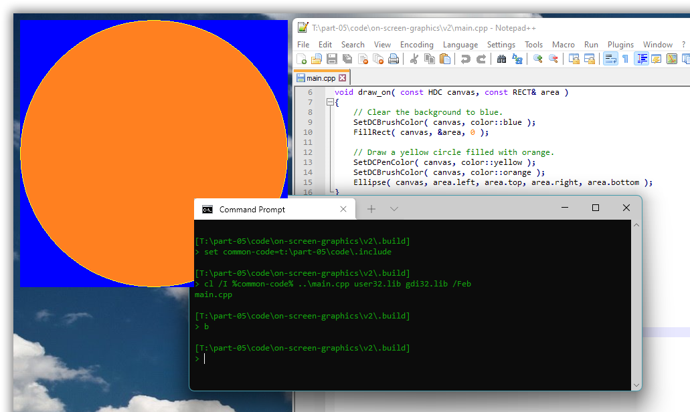

# Windows GUI-stuff in C++: a tutorial.

## Part 5 – GDI graphics: basics with a C++ fluent wrapper.

In this and some more parts we’ll use the [**GDI**](https://en.wikipedia.org/wiki/Graphics_Device_Interface), Windows’ original *graphics device interface*, to explore basic graphics: drawing shapes, lines and text, and learning how graphics drawing relates to Windows’ GUI mechanisms, such as drawing the background image of a window.

The GDI is a good starting point for C++ graphics in Windows, because

* it’s the graphics API that the windowing functionality assumes and is designed for,
* the GDI itself is simple and C-oriented, which is nice, and
* you can explore GDI graphics directly on the screen, without complex windowing.

However, the GDI’s simplicity is much like the simplicity of individual assembly language instructions. You need a lot of them to accomplish anything. General GDI code gets very verbose, which is why this part focuses on providing a C++ “fluent style” wrapper.

Also, the GDI is generally slow and produces low quality graphics. In particular the GDI doesn’t support [anti-aliasing](https://en.wikipedia.org/wiki/Spatial_anti-aliasing), and it doesn’t support [alpha channel transparency](https://en.wikipedia.org/wiki/Alpha_compositing), which are both strong reasons to later move on to the successor technologies [GDI+](https://en.wikipedia.org/wiki/Graphics_Device_Interface#Windows_XP) and [Direct 2D](https://en.wikipedia.org/wiki/Direct2D).

And unfortunately, also, the GDI doesn’t (yet) support UTF-8 encoded Unicode text for *drawing* text as graphics, as opposed to using controls to present text as we did in part 4, and it doesn’t support saving an image other than as an archaic non-portable ".wmf" file. These shortcomings are remedied in later parts of this tutorial. Just be adviced that in particular saving an image to a file, without using successor technologies, can be non-trivial.

[some figure]

<!-- START doctoc generated TOC please keep comment here to allow auto update -->

<!-- DON'T EDIT THIS SECTION, INSTEAD RE-RUN doctoc TO UPDATE -->

<!-- DON'T EDIT THIS SECTION, INSTEAD RE-RUN doctoc TO UPDATE -->

- [5.1. Draw directly on the screen.](#51-draw-directly-on-the-screen)
- [5.2 Use “DC colors” to reduce verbosity.](#52-use-dc-colors-to-reduce-verbosity)
- [5.3. A C++ fluent style wrapper for “DC color” usage.](#53-a-c-fluent-style-wrapper-for-dc-color-usage)

<!-- END doctoc generated TOC please keep comment here to allow auto update -->

---

### 5.1. Draw directly on the screen.

With the GDI you can draw more or less directly on the screen.

Drawing directly on the screen is just a special case of drawing in a window, the slightly paradoxical case of “no window”.

This involves first calling `GetDC(0)` (with `0` for “no window”) to get a handle to a drawing surface covering the screen. In Windows terminology that’s called a **device context** for the screen, and the handle type is a `HDC`, handle to device context. In more general programming the equivalent of a Windows DC is often called a **canvas**, emphasizing that it’s used for painting.

On the *output side* — the right side in the figure below — a device context generates graphics in windows, in bitmap images, to printers, and to now archaic “.wmf” image files. So, you can use roughly the same code to generate graphics for all these destinations, much like with a C++ abstract base class with `virtual` functions. There is probably some historical reason why Microsoft incongruously refers to all these graphics destinations as “devices”; maybe originally only screens and printers were supported.

The side of a device context that your code relates to, its *input side*, mainly executes drawing commands such as calls of the `Ellipse` function, but it also receives and retains drawing attributes such as a **pen** that specifies attributes of lines (e.g. color, width and pattern), and such as a **brush** that specifies attributes of color fills, in particular the fill color.


By default a device context typically has a black pen and a white brush. To draw a yellow circle filled with orange the code below uses the general GDI approach of (1) creating pen and brush objects, respectively yellow and orange; (2) **selecting** them in the device context; (3) drawing, which implicitly uses the selected objects; (4) deselecting the objects by selecting back in the original objects; and finally (5) destroying the objects. This is not necessarily inefficient, but, which is a general problem with the GDI, it’s quite verbose:

*[part-05/code/on-screen-graphics/v1/main.cpp](part-05/code/on-screen-graphics/v1/main.cpp)*:

```cpp
# // Source encoding: UTF-8 with BOM (π is a lowercase Greek "pi").
#include <wrapped-winapi/windows-h.hpp>

// COLORREF is 32-bit unsigned.
namespace color {
    constexpr COLORREF  orange      = RGB( 0xFF, 0x80, 0x20 );
    constexpr COLORREF  yellow      = RGB( 0xFF, 0xFF, 0x20 );
    constexpr COLORREF  blue        = RGB( 0x00, 0x00, 0xFF );
}  // namespace color

auto main() -> int
{
    constexpr auto  no_window   = HWND( 0 );
    constexpr auto  area        = RECT{ 10, 10, 10 + 400, 10 + 400 };

    const HDC canvas = GetDC( no_window );
        // Fill the background with blue.
        const HBRUSH blue_brush = CreateSolidBrush( color::blue );
            FillRect( canvas, &area, blue_brush );
        DeleteObject( blue_brush );

        // Draw a yellow circle filled with orange.
        const HBRUSH    orange_brush                = CreateSolidBrush( color::orange );
            const HGDIOBJ   original_brush          = SelectObject( canvas, orange_brush );
                const HPEN      yellow_pen          = CreatePen( PS_SOLID, 1, color::yellow );
                    const HGDIOBJ   original_pen    = SelectObject( canvas, yellow_pen );
                        Ellipse( canvas, area.left, area.top, area.right, area.bottom );
                    SelectObject( canvas, original_pen );
                DeleteObject( yellow_pen );
            SelectObject( canvas, original_brush );
        DeleteObject( orange_brush );
    ReleaseDC( no_window, canvas );
}
```

Originally the effect was probably to actually draw directly on the screen, bypassing all the window management, and messing up the screen Real Good&trade;. But in Windows 11 there are layers of indirection and management interposed between the drawing calls and the screen output, in particular the [Desktop Window Manager](https://docs.microsoft.com/en-us/windows/win32/dwm/dwm-overview). There are some weird effects such as the graphics partially intruding in console windows, but such code still “works” and supports explorative programming.


The effect is not entirely consistent between runs. Usually, if one doesn’t fill in the background, there’s a black background around the disk; but sometimes (rarely) there’s only the disk, then with essentially transparent background; and with some other graphics I’ve seen the background from one run of one program being retained as background for the graphics from another program, which was pretty confusing, huh where did *that* come from, before I understood what was going on. This is much like the rest of Windows 11’s functionality, i.e. it’s pretty shaky, not very reliable, depending on the phase of the moon, but the unreliability doesn’t really matter here.

For completeness, the `COLORREF` type is a 32-bit [RGB](https://en.wikipedia.org/wiki/RGB_color_model) **color** specification (3×8 = 24 bits used), and the `RECT` type is a simple struct with `left`, `top`, `right` and `bottom` integer value members.

In the default pixel coordinate system *x* increases left to right so that `left` ≤ `right` and *y* increases top to bottom so that `top` ≤ `bottom`.

Worth knowing: the `right` pixel column and the `bottom` pixel row are not part of a `RECT` rectangle. These are “beyond” values just like a C++ `o.end()` iterator. Thus the initialization `RECT{ 10, 10, 10 + 400, 10 + 400 }` creates a 400×400 rectangle.

Also, for completeness, here’s how to build and run with the Microsoft toolchain, Visual C++ (needs linking with “**gdi32**.lib”):

```txt
[T:\part-05\code\on-screen-graphics\v1\.build]
> set common-code=t:\part-05\code\.include

[T:\part-05\code\on-screen-graphics\v1\.build]
> cl /I %common-code% ..\main.cpp user32.lib gdi32.lib /Feb
main.cpp

[T:\part-05\code\on-screen-graphics\v1\.build]
> b_
```

Ditto, building and running with the MinGW toolchain, g++:

```txt
[T:\part-05\code\on-screen-graphics\v1\.build]
> set common-code=t:\part-05\code\.include

[T:\part-05\code\on-screen-graphics\v1\.build]
> g++ -I %common-code% ..\main.cpp -lgdi32

[T:\part-05\code\on-screen-graphics\v1\.build]
> a_
```

### 5.2 Use “DC colors” to reduce verbosity.

Instead of creating, selecting, using, unselecting and destroying pen and brush objects, as long as you don’t need fancy effects such as line patterns you can just change the device context’s **DC pen color** and **DC brush color**, via respectively `SetDCPenColor` and `SetDCBrushColor`. These colors are only *used* when the **stock objects** you get from respectively `GetStockObject(DC_PEN)` and `GetStockObject(DC_BRUSH)` are selected in the device context.

My experimentation showed that in Windows 11 these are not the default objects in a DC from `GetDC(0)`, so it’s necessary to explicitly select them:

*[part-05/code/on-screen-graphics/v2/main.cpp](part-05/code/on-screen-graphics/v2/main.cpp)*:

```cpp
# // Source encoding: UTF-8 with BOM (π is a lowercase Greek "pi").
#include <winapi/gdi/color_names.hpp>
#include <wrapped-winapi/windows-h.hpp>
namespace color = winapi::gdi::color_names;

void draw_on( const HDC canvas, const RECT& area )
{
    // Clear the background to blue.
    SetDCBrushColor( canvas, color::blue );
    FillRect( canvas, &area, 0 );

    // Draw a yellow circle filled with orange.
    SetDCPenColor( canvas, color::yellow );
    SetDCBrushColor( canvas, color::orange );
    Ellipse( canvas, area.left, area.top, area.right, area.bottom );
}

auto main() -> int
{
    constexpr auto  no_window   = HWND( 0 );

    const HDC canvas = GetDC( no_window );
    SelectObject( canvas, GetStockObject( DC_PEN ) );
    SelectObject( canvas, GetStockObject( DC_BRUSH ) );

        draw_on( canvas, RECT{ 10, 10, 10 + 400, 10 + 400 } );

    ReleaseDC( no_window, canvas );
}
```

… where

*[part-05/code/.include/winapi/gdi/color_names.hpp](part-05/code/.include/winapi/gdi/color_names.hpp)*:

```cpp
#pragma once    // Source encoding: UTF-8 with BOM (π is a lowercase Greek "pi").
#include <wrapped-winapi/windows-h.hpp>

namespace winapi::gdi {

    // COLORREF is 32-bit unsigned.
    namespace color_names {
        constexpr COLORREF  orange      = RGB( 0xFF, 0x80, 0x20 );
        constexpr COLORREF  yellow      = RGB( 0xFF, 0xFF, 0x20 );
        constexpr COLORREF  blue        = RGB( 0x00, 0x00, 0xFF );
    }  // namespace color_names

}  // namespace winapi::gdi
```

Result: same as before, just with shorter & more clear code,



The [current documentation of `SelectObject`](https://docs.microsoft.com/en-us/windows/win32/api/wingdi/nf-wingdi-selectobject) states that the object one selects “must have been created” by one of the functions listed in a table there, which does not include `GetStockObject`. But of course that’s just the usual Microsoft documentation SNAFU. The stock objects would not be useful for anything if they couldn’t be used.

However, the stock objects are special in that they don’t need to and shouldn’t be destroyed via `DeleteObject` (or any other way).

---

### 5.3. A C++ fluent style wrapper for “DC color” usage.


The drawing code

```cpp
using namespace winapi::gdi::color_names;

// Clear the background to blue.
SetDCBrushColor( canvas, blue );
FillRect( canvas, &area, 0 );

// Draw a yellow circle filled with orange.
SetDCPenColor( canvas, yellow );
SetDCBrushColor( canvas, orange );
Ellipse( canvas, area.left, area.top, area.right, area.bottom );
```

… is a definite improvement on the first example’s ultra-verbose general GDI code, but ideally it should look more like this:

```cpp
using namespace winapi::gdi::color_names;
canvas.use( Brush_color( blue ) ).fill( area );
canvas.use( Brush_color( orange ), Pen_color( yellow ) ).draw( Ellipse, area );
```

Here `canvas` is an instance of a C++ class that wraps an `HDC`, and its `.use` member function returns a reference to the instance so that one can tack on a call to e.g. `.fill` or `.draw`. This is the same principle as with the iostreams `<<` operator. It's called [**fluent style**](https://en.wikipedia.org/wiki/Fluent_interface).

Oh, the Yoda picture is really about absorbing a great destructive force rather than generating a constructive force. But it looks forceful. And I like Yoda. ☺

---

#### 5.3.1. A single abstract DC class for screen, window and bitmap drawing.

There are several kinds of device context, with kind-specific destruction!, so I chose to define the common features in an abstract base class `Dc`:

*Start of [part-05/code/.include/winapi/gdi/device-contexts.hpp](part-05/code/.include/winapi/gdi/device-contexts.hpp)*:

```cpp
#pragma once    // Source encoding: UTF-8 with BOM (π is a lowercase Greek "pi").
    ⋮ // `#include` directives.

namespace winapi::gdi {
    ⋮ // `using` declarations.

    inline void make_practical( const HDC dc )
    {
        SelectObject( dc, GetStockObject( DC_PEN ) );
        SelectObject( dc, GetStockObject( DC_BRUSH ) );
        SetBkMode( dc, TRANSPARENT );   // Don't fill in background of text, please.
        SelectObject( dc, gui::std_font );
    }

    class Dc: No_copying
    {
        HDC     m_handle;

        ⋮ // An internal helper function here.

    protected:
        inline virtual ~Dc() = 0;                           // Derived-class responsibility.

        Dc( HDC&& handle, const bool do_extended_init = true ):
            m_handle( handle )
        {
            hopefully( m_handle != 0 ) or CPPUTIL_FAIL( "Device context handle is 0." );
            if( do_extended_init ) { make_practical( m_handle ); }
        }

    public:
        template< class... Args >
        auto use( const Args&... colors ) const -> const Dc&;

        auto fill( const RECT& area ) const -> const Dc&;

        template< class Api_func, class... Args >
        auto simple_draw( const Api_func api_func, const Args&... args ) const -> const Dc&;

        template< class Api_func, class... Args >
        inline auto draw( const Api_func api_func, const Args&... args ) const -> const Dc&;

        auto handle() const -> HDC  { return m_handle; }
        operator HDC() const        { return handle(); }

        class Selection;                                    // RAII for SelectObject, separate.
    };

    inline Dc::~Dc() {}

    ⋮
```

For the last source code line: the pure `virtual` destructor is implemented — and needs to be implemented — because it’s called non-virtually by the destructors of derived classes. Unfortunately there’s no syntax for defining it inline in the class definition. Bjarne Stroustrup chose the `= 0` syntax for pure virtual functions because it indicated that the function has no body, which is usually true, but just not the case for pure virtual destructors.

From a Windows API point of view a device context can be created by a number of different functions, and then needs to be destroyed by corresponding destruction functions:

|     | Used for:                              | Term:             | Creation:            | Destruction |
| --- | -------------------------------------- | ----------------- | -------------------- | ----------- |
|     | Updating or repairing window contents. | –                 | `BeginPaint`         | `EndPaint`  |
| ▷   | Drawing in a window or on the screen.  | “Window DC”.      | `GetDC`              | `ReleaseDC` |
|     | Drawing to a screen or printer.        | –                 | `CreateDC`           | `DeleteDC`  |
|     | Drawing to an image (bitmap or WMF)    | “Memory DC”.      | `CreateCompatibleDC` | `DeleteDC`  |
|     | Obtaining device information.          | “Information DC”. | `CreateIC`           | `DeleteDC`  |

I guess the difference between `GetDC` and `CreateDC` is that `GetC` obtains a device context for the desktop background window, so that drawing there is effectively to draw on the screen, while `CreateDC` obtains a device context for the actual physical screen.

Anyway, for the draw-on-screen example program the only concrete derived class we need is one that captures the concept of a “window DC”, but for clarity and ease of use I define both a general such class, `Window_dc`, and a specialization `Screen_dc`:

*Middle of [part-05/code/.include/winapi/gdi/device-contexts.hpp](part-05/code/.include/winapi/gdi/device-contexts.hpp)*:

```
    ⋮

    class Window_dc: public Dc
    {
        HWND    m_window;

    public:
        // Cleanup is intentionally also done for a zero handle, which represents the screen.
        ~Window_dc() override { ReleaseDC( m_window, handle() ); }
        Window_dc( const HWND window ): Dc( GetDC( window ) ), m_window( window ) {}
    };


    class Screen_dc: public Window_dc
    {
    public:        
        Screen_dc(): Window_dc( 0 ) {}                      // Main screen specified implicitly.
    };

    ⋮
```

---

#### 5.3.2. A single color setter function for draw, fill, text and gap.

The `SetDCPenColor` and `SetDCBrushColor` functions that we’ve used sets respectively drawing color and general figure fill color. But there is also a text color, set with `SetTextColor`. And for the gaps in patterned lines and brushes, as well as for the background of text, the GDI will either use the existing image background, called **`TRANSPARENT`** mode, or the color set with the `SetBkColor` function, called **`OPAQUE`** mode. You set the mode with the `SetBkMode` function. The default is unfortunately `OPAQUE`.

And unfortunately the gap color + transparency mode cannot be naturally captured as a single 32-bit `COLORREF` value, because the convention in later API’s and file formats is that upper byte zero (the usual in GDI work) means fully *transparent* instead of fully opaque. So, setting that byte to e.g. FF₁₆ to indicate transparent would clash with the later convention. And so, unless I fail to see something really clever, any thin GDI wrapper must in practice expose the Evil&trade; mode.

Anyway this means that with the GDI there are four possible colorizations to specify the color for: drawing (pen color), general figure fill (brush color), text, and gap filling (`BK`-color, whatever *bk* is short for).

The C++ fluent device context class’  `.use` member function takes an arbitrary number of arguments that represent colors to set in the device context. The colorization to use a color for is indicated by the argument type. Specifically the `.use` function delegates the color setting to the argument type’s `.set_in` member function, as shown below, where all but the common `Color` base class are argument types:

*[part-05/code/.include/winapi/gdi/color-usage-classes.hpp](part-05/code/.include/winapi/gdi/color-usage-classes.hpp)*:

```cpp
#pragma once    // Source encoding: UTF-8 with BOM (π is a lowercase Greek "pi").
#include <wrapped-winapi/windows-h.hpp>

namespace winapi::gdi {
    struct Color{ COLORREF value; Color( const COLORREF c ): value( c ) {} };

    struct Pen_color: Color
    {
        using Color::Color;
        void set_in( const HDC canvas ) const { SetDCPenColor( canvas, value ); }
        static auto in( const HDC canvas ) -> Pen_color { return GetDCPenColor( canvas ); }
    };

    struct Brush_color: Color
    {
        using Color::Color;
        void set_in( const HDC canvas ) const { SetDCBrushColor( canvas, value ); }
        static auto in( const HDC canvas ) -> Brush_color { return GetDCBrushColor( canvas ); }
    };

    struct Gap_color: Color     // Gaps in pattern lines, and bg in text presentation.
    {
        using Color::Color;
        void set_in( const HDC canvas ) const
        {
            SetBkColor( canvas, value );  SetBkMode( canvas, OPAQUE );
        }
        static auto in( const HDC canvas ) -> Pen_color { return GetBkColor( canvas ); }
    };

    struct Transparent_gaps
    {
        void set_in( const HDC canvas ) const { SetBkMode( canvas, TRANSPARENT ); }

        static auto in( const HDC canvas )
            -> bool
        { return (GetBkMode( canvas ) == TRANSPARENT); }
    };

    struct Text_color: Color
    {
        using Color::Color;
        void set_in( const HDC canvas ) const { SetTextColor( canvas, value ); }
        static auto in( const HDC canvas ) -> Text_color { return GetTextColor( canvas ); }
    };
}  // namespace winapi::gdi
```

Corresponding implementation of the device context class' `.use` member function:

```cpp
template< class... Args >
auto Dc::use( const Args&... colors ) const
    -> const Dc&
{
    (colors.set_in( m_handle ), ...);
    return *this;
}
```

Here the first statement is a C++17 [**fold expression**](https://en.cppreference.com/w/cpp/language/fold), which expands to one *c*`.set_in(m_handle)` call for each actual argument *c*.

---

#### 5.3.3. A single fluid wrapper for all the GDI drawing functions.

The GDI offers a great many line drawing functions:

| *Function:*    | *Microsoft’s description:*                                                                        |
|:-------------- |:------------------------------------------------------------------------------------------------- |
| `AngleArc`     | Draws a line segment and an arc.                                                                  |
| `Arc`          | Draws an elliptical arc.                                                                          |
| `ArcTo`        | Draws an elliptical arc.                                                                          |
|                |                                                                                                   |
| `MoveToEx`     | Updates the current position to the specified point and optionally returns the previous position. |
| `LineTo`       | Draws a line from the current position up to, but not including, the specified point.             |
| `Polyline`     | Draws a series of line segments by connecting the points in the specified array.                  |
| `PolylineTo`   | Draws one or more straight lines.                                                                 |
| `PolyPolyline` | Draws multiple series of connected line segments.                                                 |
|                |                                                                                                   |
| `PolyBezier`   | Draws one or more Bézier curves.                                                                  |
| `PolyBezierTo` | Draws one or more Bézier curves.                                                                  |
| `PolyDraw`     | Draws a set of line segments and Bézier curves.                                                   |

In addition there’s a great number of filled shape functions:


asdasd

Instead of e.g. a `.draw_ellipse` function that would call GDI’s `Ellipse`, and so on for each GDI drawing function, I chose to *pass the relevant API function as a first argument to a single general wrapper template*.

This approach is best illustrated by `.simple_draw`, whose ~only reason for existence is to serve as a minimal, relatively simple code example:

```cpp
template< class Api_func, class... Args >
auto Dc::simple_draw( const Api_func api_func, const Args&... args ) const
    -> const Dc&
{
    api_func( m_handle, args... );
    return *this;
}
```

A call can look like the follow, here using the `Ellipse` function:

```cpp
canvas.simple_draw( Ellipse, area.left, area.top, area.right, area.bottom );
```

But ideally a call should be like just

```cpp
canvas.draw( Ellipse, area );
```

And the `.draw` function enables that, by replacing every `RECT` in the argument list with the 4 `int` values that it carries. However, this *usage simplification* yields far more intricate implementation code, so I chose to also define `simple_draw` and present that first.

A C style solution could instead be to require the caller to add a macro invocation that would expand a `RECT` into its 4 `int` member values. That’s simple but adds a macro (which is generally [Evil™](https://isocpp.org/wiki/faq/big-picture#defn-evil)) and it still adds *some* verbosity at every call site. Doing this expansion instead via obscure C++ TMP magic is complex and decidedly non-trivial, but centralized and transparent to the caller, with natural-for-C++ usage as shown.

asdasd
