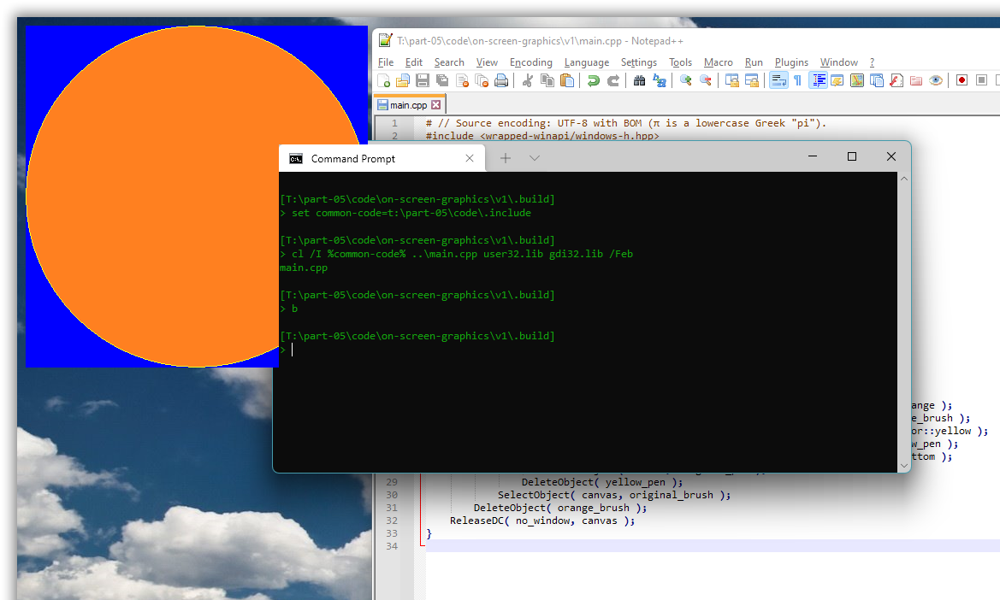

# Windows GUI-stuff in C++: a tutorial.

## Part 5 – Primitive graphics: the GDI.

With last part’s discussion of how to use UTF-8 as the `char` based text encoding in both resource definitions and GUI code, we have a limited but useful framework for exploratory C++ Windows desktop programming.

We’ll use that to now explore the [**GDI**](https://en.wikipedia.org/wiki/Graphics_Device_Interface), Windows’ original *graphics device interface*, which supports basic graphics and text. GDI is simple and C-oriented, which is nice. On the other hand it’s slow and produces low quality graphics, in particular without anti-aliasing, which is a strong reason to later move on to the successor technologies [GDI+](https://en.wikipedia.org/wiki/Graphics_Device_Interface#Windows_XP) and [Direct 2D](https://en.wikipedia.org/wiki/Direct2D).

Unfortunately Windows doesn’t yet support custom UTF-8 based text presentation, i.e. for *drawing* text as graphics, as opposed to using controls to present text, as we did in part 4. We’ll work around that limitation by writing our own wrappers over Windows’ wide text functions. Happily Windows does support conversion between UTF-8 (as well as a large number of other encodings) and UTF-16 via API functions such as [`MultiByteToWideChar`](https://docs.microsoft.com/en-us/windows/win32/api/stringapiset/nf-stringapiset-multibytetowidechar), in addition to, since Windows 10, providing the feature-rich C API of the main Unicode library [**ICU**](https://docs.microsoft.com/en-us/windows/win32/intl/international-components-for-unicode--icu-).

[some figure]

<!-- START doctoc generated TOC please keep comment here to allow auto update -->
<!-- DON'T EDIT THIS SECTION, INSTEAD RE-RUN doctoc TO UPDATE -->
*Contents (table generated with [DocToc](https://github.com/thlorenz/doctoc)):*

- [5.1. Draw directly on the screen to learn GDI basics.](#51-draw-directly-on-the-screen-to-learn-gdi-basics)

<!-- END doctoc generated TOC please keep comment here to allow auto update -->

---
### 5.1. Draw directly on the screen to learn GDI basics.

You don’t need a window to draw graphics: with GDI you can draw more or less directly on the screen.

This involves first calling `GetDC(0)` to get a handle to a drawing surface covering the screen. In Windows terminology that’s called a **device context** for the screen, emphasizing its technical rôle of abstracting away the particular hardware, and so the handle type is a `HDC`, handle to device context. More generally it’s called a **canvas**, emphasizing what it’s used for, namely painting.

Next one can create and use various drawing tools such as a **pen** to draw lines or a **brush** to fill in interiors of things. This methaphor is very shallow, e.g. there’s no notion of ink, but instead pens and brushes that have inherent colors. A device context at any time contains one object of each kind and uses that object for graphics operations. One can *replace* the current object of a given kind via `SelectObject`, which returns the handle to the original object of the argument kind. Unfortunately this is a C-oriented API with no overloading, so that the code involves a mixture of the generic GDI tool handle type, `HGDIOBJ`, and more tool kind specific handles like `HBRUSH`, sometimes (but not in this example) with downcasting required:

[*part-05/code/on-screen-graphics/v1/main.cpp*](part-05/code/on-screen-graphics/v1/main.cpp)
~~~cpp
#include <wrapped-winapi/windows-h.hpp>

auto main() -> int
{
    constexpr auto  red         = COLORREF( RGB( 0xFF, 0, 0 ) );
    constexpr auto  no_window   = HWND( 0 );
    
    const HDC canvas = GetDC( no_window );
    {
        const HBRUSH red_brush = CreateSolidBrush( red );
        {
            const HGDIOBJ original_brush = SelectObject( canvas, red_brush );
            {
                Ellipse( canvas, 10, 10, 10 + 400, 10 + 400 );
            }
            SelectObject( canvas, original_brush );
        }
        DeleteObject( red_brush );
    }
    ReleaseDC( no_window, canvas );
}
~~~

Here the `COLORREF` type is a 32-bit [RGB](https://en.wikipedia.org/wiki/RGB_color_model) **color** specification (in modern Windows it can be [RGBA](https://en.wikipedia.org/wiki/RGBA_color_model)).

The nested blocks are just for clarity of presentation, showing that each tool creation and destruction is in a limited scope, and that these usually and ideally are strictly nested scopes.

Originally the effect was probably to actually draw directly on the screen, bypassing all the window management, and messing up the screen Real Good&trade;. But in Windows 11 there are layers of indirection and management interposed between the drawing calls and the screen output, in particular the [Desktop Window Manager](https://docs.microsoft.com/en-us/windows/win32/dwm/dwm-overview). However, presumably for backward compatibility Windows still supports such old draw-directly-on-the-screen code. There are some weird effects such as the graphics partially intruding in console windows, but such code still “works” and supports explorative programming.

