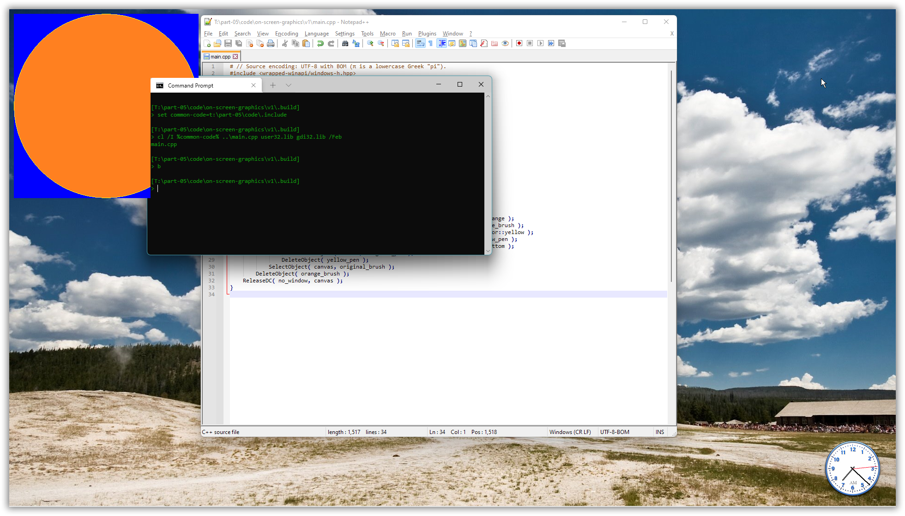

# Windows GUI-stuff in C++: a tutorial.

## Part 5 – Primitive graphics: the GDI.

With last part’s discussion of how to use UTF-8 as the `char` based text encoding in both resource definitions and GUI code, we have a limited but useful framework for exploratory C++ Windows desktop programming.

We’ll use that to now explore some of the [**GDI**](https://en.wikipedia.org/wiki/Graphics_Device_Interface), Windows’ original *graphics device interface*, which supports basic graphics and text. GDI is simple and C-oriented, which is nice. On the other hand it’s slow and produces low quality graphics, in particular without anti-aliasing, which is a strong reason to later move on to the successor technologies [GDI+](https://en.wikipedia.org/wiki/Graphics_Device_Interface#Windows_XP) and [Direct 2D](https://en.wikipedia.org/wiki/Direct2D).

Unfortunately Windows doesn’t yet support UTF-8 based text for *drawing* text as graphics, as opposed to using controls to present text as we did in part 4. We’ll work around that by writing our own wrappers over Windows’ wide text drawing functions. Happily Windows does support conversion between UTF-8 and UTF-16 via API functions such as [`MultiByteToWideChar`](https://docs.microsoft.com/en-us/windows/win32/api/stringapiset/nf-stringapiset-multibytetowidechar), in addition to, since Windows 10, providing the feature rich C API of the main Unicode library [**ICU**](https://docs.microsoft.com/en-us/windows/win32/intl/international-components-for-unicode--icu-).

[some figure]

<!-- START doctoc generated TOC please keep comment here to allow auto update -->
<!-- DON'T EDIT THIS SECTION, INSTEAD RE-RUN doctoc TO UPDATE -->
*Contents (table generated with [DocToc](https://github.com/thlorenz/doctoc)):*

- [5.1. Draw directly on the screen to learn GDI basics.](#51-draw-directly-on-the-screen-to-learn-gdi-basics)
- [5.2. Use C++ RAII to automate GDI object destruction.](#52-use-c-raii-to-automate-gdi-object-destruction)
- [5.3. In passing: support `assert` messages in a GUI program built with Visual C++.](#53-in-passing-support-assert-messages-in-a-gui-program-built-with-visual-c)

<!-- END doctoc generated TOC please keep comment here to allow auto update -->

---
### 5.1. Draw directly on the screen to learn GDI basics.

You don’t need a window to draw graphics: with GDI you can draw more or less directly on the screen.

This involves first calling `GetDC(0)` to get a handle to a drawing surface covering the screen. In Windows terminology that’s called a **device context** for the screen, emphasizing its technical rôle of abstracting away the particular hardware, and so the handle type is a `HDC`, handle to device context. More generally it’s called a **canvas**, emphasizing what it’s used for, namely painting.

Next one can create and use various drawing tools such as a **pen** to draw lines or a **brush** to fill in interiors of things. This methaphor is very shallow, e.g. there’s no notion of ink, but instead pens and brushes that have inherent colors. A device context at any time contains one object of each kind and uses that object for graphics operations. One can *replace* the current object of a given kind via `SelectObject`, which returns the handle to the original object of the argument kind. Unfortunately this is a C-oriented API with no overloading, so that the code involves a mixture of the generic GDI tool handle type, `HGDIOBJ`, and more tool kind specific handles like `HBRUSH`, sometimes (but not in this example) with downcasting required:

[*part-05/code/on-screen-graphics/v1/main.cpp*](part-05/code/on-screen-graphics/v1/main.cpp)
~~~cpp
#include <wrapped-winapi/windows-h.hpp>

auto main() -> int
{
    constexpr auto  red         = COLORREF( RGB( 0xFF, 0, 0 ) );
    constexpr auto  no_window   = HWND( 0 );
    
    const HDC canvas = GetDC( no_window );
    {
        const HBRUSH red_brush = CreateSolidBrush( red );
        {
            const HGDIOBJ original_brush = SelectObject( canvas, red_brush );
            {
                Ellipse( canvas, 10, 10, 10 + 400, 10 + 400 );
            }
            SelectObject( canvas, original_brush );
        }
        DeleteObject( red_brush );
    }
    ReleaseDC( no_window, canvas );
}
~~~

Here the `COLORREF` type is a 32-bit [RGB](https://en.wikipedia.org/wiki/RGB_color_model) **color** specification.

The nested blocks are just for clarity of presentation, showing that each tool creation and destruction is in a limited scope, and that these usually and ideally are strictly nested scopes.

Originally the effect was probably to actually draw directly on the screen, bypassing all the window management, and messing up the screen Real Good&trade;. But in Windows 11 there are layers of indirection and management interposed between the drawing calls and the screen output, in particular the [Desktop Window Manager](https://docs.microsoft.com/en-us/windows/win32/dwm/dwm-overview). However, presumably for backward compatibility Windows still supports such old draw-directly-on-the-screen code. There are some weird effects such as the graphics partially intruding in console windows, but such code still “works” and supports explorative programming.

The effect is not entirely consistent between runs. Sometimes I get the black background around the red disk, sometimes (but rarely) only the red disk, then with essentially transparent background. This is much like the rest of Windows 11’s functionality, i.e. it’s pretty shaky, not very reliable, depending on the phase of the moon, but that doesn’t really matter here.

For completeness, here’s how to build and run with the Microsoft toolchain, Visual C++ (needs linking with “**gdi32**.lib”):

~~~txt
[T:\part-05\code\on-screen-graphics\v1\.build]
> set common-code=t:\part-05\code\.include

[T:\part-05\code\on-screen-graphics\v1\.build]
> cl /I %common% ..\main.cpp user32.lib gdi32.lib /Feb
main.cpp

[T:\part-05\code\on-screen-graphics\v1\.build]
> b_
~~~

Ditto, building and running with the MinGW toolchain, g++:

~~~txt
[T:\part-05\code\on-screen-graphics\v1\.build]
> set common-code=t:\part-05\code\.include

[T:\part-05\code\on-screen-graphics\v1\.build]
> g++ -I %common-code% ..\main.cpp -lgdi32

[T:\part-05\code\on-screen-graphics\v1\.build]
> a_
~~~

---
### 5.2. Use C++ RAII to automate GDI object destruction.

The preceding section’s code exemplified how GDI usage, and for that matter many other areas of Windows programming, involves establishing and tearing down local state, with these pairs of calls at least logically in nested scopes:

~~~cpp
const HDC canvas = GetDC( no_window );
{
    const HBRUSH red_brush = CreateSolidBrush( red );
    {
        const HGDIOBJ original_brush = SelectObject( canvas, red_brush );
        {
            Ellipse( canvas, 10, 10, 10 + 400, 10 + 400 );
        }
        SelectObject( canvas, original_brush );
    }
    DeleteObject( red_brush );
}
ReleaseDC( no_window, canvas );
~~~

| What: | Create: | Destroy: |
|-------|----------|-----------|
| Window device context: | `GetDC` | `ReleaseDC` |
| Color brush: | `CreateSolidBrush` | `DeleteObject` |
| Selection state: | `SelectObject` | `SelectObject` |

These pairwise nested *create* + *destroy* call pairs are as made for applying the C++ [**RAII** technique](https://en.wikipedia.org/wiki/Resource_acquisition_is_initialization), the idea of using a C++ constructor to create something, so that the something’s eventual destruction can be automated and guaranteed via the corresponding C++ destructor. The nice thing about RAII is that it ensures destruction even when an exception occurs in the code using the something. But in this case there is a snag, for the [documentation of the `DeleteObject` function](https://docs.microsoft.com/en-us/windows/win32/api/wingdi/nf-wingdi-deleteobject) warns that

> ❞ Do not delete a drawing object (pen or brush) while it is still selected into a DC.

This means that `DeleteObject` probably can fail, even though some simple experimentation with not unselecting didn’t provoke such destruction failure, and therefore that the destructor used for RAII can fail, and if one chooses to let it report failure via an exception then it’s not unlikely that this will result in an exception in the stack unwinding of some other exception, resulting in a call of `std::terminate`… Which is seriously undesireable. Alternatives include:

* Ignore cleanup failures. This is likely to result in an ongoing GDI **resource leak**. A possible consequence is that instead of graphics the program ends up displaying white (or possibly black) areas, say.
* Ensure that the particular failure mode, `DeleteObject` of a pen or brush that’s still selected in a device context, cannot happen. Doing this in a reliable, robust way involves defining a full abstraction layer where client code doesn’t have access to the GDI object handles, so that it can’t mess up things. That can be a lot of work.
* Make it very likely that the problem, if any, is detected by testing, e.g. via `assert` statements.

The code below uses the last bullet point’s approach, the “just support discovery of the problem” approach:

[*part-05/code/.include/winapi/gdi.hpp*](part-05/code/.include/winapi/gdi.hpp)
~~~cpp
#include <wrapped-winapi/windows-h.hpp>
#include <cpp/util.hpp>

#include    <assert.h>

namespace winapi::gdi {
    class Window_dc: private cpp::util::No_copying
    {
        HWND    m_window;
        HDC     m_dc;
        
    public:
        ~Window_dc()
        {
            ::ReleaseDC( m_window, m_dc );
        }
        
        explicit Window_dc( const HWND window ):
            m_window( window ),
            m_dc( ::GetDC( window ) )
        {
            assert( m_dc != 0 );
        }
        
        auto handle() const -> HDC { return m_dc; }
        operator HDC() const { return handle(); }
    };

    template< class Handle >
    class Object_: private cpp::util::No_copying
    {
        Handle      m_object;
        
    public:
        ~Object_()
        {
            const bool ok = !!::DeleteObject( m_object );
            assert(( "DeleteObject", ok ));  (void) ok;
        }
        
        Object_( const Handle object ): m_object( object ) {}
        
        auto handle() const -> Handle { return m_object; }
        operator Handle() const { return handle(); }
    };

    class Selection: private cpp::util::No_copying
    {
        HDC         m_dc;
        HGDIOBJ     m_original_object;
        
    public:
        ~Selection() { ::SelectObject( m_dc, m_original_object ); }
        
        Selection( const HDC dc, const HGDIOBJ object ):
            m_dc( dc ),
            m_original_object( ::SelectObject( dc, object ) )
        {}
    };
}  // namespace winapi::gdi
~~~

In the v2 main program below this machinery is used to do exactly the same as the v1 program did:

[*part-05/code/on-screen-graphics/v2/main.cpp*](part-05/code/on-screen-graphics/v2/main.cpp)
~~~cpp
#include <wrapped-winapi/windows-h.hpp>
#include <winapi/gdi.hpp>
namespace gdi = winapi::gdi;

auto main() -> int
{
    constexpr auto  red         = COLORREF( RGB( 0xFF, 0, 0 ) );
    constexpr auto  no_window   = HWND( 0 );
    
    const auto canvas       = gdi::Window_dc( no_window );
    const auto red_brush    = gdi::Object_( CreateSolidBrush( red ) );

    { // Using the red brush.
        const auto _ = gdi::Selection( canvas, red_brush );
        Ellipse( canvas, 10, 10, 10 + 400, 10 + 400 );
    }
}
~~~

This can be further streamlined by defining a `WITH` macro, e.g.

~~~cpp
#define WITH( initializer )  if( const auto& _ = initializer; ((void) _, true) )
~~~

… so that one can write, for example,

~~~cpp
WITH( gdi::Selection( canvas, red_brush ) ) {
    Ellipse( canvas, 10, 10, 10 + 400, 10 + 400 );
}
~~~

… but I’ve found that I don’t actually use a `WITH` macro after definining it in some project (this has happened a number of times), so while it looks elegant it’s perhaps a waste of time.

Anyway the C++ RAII classes reduce the client code compared to direct use of the GDI API, but that’s just a nice bonus: they exist to provide *correctness* via guaranteed cleanup. This is however paid for by incurring some needless *inefficiency*, namely that *n* selection effect calls of `SelectObject` are paired with *n* corresponding guaranteed unselection calls, when just 1 final unselection call would suffice… The GDI API provides the `SaveDC` and `RestoreDC` functions to address that efficiency concern, where `SaveDC` saves the current selections, somewhere, and `RestoreDC` restores the last saved state.

However, from a C++ RAII automation point of view `SaveDC`+`RestoreDC` are slightly problematic because the unselection in `RestoreDC` should ideally be done before any possibly selected pen or brush is destroyed, which practically requires overlapping lifetimes for the RAII objects, and overlapping lifetimes don’t match C++ scopes very well.

---
### 5.3. In passing: support `assert` messages in a GUI program built with Visual C++.

To be sure that the `assert` statements really do their job you can intentionally trigger an assert, make it “fire”, e.g. by changing

~~~cpp
    assert( m_dc != 0 );
~~~

… to

~~~cpp
    assert( m_dc != 0 and false );
~~~

With a MinGW g++ console subsystem build this works fine; in that the assertion text is reported in the console:

~~~txt
[T:\part-05\code\on-screen-graphics\v2\.build]
> g++ -std=c++17 -I %common-code% ..\main.cpp -lgdi32

[T:\part-05\code\on-screen-graphics\v2\.build]
> a
Assertion failed: m_dc != 0 and false, file t:\part-05\code\.include/winapi/gdi.hpp, line 22
~~~

With a MinGW g++ GUI subsystem build it also works fine, 

