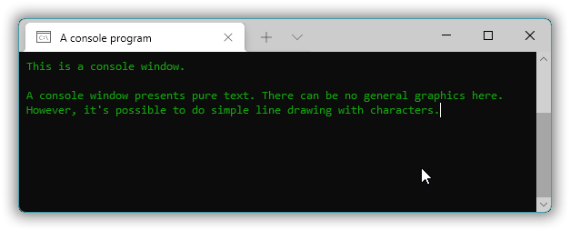
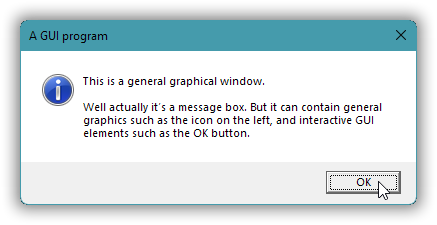
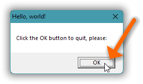
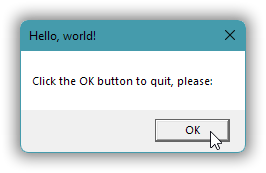
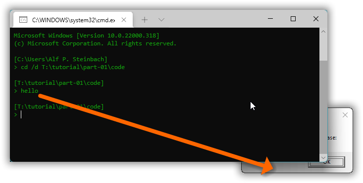

# Windows GUI-stuff in C++: a tutorial.

## Part 1 – A Windows GUI “Hello, world!”.

The main purpose of this first part is to get you up and running wrt.

* basic *concepts*, *tools* usage, basic *starter code*, and *documentation*,

so that you can explore further.

Some things that can seem mysterious are therefore explained in later parts of the tutorial, and not here.

<!-- START doctoc generated TOC please keep comment here to allow auto update -->
<!-- DON'T EDIT THIS SECTION, INSTEAD RE-RUN doctoc TO UPDATE -->
*Contents (table generated with [DocToc](https://github.com/thlorenz/doctoc)):*

- [1. Message boxes.](#1-message-boxes)
- [2. About modern C++ syntax.](#2-about-modern-c-syntax)
- [3. Windows subsystems.](#3-windows-subsystems)
- [4. Building for the GUI subsystem.](#4-building-for-the-gui-subsystem)
- [5. Find required libraries and headers.](#5-find-required-libraries-and-headers)
- [6. Run the program via commands and via mouse clicking.](#6-run-the-program-via-commands-and-via-mouse-clicking)
- [7. Varying behaviors of programs when you run them in Windows 11.](#7-varying-behaviors-of-programs-when-you-run-them-in-windows-11)

<!-- END doctoc generated TOC please keep comment here to allow auto update -->

---
### 1. Message boxes.

The simplest code for a GUI “Hello, world!” just produces a special restricted kind of window called a **message box**, like this:

A message box presents a title, a text, one or more buttons (by default just “OK”), and optionally an icon. The built-in icons indicate basic message box flavors such as  informational,  question,  warning or  error. Nearly every GUI environment has such message boxes, and with about the same flavors, but of course the details of how a box looks and what code you need to produce it are system specific.

This particular message box is produced by a call of Windows’ `MessageBox` function:

[*hello.cpp*](part-01/code/hello.cpp):
~~~cpp
#include <windows.h>

auto main() -> int
{
    const auto& title   = "Hello, world!";
    const auto& text    = "Click the OK button to quit, please:";

    MessageBox( 0, text, title, MB_SETFOREGROUND );
}
~~~

We’ll build this program in section 4, and we’ll run it — in various ways — in section 6.

---
### 2. About modern C++ syntax.

All the `auto` stuff in that code may seem mysterious and complex, perhaps a little frightening!, especially if you’re the victim of education that teaches C instead of C++. But the code is simply ordinary modern C++, as opposed to C89. C++11 introduced a new syntax for function declarations, and a syntax for variable declarations where you just want the compiler to fill in the variable’s type.

First, modern `auto main() -> int` means exactly the same as old C syntax `int main()`. However, the modern syntax can deal with many things that the old C syntax can’t, so if you want a single unified syntax then it has to be the modern syntax. This is called **trailing return type** syntax, and it has `auto` in front and `->` plus return type (in this case `int`) at the end.

The `title` and `text` names of literals are declared as simple `&` references, which means that all the type information, including the string sizes, is retained, which is good. Using `auto` for the array type is then practically required because the array sizes depend on the literals. Instead of naming these literals they could have been specified directly in the function call, but that would’ve been a slightly too longish line of code.

---
### 3. Windows subsystems.

Every Windows executable contains a little number that specifies broadly what kind of environment it needs or is designed for. This is called the executable’s Windows **subsystem**. For example, nearly all beginners’s exercise and exploration programs need console windows to present text in. And such a program is therefore built with subsystem value 3 that tells Windows to if necessary create a new console window for the program. I.e. Windows will then ensure that any running instance of the program always has an associated console window.

In contrast, subsystem value 2 says that the program should *not* get an automatic console window. It’s just, “Automatic console window? No thanks!”. Very clean.

Subsystem #3 is called the **console subsystem**, and subsystem #2 is called the **GUI subsystem** because it’s generally better suited for a GUI (Graphical User Interface) program.

---
### 4. Building for the GUI subsystem.

You can build any ordinary program with either console or GUI subsystem, depending on whether you want the program to have a console window. Even for a GUI program a console window can be useful in development, to see text output about what’s going on inside the program. I.e. the categories are not mutually exclusive: a program designed as pure GUI can still do console text output, and a program designed as mainly console text i/o oriented can still e.g. pop up a message box, and both these mixed possibilities can be quite useful.

How you specify the GUI subsystem depends on the compiler, but in general it uses the word “`windows`”.

For example, here’s how to build with GUI subsystem with the MinGW g++ compiler, using option **`-mwindows`**:

~~~txt
[T:\tutorial\part-01\code]
> g++ --version | find "++"
g++ (GCC) 9.2.0

[T:\tutorial\part-01\code]
> g++ -mwindows hello.cpp

[T:\tutorial\part-01\code]
> a.exe_
~~~

The corresponding option for Visual C++, **`/subsystem:windows`**, must be provided as a linker option, i.e. in a simple “let the compiler invoke the linker” build command it must come after option `/link`. And unfortunately, when the GUI subsystem is requested the Microsoft linker defaults to looking for a non-standard startup function called `WinMain`, instead of standard C++ `main`. In order to get standard `main` you can use linker option **`/entry:mainCRTStartup`**, which perhaps is best provided via the **`LINK`** environment variable:

~~~txt
[T:\tutorial\part-01\code]
> cl /? 2>&1 | find "++"
Microsoft (R) C/C++ Optimizing Compiler Version 19.30.30705 for x64

[T:\tutorial\part-01\code]
> set LINK=/entry:mainCRTStartup

[T:\tutorial\part-01\code]
> cl /nologo hello.cpp /link /subsystem:windows user32.lib
hello.cpp

[T:\tutorial\part-01\code]
> hello.exe_
~~~

Here `user32.lib` is the library that for Visual C++ provides the Windows `MessageBox` function. The corresponding library for g++ is `libuser32.a`, which you can specify via option `-luser32`, which however is done by default for a g++ GUI subsystem build. In both cases the compiler specific library just causes linking with Windows’ `user32.dll` library, which is the one that actually provides the function.

---
### 5. Find required libraries and headers.

You can find out which library is needed for a function by checking Microsoft’s documentation. This also tells you if you need to include any special header in addition to `<windows.h>`. Usually `<windows.h>` suffices.

The online documentation is moved around a lot, but googling e.g. “Microsoft MessageBox” is sure to find it. And ditto for other functions. And then in [the "Requirements" section](https://docs.microsoft.com/en-us/windows/win32/api/winuser/nf-winuser-messagebox#requirements) of the function’s page you find e.g.

|  |  |
|--|--|
| Minimum supported client | Windows 2000 Professional [desktop apps only] |
| Minimum supported server | Windows 2000 Server [desktop apps only] |
| Target Platform | Windows |
| Header | winuser.h (include Windows.h) |
| Library | User32.lib |
| DLL | User32.dll |
| API set | ext-ms-win-ntuser-dialogbox-l1-1-0 (introduced in Windows 8) |

The documentation needs to be read with the understanding that it's often imperfect. For example, Windows 2000 is mentioned but Microsoft’s current tools do not support building for anything earlier than Windows Vista, and in the other direction the `MessageBox` function has been in Windows from the very start. Anyway, the **DLL** row says that `MessageBox` is provided by `User32.dll`, which for Visual C++ means specifying `user32.lib`, and for g++ means (if necessary, e.g. for a console subsystem build) specifying `-luser32`.

---
### 6. Run the program via commands and via mouse clicking.

In Windows Cmd you can run an executable by using the file name as a command, e.g. command `hello` to run `hello.exe` in the current directory.

In Windows Powershell you have to specify the current directory if you want to run an executable there, e.g. command `.\hello`.

You can also run an executable by double-clicking it in Windows Explorer.

---
### 7. Varying behaviors of programs when you run them in Windows 11.

The detailed behavior of the program in Windows 11 depends on how you run it, and when that’s via a command interpreter, how you ran that command interpreter.

Uh, wait… What?!?

Well, it’s probably very unintentional, just bugs that hopefully will disappear in some future Windows version or update. This means that it may not even be reproducible on your system. But currently, as of December 2021, on my Windows 11 installation:

| Invocation: | Window order: | Keyboard focus: |
| ----------- | ------------- | -----  |
| Command in a command interpreter invoked via e.g. shortcut. | On top. | Focused OK button. |
| Command in a command interpreter invoked via the `Run` dialog. | ***Not on top.*** | Focused OK button.
| Single click plus Enter in Windows Explorer. | On top. | Focused OK button. |
| Double click in Windows Explorer. | On top. | ***No focus.*** |

The **keyboard focus** is which widget will react to keypresses. For example, a button, a menu, or an edit field. Windows’ general convention is that the keyboard focus is indicated with a dotted rectangle:

When I run the program via double clicking in Windows Explorer the focus is missing:

And when I run the program via a command (e.g. `hello` or `a`) in a command interpreter that itself was started via the Run dialog, then the message box is not on top and can be partially or fully obscured by the command interpreter window, and/or by some other window:

The case of fully obscured is especially problematic and insidious.

For example, when Google’s logon procedure changed it appeared that Thunderbird was no longer able to connect to Google mail. What happened was that the extra logon confirmation via a Google password dialog, appeared completely obscured beneath other windows. I only accidentally became aware of it the day after…

The **`MB_SETFOREGROUND`** foreground flag in the `MessageBox` call,

~~~cpp
    MessageBox( 0, text, title, MB_SETFOREGROUND );
~~~

… is meant to guarantee that the box appears visible, initially on top of other windows, and it had that effect prior to Windows 11, but alas, Windows 11 fouled that up and apparently ignores the flag.

So, if you run a GUI program in Windows 11 or later and it doesn’t appear:

* look in the task bar to check if the program is running, and perhaps
* use [Alt]+[Tab] to check if the window is just obscured, before
* checking in the Task Manager whether the executable is running without a window.
