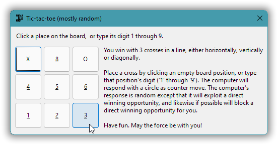
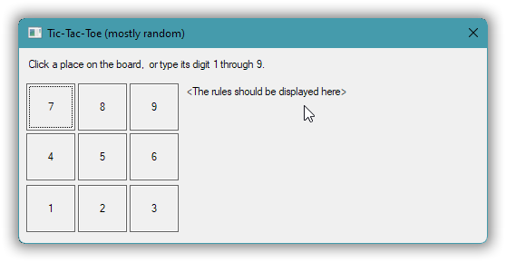
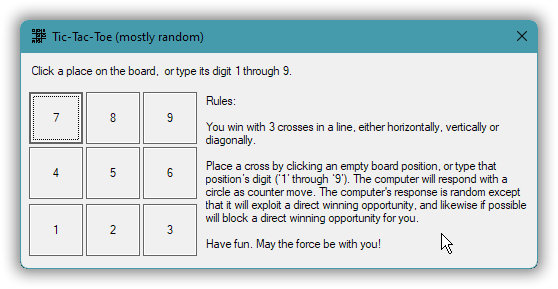

# Windows GUI-stuff in C++: a tutorial.

## Part 3 – A Tic-Tac-Toe game in a general window.

In the previous part we saw that an application’s icon is provided via data embedded in the executable, called a resource. Now we’ll additionally use a resource called a **dialog template**, that describes the contents of a simple window. As a concrete example we’ll use that for a simple Tic-Tac-Toe (tree in a row) game in a general window.

That window contains two text areas and nine flat buttons, specified by the dialog template:

The game logic is just a little detail at the end, though. Mainly the five (!) versions of the program exemplify general Windows programming techniques and issues, a kind of C style **event based programming**. The parts of the Windows API used here are all designed for use from C, and we’ll use this API more or less directly with C++ as just a “better C”.

<!-- START doctoc generated TOC please keep comment here to allow auto update -->
<!-- DON'T EDIT THIS SECTION, INSTEAD RE-RUN doctoc TO UPDATE -->
*Contents (table generated with [DocToc](https://github.com/thlorenz/doctoc)):*

- [3.1. Create and run a general window based on a dialog template.](#31-create-and-run-a-general-window-based-on-a-dialog-template)
- [3.2. Add a window icon and the too longish text by sending window messages.](#32-add-a-window-icon-and-the-too-longish-text-by-sending-window-messages)
- [3.3. Factor out: `<windows.h>` inclusion; support machinery; window message cracking.](#33-factor-out-windowsh-inclusion-support-machinery-window-message-cracking)

<!-- END doctoc generated TOC please keep comment here to allow auto update -->

---

### 3.1. Create and run a general window based on a dialog template.

In order to keep things simple now, there will be a host of issues that are deferred, problems that will need fixing in later versions. So version 1 is an incomplete and quite imperfect window. It’s even without a custom window icon!

Only two absolutely crucial problems are addressed in this version:

* The default behavior is, quite unreasonably, that any attempt to close the window has *no effect*.
* Windows 11 often fails to [**activate**](https://docs.microsoft.com/en-us/windows/win32/winmsg/window-features#active-window) a new window, so that in many situations running a program has *no visible effect* where you’re looking (though an icon may appear in the taskbar).

For now and until version 4 we’ll deal with the activation problem by just specifying in the dialog template that the window should be in **topmost** mode, where it’s always very visible above all normal mode windows. The main problem with that is that the window also appears above existing topmost windows, such as on my machine above the on-screen analog clock. For that reason version 4 will turn off topmost mode after the window has been created.

To address the window no-close problem we need to programmatically override the default handling of a window close attempt. Normally in C++ one would do that by overriding some virtual function, preferably using the C++ `override` keyword, and indeed that’s the way to do it with some C++ GUI frameworks. However, here we’re dealing with a C oriented part of the Windows API, where it needs to be done in a C-ish way via a freestanding function:

~~~ cpp
auto CALLBACK message_handler(
    const HWND              window,
    const UINT              msg_id,
    const WPARAM            ,       // w_param
    const LPARAM                    // ell_param
    ) -> INT_PTR
{
    if( msg_id == WM_CLOSE ) {
        EndDialog( window, IDOK );  // Without this the window won't close.
        return true;
    }
    return false;       // Didn't process the message, want default.
}
~~~

This function is specified in the call to **`DialogBox`** that creates and runs the window,

~~~ cpp
DialogBox( ⋯, message_handler );
~~~

The `DialogBox` call returns when the window is closed, i.e. it’s a blocking call. In the meantime the internal Windows code that runs the window calls the specified function each time something happens that application code can customize or react to. I.e. this is a **callback** function.

A callback for a dialog, in Windows parlance a “**dialog proc**”, can serve many dialog windows. Which window a call of the callback is about is specified by the `window` argument, somewhat akin to the `this` pointer in C++ programming. And exactly what happened or is about to happen is specied by the `msg_id` argument, a window **message**. With modern terminology it’s called an **event id**. The modern event terminology is however rarely used in Windows API-level window programming. Both Microsoft Windows and the Apple Macintosh GUI were created based on ideas from the research at Xerox PARC, and much of the Xerox PARC terminology, in particular [Smalltalk “message”](https://en.wikipedia.org/wiki/Smalltalk#Messages), was adopted.

The **`WM_CLOSE`** message (event id) is received when the user has attempted to close the window, e.g. by clicking the **✕** close button or via the `Alt`+`F4` keyboard shortcut. The default is that nothing happens, but our override/handler now calls `EndDialog`. Calling **`EndDialog`** is the proper way to close a window that was created via `DialogBox`.

The argument to `EndDialog`, here `IDOK`, specifies the value that `DialogBox` should return. `IDOK`, `IDCANCEL`, `IDYES` etc. are the id numbers of the possible buttons in a message box, and they serve as [standard return values from dialog windows](https://docs.microsoft.com/en-us/windows/win32/api/winuser/nf-winuser-messagebox#return-value). It’s just an `int` return value that you can use for whatever.

Note about [the documentation of `DialogBox`](https://docs.microsoft.com/en-us/windows/win32/api/winuser/nf-winuser-dialogboxa): it currently states that `DialogBoxA` is a macro. But `DialogBoxA` is a function. It’s `DialogBox` that is a macro, that by default resolves to `DialogBoxA`. Microsoft’s documentation used to be of less severe ungoodness. It needs to be read with a lot of understanding and sometimes *testing*, and an assumption that those technical writers that maintain it, don’t know the first thing about programming (as an example, as of late 2021 the documentation is still [full of invalid-in-C++ `void main`](https://www.google.com/search?q=%22void+main%22+site%3Ahttps%3A%2F%2Fdocs.microsoft.com%2Fen-us%2Fwindows%2Fwin32%2Fapi) beginners’ first thing mistakes).

Full C++ code:

[*part-03/code/tic-tac-toe/v1/main.cpp*](part-03/code/tic-tac-toe/v1/main.cpp)
~~~ cpp
// v1 - Roughly minimal code to display a window based on a dialog template resource.

#include <windows.h>
#include "resources.h"

auto CALLBACK message_handler(
    const HWND              window,
    const UINT              msg_id,
    const WPARAM            ,       // w_param
    const LPARAM                    // ell_param
    ) -> INT_PTR
{
    if( msg_id == WM_CLOSE ) {
        EndDialog( window, IDOK );  // Without this the window won't close.
        return true;
    }
    return false;       // Didn't process the message, want default.
}

auto main() -> int
{
    using C_str = const char*;
    const HINSTANCE this_executable     = GetModuleHandle( nullptr );
    const C_str     resource_id_as_ptr  = MAKEINTRESOURCE( IDD_MAIN_WINDOW );

    DialogBox( this_executable, resource_id_as_ptr, HWND(), message_handler );
}
~~~

Here the `"resources.h"` file just specifies the `IDD_MAIN_WINDOW` macro that resolves to a number that — together with a specification of which executable the resource is in — identifies the dialog template resource. It’s a macro because the resource compiler understands C macros but not C or C++ typed constants. In essence the C and C++ preprocessor is the glue, a common shared little language, that connects the C++ code with the resource script.

[*part-03/code/tic-tac-toe/v1/resources.h*](part-03/code/tic-tac-toe/v1/resources.h)
~~~ cpp
#pragma once

#define IDC_STATIC                      -1

#define IDD_MAIN_WINDOW                 101
#define IDC_RULES_DISPLAY               102
#define IDS_RULES                       103
#define IDI_APP                         104

#define BOARD_BUTTON_BASE               1000
~~~

The resource compiler understands simple constant expressions such as `BOARD_BUTTON_BASE + 7`, i.e. that’s part of the resource script language. Unfortunately the **dialog designer** in Visual Studio doesn’t support that, and it also has some other severe shortcomings that include generating resource script code that the resource compiler flags as an error. One Microsoft tool producing something that another Microsoft tool can’t digest. And the VS dialog editor is the only reasonably useful remaining one that I know of (the ones of old, such as the [Whitewater resource editor](https://en.wikipedia.org/wiki/Whitewater_Resource_Editor), are no more).

Anyway, because the VS resource editor adds more ungrokable meta-information than real resource script code I just used VS for the initial visual design,

… copied the resulting resource script, removed all the VS noise, and tidied up e.g. by using expressions:

[*part-03/code/tic-tac-toe/v1/resources.rc*](part-03/code/tic-tac-toe/v1/resources.rc)
~~~ c
#pragma code_page( 1252 )   // Windows ANSI Western encoding, an extension of Latin 1.
#include "resources.h"
#include <windows.h>

/////////////////////////////////////////////////////////////////////////////
// Neutral resources
LANGUAGE LANG_NEUTRAL, SUBLANG_NEUTRAL

// The icon with lowest ID value should be placed first to ensure that the
// application icon (executable's file icon) remains consistent on all systems.
IDI_APP     ICON    "resources/app.ico"

/////////////////////////////////////////////////////////////////////////////
// English (United States) resources
LANGUAGE LANG_ENGLISH, SUBLANG_ENGLISH_US

IDD_MAIN_WINDOW DIALOGEX 0, 0, 344, 132
STYLE DS_SETFONT | DS_CENTER | WS_CAPTION | WS_SYSMENU
EXSTYLE WS_EX_OVERLAPPEDWINDOW | WS_EX_TOPMOST
CAPTION "Tic-Tac-Toe (mostly random)"
FONT 8, "MS Shell Dlg", 400, 0, 0x1
BEGIN
    LTEXT           "Click a place on the board,  or type its digit 1 through 9.", 0,
                    7, 7, 313, 11, SS_NOPREFIX
    PUSHBUTTON      "7", BOARD_BUTTON_BASE + 7, 5, 24, 36, 32, BS_FLAT
    PUSHBUTTON      "8", BOARD_BUTTON_BASE + 8, 43, 24, 36, 32, BS_FLAT
    PUSHBUTTON      "9", BOARD_BUTTON_BASE + 9, 81, 24, 36, 32, BS_FLAT
    PUSHBUTTON      "4", BOARD_BUTTON_BASE + 4, 5, 58, 36, 32, BS_FLAT
    PUSHBUTTON      "5", BOARD_BUTTON_BASE + 5, 43, 58, 36, 32, BS_FLAT
    PUSHBUTTON      "6", BOARD_BUTTON_BASE + 6, 81, 58, 36, 32, BS_FLAT
    PUSHBUTTON      "1", BOARD_BUTTON_BASE + 1, 5, 93, 36, 32, BS_FLAT
    PUSHBUTTON      "2", BOARD_BUTTON_BASE + 2, 43, 93, 36, 32, BS_FLAT
    PUSHBUTTON      "3", BOARD_BUTTON_BASE + 3, 81, 93, 36, 32, BS_FLAT
    LTEXT           "<The rules should be displayed here>", IDC_RULES_DISPLAY,
                    123, 25, 217, 96, SS_NOPREFIX
END

STRINGTABLE
BEGIN
  IDS_RULES         "\
Rules:\n\nYou win with 3 crosses in a line, either horizontally, vertically or diagonally.\
\n\nPlace a cross by clicking an empty board position, or type that position’s digit (‘1’ \
through ‘9’). The computer will respond with a circle as counter move. The computer's \
response is random except that it will exploit a direct winning opportunity, and likewise \
if possible will block a direct winning opportunity for you.\n\nHave fun. May the force be \
with you!"
END
~~~

As you can see each resource is associated with some natural language such as US English, or is language neutral. An application can use e.g. English, French or Russian resources, depending on the customer’s choice, which is nice. The aforementioned invalid code generated by Visual Studio was a `#pragma code_page(0)` directive for the language neutral icon, which in addition to being being treated as an error by the resource compiler, would be seriously wrong if it did work (the directive concerns only the text encoding in the resource script file, not the language of the resource).

The `STRINGTABLE` resource, which more generally is a collection of text strings but here has just one, is used because Visual Studio refused to accept a rules text with more than 256 characters. So, in the dialog resource there’s just a short dummy text, and the text in the `STRINGTABLE` resource will be put into the dialog programmatically in version 2. For the purpose of code presentation that long string is expressed in a pretty awkward way using *preprocessor line continuations*, because the resource script language has its own Basic-like string syntax that doesn’t support string literal concatenation.

There’s a lot more to say about idiosyncrasies and limitations and how e.g. this Windows ANSI Western string resource specification is compiled into an UTF-16 encoded string resource that in turn is translated automatically to the process’ Windows ANSI encoding, which can be UTF-8, and so on, a lot of details!, but let’s just now build and run this program.

*Using the Microsoft toolchain (Visual C++):*
~~~
[T:\tutorial\part-03\code\tic-tac-toe\v1\.build]
> rc /nologo /fo resources.res ..\resources.rc

[T:\tutorial\part-03\code\tic-tac-toe\v1\.build]
> cl ..\main.cpp resources.res user32.lib /Fo"ttt"
main.cpp

[T:\tutorial\part-03\code\tic-tac-toe\v1\.build]
> ttt_
~~~

*Using the GNU toolchain (MinGW g++):*
~~~
[T:\tutorial\part-03\code\tic-tac-toe\v1\.build]
> windres ..\resources.rc -o resources.o

[T:\tutorial\part-03\code\tic-tac-toe\v1\.build]
> g++ ..\main.cpp resources.o -o ttt

[T:\tutorial\part-03\code\tic-tac-toe\v1\.build]
> ttt_
~~~

Oh well, one important detail about the dialog resource definition should be mentioned: this window is quite a bit wider than 344 pixels, and quite a bit higher than 132 pixels (the numbers in the definition). That’s because the units in the dialog template specification are **dialog units**. A Windows dialog unit is [proportional to the font size](https://docs.microsoft.com/en-us/windows/win32/api/winuser/nf-winuser-getdialogbaseunits) and is much like the “em” unit in CSS, and was supposed to make dialogs automatically scaleable.

---
### 3.2. Add a window icon and the too longish text by sending window messages.

Windows presents the executable with a custom Tic-Tac-Toe icon because that's in the executable’s resources, but there’s no such automatic use for the program’s main window. Worse, there’s no way to specify the window icon in the dialog template resource. And going beyond sheer unreasonableness, there’s not even a dedicated Windows API function to set the icon.

Instead you specify a window’s icon by sending the window a *message*, namely **`WM_SETICON`** (in passing, “`WM`” is short for *window message*). **Sending** the message means using the `SendMessage` function, which is a blocking call where the message is fully processed at this time, so that any effect is obtained before the call returns. Alternatively the message can be **posted**, using the `PostMessage` function, which means that the message id plus parameters is put in a queue, and is sent to the window and processed later, which is sometimes desirable and sometimes even necessary.

Ultimately the processing usually ends up somewhere in the deep innards of Windows, in the `DefWindowProc` function, which one *could* call directly instead of `SendMessage`. A conventional `SendMessage` call has the advantage that the processing can be overridden at several stages in the message’s journey towards `DefWindowProc`, including (for a dialog window) via the dialog proc. Calling `SendMessage` instead of `DefWindowProc` is like calling a virtual function in C++, instead of calling the non-virtual function that one is pretty sure that the virtual call will end up in, which is generally a very good idea.

~~~cpp
using C_str = const char*;

namespace icon_sizes{
    enum Enum{ small = ICON_SMALL, large = ICON_BIG };       // WM_SETICON values.
}  // namespace icon_sizes

void set_icon( const HWND window, const icon_sizes::Enum size, const int resource_id )
{
    const C_str     id_as_ptr   = MAKEINTRESOURCE( resource_id );
    const int       pixel_size  = (size == icon_sizes::small? 16 : 32);
    const HANDLE    icon        = LoadImage(
        this_exe, id_as_ptr, IMAGE_ICON, pixel_size, pixel_size, {}
        );
    SendMessage( window, WM_SETICON, size, reinterpret_cast<LPARAM>( icon ) );
}
~~~

The above wrapper function sets a single icon image of either “small” or “large” size, at a time. The small 16×16 image is used for the icon in the window’s upper left corner, and the (allegedly, perhaps historically) large 32×32 image is used for e.g. `Alt`+`Tab` switching between windows. Recall that an icon resource contains a number of supported image sizes, usually at minimum 16×16 and 32×32, and that’s how it is for this app.

I just downloaded [a free 32×32 Tic-Tac-Toe icon image](https://icon-icons.com/icon/tic-tac-toe/39453) from the nets, and scaled it down for the 16×16 image. And used Visual Studio (as I recall) to embed these images in a single “.ico” file for the resource. So the function that sets the main window’s icon uses the same resource id, `IDI_APP`, for both sizes:

32×32:  &nbsp;&nbsp;&nbsp;&nbsp; 16×16: 

~~~cpp
void set_app_icon( const HWND window )
{
    set_icon( window, icon_sizes::small, IDI_APP );
    set_icon( window, icon_sizes::large, IDI_APP );
}
~~~

Setting the text in the rules text field is much the same as for the icon, ultimately done by sending a window message. Because even though it doesn’t look like a window to the user, technically, on the inside, as viewed from a programming perspective, *also a text field is a window*, called a **child window**. In Windows a child window is also called a **control**, and with more general system-independent terminology it’s called a **widget**.

Anyway, any Windows window, whether a main window or a control, can have a text. A main window usually displays that text in its title bar, a.k.a. its caption; a button control displays the text as the button text; and a text field control, for obscure reasons called a **static** control, just displays the text because that’s its one and only purpose, to display text. To set the text of a window you can send it the **`WM_SETTEXT`** message, but as opposed to the situation for the icon here Windows provides a common wrapper function, `SetWindowText`, which is much easier to use (in particular, no casting required), so:

~~~cpp
void set_rules_text( const HWND window )
{
    char text[2048];
    LoadString( this_exe, IDS_RULES, text, sizeof( text ) );
    const HWND rules_display = GetDlgItem( window, IDC_RULES_DISPLAY );
    SetWindowText( rules_display, text );
}
~~~

The `LoadString` function converts the string resource text from UTF-16 encoding to the process’ ANSI codepage, and copies it to the specified buffer; the `GetDlgItem` function obtains a handle to a child window (control) that’s identified by its parent window and its control identifier, namely `IDC_RULES_DISPLAY` which was specified in the dialog resource; and `SetWindowText` as mentioned just sends a `WM_SETTEXT` message to the specified window, namely to the `IDC_RULES_DISPLAY` control.

Since both `set_app_icon` and `set_rules_text` require a **handle** to the window (the `HWND` value that identifies the window), they can’t be called before the window is created.

A good opportunity to call these functions is when the newly created window receives a **`WM_INITDIALOG`** message:

~~~cpp
void on_wm_close( const HWND window )
{
    EndDialog( window, IDOK );
}

auto on_wm_initdialog( const HWND window )
    -> bool
{
    set_app_icon( window );
    set_rules_text( window );
    return true;    // `true` sets focus to the control specified by the `w_param`.
}

auto CALLBACK message_handler(
    const HWND      window,
    const UINT      msg_id,
    const WPARAM    /*w_param*/,
    const LPARAM    /*ell_param*/
    ) -> INT_PTR
{
    switch( msg_id ) {
        case WM_CLOSE:          on_wm_close( window ); return true;
        case WM_INITDIALOG:     return on_wm_initdialog( window );
    }
    return false;   // Didn't process the message, want default processing.
}
~~~

To place this in context you may want to look at [the full code](part-03/code/tic-tac-toe/v2/main.cpp) for this version 2. One important little part not shown above — there was no really natural place to discuss this — is that the macro `small` that `<windows.h>` introduces by default, that would otherwise wreak havoc with the `icon_sizes::Enum` definition, is rendered harmless by an `#undef` directive. In later versions we’ll instead just use a subset of `<windows.h>` that is less over the top inconsiderate…

Result:

---
### 3.3. Factor out: `<windows.h>` inclusion; support machinery; window message cracking.

Version 3 is a refactoring of version 2. No new functionality is introduced. But the code is cleaned up to avoid a difficult to maintain mess in later versions; it’s like cleaning a floor *before* it gets very noticably dirty, to avoid getting to that state.

First, to exclude some of the irrelevant and sabotage-like stuff from `<windows.h>` one can define various macros, such as **`NOMINMAX`** and **`WIN32_LEAN_AND_MEAN`**, before including that header. Using `NOMINMAX` one avoids getting the macros `min` and `max`, that like `small` can wreak havoc. Using `WIN32_LEAN_AND_MEAN` one cuts the number of lines roughly in half; in particular it avoids including `<rpcndr.h>`, which is the header that defines the `small` macro, and it also avoids including the `<winsock.h>` header which can have the same include guard as (and hence prevent inclusion of) the `<winsock2.h>` header that one really wants.

So, version 2’s

~~~cpp
#include <windows.h>
#undef small    // MSVC <windows.h> includes <rpcndr.h> which defines `small` as macro. :(
~~~

… is now replaced with use of a **header wrapper** that defines the above two mentioned macros, and more,

~~~cpp
#include "wrapped-windows-h.hpp"    // Safer and faster. Safe = e.g. no `small` macro.    
~~~

… where

[*part-03/code/tic-tac-toe/v3/wrapped-windows-h.hpp*](part-03/code/tic-tac-toe/v3/wrapped-windows-h.hpp)
~~~cpp
#pragma once
#ifdef UNICODE
#   error "`UNICODE` should not be defined for a `char` based application."
#   include <stop-compilation>
#endif

#undef STRICT
#undef NOMINMAX
#undef WIN32_LEAN_AND_MEAN

#define STRICT                  // C++-compatible declarations (the default now).
#define NOMINMAX                // No `min` and `max` macros, please.
#define WIN32_LEAN_AND_MEAN     // Excludes about half of `<windows.h>` = faster & safer.

#include <windows.h>

#ifdef small
#   error "The macro `small` was defined by <windows.h>. Oops."
#   include <stop-compilation>
#endif
~~~

There’s a lot more that can and maybe should go into a `<windows.h>` wrapper, sometimes crucial “settings” of `<windows.h>` such as the `WIN32_WINNT` version macro, but the above is good enough for our purposes.

A header wrapper’s job is exclusively to provide a clean include of some other party’s header. To make it reliable and easy to understand, and to minimize name pollution, it should not provide additional functionality. Version 2’s general reusable **wrapper function** `set_icon` that provides clarity and convenience, should therefore not go into the `<windows.h>` wrapper but into a separate header that can provide more such support machinery.

In that Windows API support machinery header it’s natural to include a little class for resource id’s, so that one avoids peppering the code with `MAKEINTRESOURCE` invocations and so that one can overload on resource id as argument, and have some confidence that an integer actually is a resource id. Let’s call it `Resource_id`. With that class in hand it’s also natural to add a reusable overload of `set_icon` that sets both the small and large icon with a given resource id, as we’ve found a need for:

[*part-03/code/tic-tac-toe/v3/winapi_util.hpp*](part-03/code/tic-tac-toe/v3/winapi_util.hpp)
~~~cpp
#pragma once
#include "wrapped-windows-h.hpp"    // Safer and faster. Safe = e.g. no `small` macro.    
#include <windowsx.h>               // E.g. HANDLE_WM_CLOSE, HANDLE_WM_INITDIALOG

#include <initializer_list>         // For using range-based `for` over initializer list.

namespace winapi_util {
    inline const HINSTANCE this_exe = GetModuleHandle( nullptr );

    namespace icon_sizes{
        enum Enum{ small = ICON_SMALL, large = ICON_BIG };
    }  // namespace icon_sizes

    struct Resource_id
    {
        int value;
        auto as_ptr() const -> const char* { return MAKEINTRESOURCE( value ); }
    };

    inline void set_icon( const HWND window, const icon_sizes::Enum size, const Resource_id id )
    {
        const int       pixel_size  = (size == icon_sizes::small? 16 : 32);
        const HANDLE    icon        = LoadImage(
            this_exe, id.as_ptr(), IMAGE_ICON, pixel_size, pixel_size, {}
            );

        SendMessage( window, WM_SETICON, size, reinterpret_cast<LPARAM>( icon ) );
    }

    inline void set_icon( const HWND window, const Resource_id id )
    {
        for( const auto icon_size: {icon_sizes::small, icon_sizes::large} ) {
            set_icon( window, icon_size, id );
        }
    }
}  // namespace winapi_util
~~~

The **`<windowsx.h>`** header is included here because it adds a lot of convenience macros, including function-like macros such as `SetWindowFont` which we’ll use in version 4.

Here we’ll just avail us of the `HANDLE_VM_CLOSE` and `HANDLE_WM_INITDIALOG` macros, that are examples of **message cracker** macros. They’re called “cracker” macros because they extract message specific parameters from the `WPARAM` and `LPARAM` values, where each such macro calls a specified **message handler** function with the extracted parameter values. And these macros can be used in exactly the same way because every message cracker macro takes the same arguments and produces a return value, even when the message handler is a `void` function.

It can look like this, in this version’s main program:

~~~cpp
void on_wm_close( HWND window );
auto on_wm_initdialog( HWND window, HWND focus, LPARAM ell_param ) -> bool;

auto CALLBACK message_handler(
    const HWND      window,
    const UINT      msg_id,
    const WPARAM    w_param,
    const LPARAM    ell_param
    ) -> INT_PTR
{
    optional<INT_PTR> result;

    #define HANDLE_WM( name, handler_func ) \
        HANDLE_WM_##name( window, w_param, ell_param, handler_func )
    switch( msg_id ) {
        case WM_CLOSE:      result = HANDLE_WM( CLOSE, on_wm_close ); break;
        case WM_INITDIALOG: result = HANDLE_WM( INITDIALOG, on_wm_initdialog ); break;
    }
    #undef HANDLE_WM

    // `false` => Didn't process the message, want default processing.
    return (result? SetDlgMsgResult( window, msg_id, result.value() ) : false);
}
~~~

The local macro `HANDLE_WM` reduces verbosity and increases the [DRY-ness](https://en.wikipedia.org/wiki/Don%27t_repeat_yourself) of the code. It would have been nice to be able to limit that measure even further, to just a `PARAMS` macro that expanded to the three first arguments of a message cracker. However, the C and C++ preprocessor works in a convoluted way where such a macro-in-a-macro-call wouldn’t be expanded.

But, what’s with that `optional<INT_PTR> result`, and the call to `SetDlgMsgResult`?

Well, the message cracker results are not directly `return`ed because *the dialog proc return value is generally just a boolean*, with `true` for “I handled this message, no further action required” and `false` for “I want the default handling of this message”. Where a message handling result needs to be communicated back up the call chain, it must therefore generally be done by storing it somewhere accessible to Windows’ calling code, namely via a `SetWindowLongPtr` call with the `DWLP_MSGRESULT` index, that uses storage in the window object. But just to complicate things, or at least to avoid a simple and clear uniform treatment, some messages designed specifically for dialog windows, such as `WM_CTLCOLORBTN`, should have the result value returned directly from the dialogproc. The `<windowsx.h>` macro **`SetDlgMsgResult`** does just that: depending on the message id value it either calls `SetWindowLongPtr` to communicate a message handling result, and produces `true`, or produces the message handling result directly so that it’s `return`ed directly. OK, that was complicated, too long too read. Simple version: it’s Microsoft, just do as above.

The full version 3 main program:

[*part-03/code/tic-tac-toe/v3/main.cpp*](part-03/code/tic-tac-toe/v3/main.cpp)
~~~cpp
// v3 - Refactoring: <windows.h> wrapped; using <windowsx.h> macros; resource-id class.
//      <winapi_util.hpp> introduced as place for simple Windows API utility stuff.
// v2 - Missing window parts added programmatically: the rules text; the window icon.
// v1 - Roughly minimum code to display a window based on a dialog template resource.

#include "winapi_util.hpp"          // winapi_util::*, <windowsx.h>
#include "resources.h"              // IDS_RULES, IDC_RULES_DISPLAY, IDD_MAIN_WINDOW

namespace wu = winapi_util;

void set_app_icon( const HWND window )
{
    wu::set_icon( window, wu::Resource_id{ IDI_APP } );
}

void set_rules_text( const HWND window )
{
    char text[2048];
    LoadString( wu::this_exe, IDS_RULES, text, sizeof( text ) );
    SetDlgItemText( window, IDC_RULES_DISPLAY, text );
}

void on_wm_close( const HWND window )
{
    EndDialog( window, IDOK );
}

auto on_wm_initdialog( const HWND window, const HWND /*focus*/, const LPARAM /*ell_param*/ )
    -> bool
{
    set_app_icon( window );
    set_rules_text( window );
    return true;    // `true` sets focus to the `focus` control.
}

auto CALLBACK message_handler(
    const HWND      window,
    const UINT      msg_id,
    const WPARAM    w_param,
    const LPARAM    ell_param
    ) -> INT_PTR
{
    optional<INT_PTR> result;

    #define HANDLE_WM( name, handler_func ) \
        HANDLE_WM_##name( window, w_param, ell_param, handler_func )
    switch( msg_id ) {
        case WM_CLOSE:      result = HANDLE_WM( CLOSE, on_wm_close ); break;
        case WM_INITDIALOG: result = HANDLE_WM( INITDIALOG, on_wm_initdialog ); break;
    }
    #undef HANDLE_WM

    // `false` => Didn't process the message, want default processing.
    return (result? SetDlgMsgResult( window, msg_id, result.value() ) : false);
}

auto main() -> int
{
    DialogBox(
        wu::this_exe, wu::Resource_id{ IDD_MAIN_WINDOW }.as_ptr(),
        HWND(),             // Parent window, a zero handle is "no parent".
        message_handler
        );
}
~~~

`SetDlgItemText` is a simple wrapper function that obtains the window handle for a control specified by id, and just calls `SetWindowText`, saving 1 line of code relative to version 2.

--- 

Versions 1 is minimal code to get the window up and running, based on the dialog template. Essentially this uses Windows’s `DialogBox` function to launch the window, and provides a callback function to handle window closing, customizing that. For unfortunately the default functionality doesn’t let the user close the window…

Version 2 mainly adds a custom window icon (upper left in the window), and the rules text in the text display to the right. The window icon needs to be added programmatically because dialog templates don’t support specifying an icon. And the rules text “needs” to be set programmatically because the Visual Studio dialog template editor refuses to accept a text larger than 256 characters, which is one of a number of ways that even Microsoft’s flagship IDE fails to fully support dialog templates.

Other dialog template editors have even worse limitations. The tool support is lacking because the simple windows that dialog templates once made simpler to create, relative to the technology of that time, can now be done in much much simpler ways e.g. as web applications, or in Windows via C# in .NET. So, dialog templates are an almost archaic technology, but they serve well for introducing a number of Windows programming techniques and concepts.

Version 3 is a refactoring introducing the also archaic C language oriented *message cracker* macros from `<windowsx.h>`; a change that doesn’t affect the functionality, just improving the maintainability.

Version 4 fixes some gross imperfection issues that are due to the evolving nature of Windows, including standard GUI font (always a problem in Windows), getting a new window on top (a problem introduced with Windows 11), and modern look and feel (a problem created in Windows Vista).

Finally, in version 5 the game logic is added, plus a few UI features for a better user experience.
